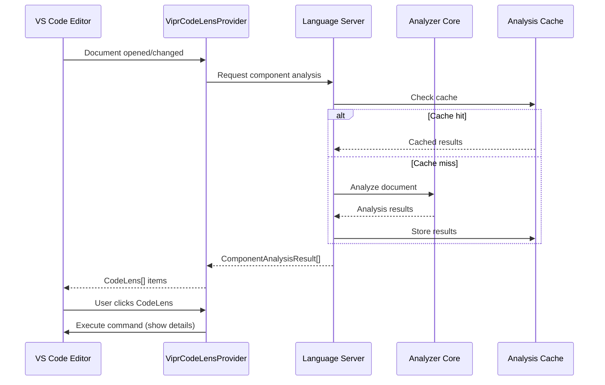
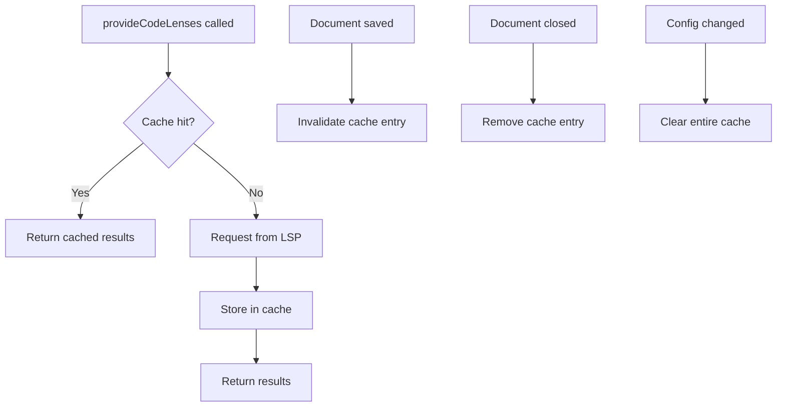

# Phase 8A: CodeLens Integration

**Parent Phase:** Phase 08 - VS Code Extension Features
**Dependency:** Phase 07 - VS Code Extension Foundation
**Duration:** 1 day
**Complexity:** Medium
**Status:** Planned

---

## 1. Overview

### 1.1 Purpose

CodeLens provides inline actionable information displayed above React component declarations. This phase implements a CodeLens provider that displays complexity scores and grades, allowing developers to quickly assess component health and access detailed breakdowns with a single click.

### 1.2 Key Features

| Feature                 | Description                                                   |
| ----------------------- | ------------------------------------------------------------- |
| Inline Score Display    | Shows complexity score and grade above component declarations |
| Click-to-Detail         | Clicking CodeLens reveals full complexity breakdown           |
| Grade-Based Styling     | Visual differentiation based on severity (A-F grades)         |
| Configurable Visibility | User control over when CodeLens appears                       |
| Lazy Resolution         | Performance-optimized command resolution                      |

### 1.3 Architecture Context



---

## 2. Technical Specification

### 2.1 ViprCodeLensProvider Class

The core provider class implementing VS Code's `CodeLensProvider` interface.

```typescript
import * as vscode from 'vscode';
import { LanguageClient } from 'vscode-languageclient/node';
import { ComponentAnalysisResult, CodeLensData, ComponentId, Grade, LocationRange } from '../types';

/**
 * CodeLens provider for displaying complexity metrics above React components.
 * Implements lazy resolution for optimal performance.
 */
export class ViprCodeLensProvider implements vscode.CodeLensProvider {
  /**
   * Event emitter for triggering CodeLens refresh.
   * Fire this when analysis results change.
   */
  private readonly _onDidChangeCodeLenses = new vscode.EventEmitter<void>();
  public readonly onDidChangeCodeLenses = this._onDidChangeCodeLenses.event;

  /**
   * Cache of analysis results keyed by document URI.
   */
  private readonly analysisCache = new Map<string, ComponentAnalysisResult[]>();

  /**
   * Debounce timer for refresh events.
   */
  private refreshDebounceTimer: NodeJS.Timeout | undefined;

  /**
   * Reference to the LSP client for requesting analysis.
   */
  private readonly client: LanguageClient;

  /**
   * Configuration accessor.
   */
  private readonly getConfig: () => ViprCodeLensConfig;

  constructor(client: LanguageClient, configAccessor: () => ViprCodeLensConfig) {
    this.client = client;
    this.getConfig = configAccessor;
  }

  /**
   * Provide CodeLens items for the document.
   * Called when document opens or changes.
   */
  async provideCodeLenses(
    document: vscode.TextDocument,
    token: vscode.CancellationToken
  ): Promise<vscode.CodeLens[]> {
    const config = this.getConfig();

    // Check if CodeLens is enabled
    if (!config.showCodeLens) {
      return [];
    }

    // Only process React files
    if (!this.isReactDocument(document)) {
      return [];
    }

    try {
      // Get analysis results (from cache or LSP)
      const results = await this.getAnalysisResults(document, token);

      if (token.isCancellationRequested) {
        return [];
      }

      // Convert results to CodeLens items
      return this.createCodeLenses(results, document, config);
    } catch (error) {
      console.error('[ViprCodeLens] Error providing CodeLenses:', error);
      return [];
    }
  }

  /**
   * Resolve CodeLens command lazily.
   * Called when CodeLens becomes visible in viewport.
   */
  resolveCodeLens(
    codeLens: vscode.CodeLens,
    token: vscode.CancellationToken
  ): vscode.CodeLens | Thenable<vscode.CodeLens> {
    // CodeLens data is stored in the data property
    const data = (codeLens as CodeLensWithData).data;

    if (!data) {
      return codeLens;
    }

    // Build the command with full details
    codeLens.command = {
      title: this.formatCodeLensTitle(data),
      command: 'vipr.showComponentDetails',
      arguments: [data.componentId, data.filePath],
      tooltip: data.tooltip,
    };

    return codeLens;
  }

  /**
   * Trigger CodeLens refresh with debouncing.
   */
  public refresh(): void {
    if (this.refreshDebounceTimer) {
      clearTimeout(this.refreshDebounceTimer);
    }

    this.refreshDebounceTimer = setTimeout(() => {
      this._onDidChangeCodeLenses.fire();
    }, 150);
  }

  /**
   * Invalidate cache for a specific document.
   */
  public invalidateCache(uri: string): void {
    this.analysisCache.delete(uri);
    this.refresh();
  }

  /**
   * Clear all cached results.
   */
  public clearCache(): void {
    this.analysisCache.clear();
    this.refresh();
  }

  /**
   * Dispose of resources.
   */
  public dispose(): void {
    this._onDidChangeCodeLenses.dispose();
    if (this.refreshDebounceTimer) {
      clearTimeout(this.refreshDebounceTimer);
    }
    this.analysisCache.clear();
  }

  // --- Private Methods ---

  /**
   * Check if document is a React file.
   */
  private isReactDocument(document: vscode.TextDocument): boolean {
    const validLanguages = ['typescriptreact', 'javascriptreact'];
    return validLanguages.includes(document.languageId);
  }

  /**
   * Get analysis results from cache or request from LSP.
   */
  private async getAnalysisResults(
    document: vscode.TextDocument,
    token: vscode.CancellationToken
  ): Promise<ComponentAnalysisResult[]> {
    const uri = document.uri.toString();

    // Check cache first
    const cached = this.analysisCache.get(uri);
    if (cached) {
      return cached;
    }

    // Request from LSP
    const results = await this.client.sendRequest<ComponentAnalysisResult[]>(
      'vipr/getDocumentComponents',
      { uri },
      token
    );

    // Cache results
    if (results && !token.isCancellationRequested) {
      this.analysisCache.set(uri, results);
    }

    return results || [];
  }

  /**
   * Create CodeLens items from analysis results.
   */
  private createCodeLenses(
    results: ComponentAnalysisResult[],
    document: vscode.TextDocument,
    config: ViprCodeLensConfig
  ): vscode.CodeLens[] {
    const codeLenses: vscode.CodeLens[] = [];

    for (const result of results) {
      // Apply minimum score threshold
      if (result.complexity.total < config.codeLensMinScore) {
        continue;
      }

      // Create range for CodeLens position
      const range = this.createRange(result.range, config.codeLensPosition);

      // Create CodeLens data
      const data: CodeLensData = {
        componentId: result.componentId,
        filePath: result.filePath,
        range: result.range,
        score: result.complexity.total,
        grade: result.complexity.grade,
        command: {
          command: 'vipr.showComponentDetails',
          title: '', // Set in resolveCodeLens
          arguments: [result.componentId, result.filePath],
        },
        tooltip: this.buildTooltip(result),
        metadata: {
          style: this.getCodeLensStyle(result.complexity.grade),
          showInlineHints: config.showInlineHints,
        },
      };

      // Create CodeLens with attached data
      const codeLens = new vscode.CodeLens(range) as CodeLensWithData;
      codeLens.data = data;

      codeLenses.push(codeLens);
    }

    return codeLenses;
  }

  /**
   * Create VS Code range from location range.
   */
  private createRange(location: LocationRange, position: 'above' | 'inline'): vscode.Range {
    if (position === 'above') {
      // Place CodeLens on the line above component declaration
      const line = Math.max(0, location.startLine - 1);
      return new vscode.Range(line, 0, line, 0);
    } else {
      // Place CodeLens inline with component declaration
      return new vscode.Range(
        location.startLine,
        location.startColumn,
        location.startLine,
        location.endColumn
      );
    }
  }

  /**
   * Format CodeLens title based on score and grade.
   */
  private formatCodeLensTitle(data: CodeLensData): string {
    const { score, grade } = data;
    const roundedScore = Math.round(score * 10) / 10;

    switch (data.metadata.style.type) {
      case 'error':
        return `Complexity: ${roundedScore} (${grade}) - Refactor Required`;
      case 'warning':
        return `Complexity: ${roundedScore} (${grade}) - Consider Refactoring`;
      default:
        return `Complexity: ${roundedScore} (${grade})`;
    }
  }

  /**
   * Build tooltip content for CodeLens hover.
   */
  private buildTooltip(result: ComponentAnalysisResult): string {
    const { complexity } = result;
    const lines = [
      `React Complexity: ${complexity.total.toFixed(1)} (Grade ${complexity.grade})`,
      '',
      'Dimension Breakdown:',
      `  Structural: ${complexity.structural.score.toFixed(1)}`,
      `  Hooks: ${complexity.hooks.score.toFixed(1)}`,
      `  Temporal: ${complexity.temporal.score.toFixed(1)}`,
      `  Coupling: ${complexity.coupling.score.toFixed(1)}`,
      `  Identity: ${complexity.identity.score.toFixed(1)}`,
      '',
      'Click for detailed analysis',
    ];
    return lines.join('\n');
  }

  /**
   * Determine CodeLens style based on grade.
   */
  private getCodeLensStyle(grade: Grade): CodeLensStyle {
    switch (grade) {
      case 'F':
        return { type: 'error', reason: 'Critical complexity' };
      case 'D':
        return { type: 'warning', reason: 'High complexity' };
      case 'C':
        return { type: 'warning', reason: 'Moderate complexity' };
      default:
        return { type: 'normal' };
    }
  }
}

/**
 * Extended CodeLens with attached data.
 */
interface CodeLensWithData extends vscode.CodeLens {
  data?: CodeLensData;
}

/**
 * CodeLens style configuration.
 */
type CodeLensStyle =
  | { type: 'normal' }
  | { type: 'warning'; reason: string }
  | { type: 'error'; reason: string };

/**
 * CodeLens configuration interface.
 */
interface ViprCodeLensConfig {
  showCodeLens: boolean;
  codeLensPosition: 'above' | 'inline';
  codeLensMinScore: number;
  showInlineHints: boolean;
}
```

### 2.2 Component Detection Integration

The provider integrates with the analyzer through the LSP client to retrieve component ranges and metrics.

```typescript
/**
 * LSP request handler for document components.
 * Implemented in the language server.
 */
interface GetDocumentComponentsRequest {
  method: 'vipr/getDocumentComponents';
  params: {
    uri: string;
  };
  result: ComponentAnalysisResult[];
}

/**
 * Server-side handler implementation.
 */
export function registerDocumentComponentsHandler(
  connection: Connection,
  analyzer: AnalyzerAdapter
): void {
  connection.onRequest(
    'vipr/getDocumentComponents',
    async (params: { uri: string }): Promise<ComponentAnalysisResult[]> => {
      const { uri } = params;

      // Convert URI to file path
      const filePath = uriToFilePath(uri);
      if (!filePath) {
        return [];
      }

      // Get or compute analysis results
      const results = await analyzer.analyzeFile(filePath as FilePath);

      return results;
    }
  );
}
```

### 2.3 Event Handling

The provider responds to various events to keep CodeLens items up-to-date.

```typescript
/**
 * Event subscription setup for CodeLens refresh.
 */
export function setupCodeLensEventHandlers(
  context: vscode.ExtensionContext,
  provider: ViprCodeLensProvider,
  eventBus: EventBus
): void {
  // Refresh on analysis completion
  context.subscriptions.push(
    eventBus.on('analysis-completed', event => {
      provider.invalidateCache(event.payload.filePath);
    })
  );

  // Refresh on configuration change
  context.subscriptions.push(
    vscode.workspace.onDidChangeConfiguration(e => {
      if (
        e.affectsConfiguration('vipr.showCodeLens') ||
        e.affectsConfiguration('vipr.codeLensPosition') ||
        e.affectsConfiguration('vipr.codeLensMinScore')
      ) {
        provider.clearCache();
      }
    })
  );

  // Invalidate cache on document save
  context.subscriptions.push(
    vscode.workspace.onDidSaveTextDocument(document => {
      if (isReactDocument(document)) {
        provider.invalidateCache(document.uri.toString());
      }
    })
  );

  // Clear cache entry when document closes
  context.subscriptions.push(
    vscode.workspace.onDidCloseTextDocument(document => {
      provider.invalidateCache(document.uri.toString());
    })
  );
}

function isReactDocument(document: vscode.TextDocument): boolean {
  return ['typescriptreact', 'javascriptreact'].includes(document.languageId);
}
```

---

## 3. VS Code API Details

### 3.1 Document Selector Configuration

```typescript
/**
 * Document selector for React files (TSX/JSX).
 */
export const REACT_DOCUMENT_SELECTOR: vscode.DocumentSelector = [
  { scheme: 'file', language: 'typescriptreact' },
  { scheme: 'file', language: 'javascriptreact' },
  { scheme: 'untitled', language: 'typescriptreact' },
  { scheme: 'untitled', language: 'javascriptreact' },
];
```

### 3.2 Provider Registration

```typescript
/**
 * Register CodeLens provider with VS Code.
 */
export function registerCodeLensProvider(
  context: vscode.ExtensionContext,
  client: LanguageClient,
  eventBus: EventBus
): ViprCodeLensProvider {
  // Create configuration accessor
  const getConfig = (): ViprCodeLensConfig => {
    const config = vscode.workspace.getConfiguration('vipr');
    return {
      showCodeLens: config.get('showCodeLens', true),
      codeLensPosition: config.get('codeLensPosition', 'above'),
      codeLensMinScore: config.get('codeLensMinScore', 0),
      showInlineHints: config.get('diagnostics.showInlineHints', true),
    };
  };

  // Create provider instance
  const provider = new ViprCodeLensProvider(client, getConfig);

  // Register with VS Code
  const registration = vscode.languages.registerCodeLensProvider(REACT_DOCUMENT_SELECTOR, provider);

  // Setup event handlers
  setupCodeLensEventHandlers(context, provider, eventBus);

  // Add to subscriptions for cleanup
  context.subscriptions.push(registration);
  context.subscriptions.push(provider);

  return provider;
}
```

### 3.3 Command Registration

```typescript
/**
 * Register CodeLens command handler.
 */
export function registerCodeLensCommand(
  context: vscode.ExtensionContext,
  panelManager: DetailsPanelManager
): void {
  const command = vscode.commands.registerCommand(
    'vipr.showComponentDetails',
    async (componentId: ComponentId, filePath: FilePath) => {
      try {
        // Open or focus the details panel
        await panelManager.showComponentDetails(componentId, filePath);
      } catch (error) {
        const message = error instanceof Error ? error.message : 'Unknown error';
        vscode.window.showErrorMessage(`Failed to show component details: ${message}`);
      }
    }
  );

  context.subscriptions.push(command);
}
```

### 3.4 Event Debouncing

```typescript
/**
 * Debounce utility for CodeLens refresh events.
 */
export class Debouncer {
  private timers = new Map<string, NodeJS.Timeout>();

  /**
   * Debounce a function call.
   * @param key Unique key for this debounce group
   * @param fn Function to call after delay
   * @param delay Delay in milliseconds
   */
  debounce(key: string, fn: () => void, delay: number): void {
    const existing = this.timers.get(key);
    if (existing) {
      clearTimeout(existing);
    }

    const timer = setTimeout(() => {
      this.timers.delete(key);
      fn();
    }, delay);

    this.timers.set(key, timer);
  }

  /**
   * Cancel pending debounced call.
   */
  cancel(key: string): void {
    const timer = this.timers.get(key);
    if (timer) {
      clearTimeout(timer);
      this.timers.delete(key);
    }
  }

  /**
   * Cancel all pending calls.
   */
  dispose(): void {
    for (const timer of this.timers.values()) {
      clearTimeout(timer);
    }
    this.timers.clear();
  }
}
```

---

## 4. Implementation Steps

### Step 1: Create Type Definitions

**File:** `src/providers/codeLens/types.ts`

```typescript
import * as vscode from 'vscode';
import { ComponentId, FilePath, Grade, LocationRange } from '../../types';

/**
 * Configuration for CodeLens display.
 */
export interface ViprCodeLensConfig {
  /** Enable/disable CodeLens display */
  showCodeLens: boolean;

  /** Position relative to component declaration */
  codeLensPosition: 'above' | 'inline';

  /** Minimum complexity score to show CodeLens */
  codeLensMinScore: number;

  /** Show additional inline hints */
  showInlineHints: boolean;
}

/**
 * Data attached to CodeLens items.
 */
export interface CodeLensItemData {
  componentId: ComponentId;
  filePath: FilePath;
  range: LocationRange;
  score: number;
  grade: Grade;
  tooltip: string;
  style: CodeLensStyle;
}

/**
 * CodeLens visual style.
 */
export type CodeLensStyle =
  | { type: 'normal' }
  | { type: 'warning'; reason: string }
  | { type: 'error'; reason: string };

/**
 * Extended CodeLens with attached data.
 */
export interface CodeLensWithData extends vscode.CodeLens {
  data?: CodeLensItemData;
}
```

### Step 2: Implement the Provider Class

**File:** `src/providers/codeLens/ViprCodeLensProvider.ts`

Create the full provider implementation as shown in Section 2.1.

### Step 3: Create Document Selector

**File:** `src/providers/codeLens/documentSelector.ts`

```typescript
import * as vscode from 'vscode';

/**
 * Document selector for React files.
 */
export const REACT_DOCUMENT_SELECTOR: vscode.DocumentSelector = [
  { scheme: 'file', language: 'typescriptreact' },
  { scheme: 'file', language: 'javascriptreact' },
  { scheme: 'untitled', language: 'typescriptreact' },
  { scheme: 'untitled', language: 'javascriptreact' },
];

/**
 * Check if a document matches the React selector.
 */
export function isReactDocument(document: vscode.TextDocument): boolean {
  return vscode.languages.match(REACT_DOCUMENT_SELECTOR, document) > 0;
}
```

### Step 4: Implement Event Handlers

**File:** `src/providers/codeLens/eventHandlers.ts`

Create the event subscription setup as shown in Section 2.3.

### Step 5: Register Command

**File:** `src/providers/codeLens/commands.ts`

```typescript
import * as vscode from 'vscode';
import { ComponentId, FilePath } from '../../types';

/**
 * Register all CodeLens-related commands.
 */
export function registerCodeLensCommands(context: vscode.ExtensionContext): void {
  // Show component details command
  context.subscriptions.push(
    vscode.commands.registerCommand('vipr.showComponentDetails', handleShowComponentDetails)
  );

  // Toggle CodeLens visibility command
  context.subscriptions.push(
    vscode.commands.registerCommand('vipr.toggleCodeLens', handleToggleCodeLens)
  );
}

async function handleShowComponentDetails(
  componentId: ComponentId,
  filePath: FilePath
): Promise<void> {
  // Implementation delegates to details panel manager
  await vscode.commands.executeCommand('vipr.internal.showDetailsPanel', { componentId, filePath });
}

async function handleToggleCodeLens(): Promise<void> {
  const config = vscode.workspace.getConfiguration('vipr');
  const current = config.get('showCodeLens', true);
  await config.update('showCodeLens', !current, vscode.ConfigurationTarget.Global);

  vscode.window.showInformationMessage(`Vipr CodeLens ${!current ? 'enabled' : 'disabled'}`);
}
```

### Step 6: Create Index File

**File:** `src/providers/codeLens/index.ts`

```typescript
export { ViprCodeLensProvider } from './ViprCodeLensProvider';
export { registerCodeLensProvider } from './registration';
export { registerCodeLensCommands } from './commands';
export { REACT_DOCUMENT_SELECTOR, isReactDocument } from './documentSelector';
export type { ViprCodeLensConfig, CodeLensItemData, CodeLensStyle } from './types';
```

### Step 7: Update Extension Activation

**File:** `src/extension.ts` (modify existing)

```typescript
import { registerCodeLensProvider, registerCodeLensCommands } from './providers/codeLens';

export async function activate(context: vscode.ExtensionContext): Promise<void> {
  // ... existing activation code ...

  // Register CodeLens provider (after client is ready)
  client.onReady().then(() => {
    const codeLensProvider = registerCodeLensProvider(context, client, eventBus);
    registerCodeLensCommands(context);

    // Store reference for other providers if needed
    context.subscriptions.push(codeLensProvider);
  });
}
```

### Step 8: Add Configuration Schema

**File:** `package.json` (add to contributes.configuration)

```json
{
  "contributes": {
    "configuration": {
      "properties": {
        "vipr.showCodeLens": {
          "type": "boolean",
          "default": true,
          "description": "Show complexity CodeLens above React components"
        },
        "vipr.codeLensPosition": {
          "type": "string",
          "enum": ["above", "inline"],
          "default": "above",
          "enumDescriptions": [
            "Display CodeLens on the line above the component",
            "Display CodeLens inline with the component declaration"
          ],
          "description": "Position of CodeLens relative to component declaration"
        },
        "vipr.codeLensMinScore": {
          "type": "number",
          "default": 0,
          "minimum": 0,
          "maximum": 100,
          "description": "Minimum complexity score required to show CodeLens (0 = show all)"
        }
      }
    },
    "commands": [
      {
        "command": "vipr.showComponentDetails",
        "title": "Show Component Complexity Details",
        "category": "Vipr"
      },
      {
        "command": "vipr.toggleCodeLens",
        "title": "Toggle CodeLens Display",
        "category": "Vipr"
      }
    ]
  }
}
```

### Step 9: Add Server-Side Handler

**File:** `src/server/handlers/documentComponents.ts`

```typescript
import { Connection } from 'vscode-languageserver';
import { AnalyzerAdapter } from '../analyzer';
import { ComponentAnalysisResult, FilePath } from '../../types';

/**
 * Register handler for document component requests.
 */
export function registerDocumentComponentsHandler(
  connection: Connection,
  analyzer: AnalyzerAdapter
): void {
  connection.onRequest(
    'vipr/getDocumentComponents',
    async (params: { uri: string }): Promise<ComponentAnalysisResult[]> => {
      const filePath = uriToFilePath(params.uri);
      if (!filePath) {
        return [];
      }

      try {
        return await analyzer.analyzeFile(filePath as FilePath);
      } catch (error) {
        connection.console.error(`[vipr/getDocumentComponents] Error: ${error}`);
        return [];
      }
    }
  );
}

function uriToFilePath(uri: string): string | undefined {
  try {
    const url = new URL(uri);
    if (url.protocol === 'file:') {
      return decodeURIComponent(url.pathname);
    }
  } catch {
    // Invalid URI
  }
  return undefined;
}
```

---

## 5. Configuration Options

### 5.1 Configuration Schema

| Setting                 | Type    | Default   | Description                       |
| ----------------------- | ------- | --------- | --------------------------------- |
| `vipr.showCodeLens`     | boolean | `true`    | Enable/disable CodeLens display   |
| `vipr.codeLensPosition` | enum    | `'above'` | Position: `'above'` or `'inline'` |
| `vipr.codeLensMinScore` | number  | `0`       | Minimum score to show (0-100)     |

### 5.2 Configuration Examples

**Show all CodeLens (default):**

```json
{
  "vipr.showCodeLens": true,
  "vipr.codeLensPosition": "above",
  "vipr.codeLensMinScore": 0
}
```

**Only show for problematic components:**

```json
{
  "vipr.showCodeLens": true,
  "vipr.codeLensPosition": "above",
  "vipr.codeLensMinScore": 45
}
```

**Inline display for compact view:**

```json
{
  "vipr.showCodeLens": true,
  "vipr.codeLensPosition": "inline",
  "vipr.codeLensMinScore": 0
}
```

### 5.3 Configuration Change Handling

```typescript
/**
 * Watch for configuration changes and update provider behavior.
 */
function watchConfigurationChanges(
  context: vscode.ExtensionContext,
  provider: ViprCodeLensProvider
): void {
  context.subscriptions.push(
    vscode.workspace.onDidChangeConfiguration(event => {
      const affectsVipr = [
        'vipr.showCodeLens',
        'vipr.codeLensPosition',
        'vipr.codeLensMinScore',
      ].some(key => event.affectsConfiguration(key));

      if (affectsVipr) {
        // Clear cache to apply new configuration
        provider.clearCache();
      }
    })
  );
}
```

---

## 6. Acceptance Criteria

### 6.1 Functional Requirements

- [ ] CodeLens appears above every function component declaration
- [ ] CodeLens appears above every class component declaration
- [ ] Score and grade displayed in format: `Complexity: 45.2 (C)`
- [ ] Grade F components show: `Complexity: 82.1 (F) - Refactor Required`
- [ ] Grade D components show: `Complexity: 68.5 (D) - Consider Refactoring`
- [ ] Clicking CodeLens opens detailed breakdown panel
- [ ] Hover tooltip shows dimension breakdown

### 6.2 Configuration Requirements

- [ ] `vipr.showCodeLens` setting toggles visibility
- [ ] `vipr.codeLensPosition` setting changes placement
- [ ] `vipr.codeLensMinScore` setting filters by score threshold
- [ ] Configuration changes apply without restart

### 6.3 Performance Requirements

| Metric            | Target  | Measurement Method |
| ----------------- | ------- | ------------------ |
| Initial render    | < 100ms | Performance.mark() |
| Update after edit | < 200ms | Performance.mark() |
| Memory per file   | < 5KB   | Heap snapshot      |
| Cache lookup      | < 5ms   | Performance.mark() |

- [ ] CodeLens renders within 100ms of document open
- [ ] CodeLens updates within 200ms of document change (debounced)
- [ ] No visible lag when typing
- [ ] Memory usage scales linearly with file count

### 6.4 Cross-IDE Compatibility

- [ ] Works in VS Code stable
- [ ] Works in VS Code Insiders
- [ ] Works in Cursor
- [ ] Works in Windsurf
- [ ] Graceful degradation if features unavailable

---

## 7. Testing Instructions

### 7.1 Manual Testing Steps

#### Test 1: Basic CodeLens Display

1. Open a React component file (`.tsx` or `.jsx`)
2. Verify CodeLens appears above component declarations
3. Verify format shows: `Complexity: XX.X (Y)`
4. Expected: CodeLens visible for all components

#### Test 2: Click Navigation

1. Click on a CodeLens item
2. Verify details panel opens
3. Verify correct component information displayed
4. Expected: Panel shows matching component analysis

#### Test 3: Configuration Toggle

1. Open VS Code settings
2. Set `vipr.showCodeLens` to `false`
3. Verify CodeLens items disappear
4. Set `vipr.showCodeLens` to `true`
5. Verify CodeLens items reappear
6. Expected: Toggle works without restart

#### Test 4: Minimum Score Filter

1. Set `vipr.codeLensMinScore` to `50`
2. Open a file with mixed complexity components
3. Verify only components with score >= 50 show CodeLens
4. Expected: Low-complexity components hidden

#### Test 5: Position Configuration

1. Set `vipr.codeLensPosition` to `'inline'`
2. Open a React file
3. Verify CodeLens appears inline with declaration
4. Set to `'above'`
5. Verify CodeLens appears above declaration
6. Expected: Position changes correctly

#### Test 6: Document Edit Response

1. Open a React file with CodeLens visible
2. Add a new `useState` hook to a component
3. Wait 200ms
4. Verify CodeLens score updates
5. Expected: Score reflects new hook

### 7.2 Unit Test Specifications

**File:** `src/providers/codeLens/__tests__/ViprCodeLensProvider.test.ts`

```typescript
import { describe, it, expect, beforeEach, vi } from 'vitest';
import * as vscode from 'vscode';
import { ViprCodeLensProvider } from '../ViprCodeLensProvider';

describe('ViprCodeLensProvider', () => {
  let provider: ViprCodeLensProvider;
  let mockClient: MockLanguageClient;
  let mockConfig: ViprCodeLensConfig;

  beforeEach(() => {
    mockClient = createMockLanguageClient();
    mockConfig = {
      showCodeLens: true,
      codeLensPosition: 'above',
      codeLensMinScore: 0,
      showInlineHints: true,
    };
    provider = new ViprCodeLensProvider(mockClient, () => mockConfig);
  });

  describe('provideCodeLenses', () => {
    it('should return empty array when disabled', async () => {
      mockConfig.showCodeLens = false;
      const document = createMockDocument('typescriptreact');

      const result = await provider.provideCodeLenses(document, createCancellationToken());

      expect(result).toEqual([]);
    });

    it('should return empty array for non-React files', async () => {
      const document = createMockDocument('typescript');

      const result = await provider.provideCodeLenses(document, createCancellationToken());

      expect(result).toEqual([]);
    });

    it('should return CodeLens for each component', async () => {
      const document = createMockDocument('typescriptreact');
      mockClient.setResponse('vipr/getDocumentComponents', [
        createMockComponentResult('Component1', 10, 50, 42.5, 'C'),
        createMockComponentResult('Component2', 60, 90, 28.3, 'B'),
      ]);

      const result = await provider.provideCodeLenses(document, createCancellationToken());

      expect(result).toHaveLength(2);
    });

    it('should filter by minimum score', async () => {
      mockConfig.codeLensMinScore = 40;
      const document = createMockDocument('typescriptreact');
      mockClient.setResponse('vipr/getDocumentComponents', [
        createMockComponentResult('LowComplexity', 10, 30, 25.0, 'B'),
        createMockComponentResult('HighComplexity', 40, 80, 65.0, 'D'),
      ]);

      const result = await provider.provideCodeLenses(document, createCancellationToken());

      expect(result).toHaveLength(1);
      expect((result[0] as CodeLensWithData).data?.score).toBe(65.0);
    });

    it('should respect cancellation token', async () => {
      const document = createMockDocument('typescriptreact');
      const token = createCancellationToken(true);

      const result = await provider.provideCodeLenses(document, token);

      expect(result).toEqual([]);
    });
  });

  describe('resolveCodeLens', () => {
    it('should add command to CodeLens', () => {
      const codeLens = createCodeLensWithData({
        componentId: 'Test@10-50' as ComponentId,
        score: 45.2,
        grade: 'C',
      });

      const resolved = provider.resolveCodeLens(codeLens, createCancellationToken());

      expect(resolved.command).toBeDefined();
      expect(resolved.command?.title).toContain('45.2');
      expect(resolved.command?.title).toContain('C');
    });

    it('should format title for critical grade', () => {
      const codeLens = createCodeLensWithData({
        componentId: 'Test@10-50' as ComponentId,
        score: 85.0,
        grade: 'F',
        style: { type: 'error', reason: 'Critical' },
      });

      const resolved = provider.resolveCodeLens(codeLens, createCancellationToken());

      expect(resolved.command?.title).toContain('Refactor Required');
    });
  });

  describe('cache management', () => {
    it('should cache analysis results', async () => {
      const document = createMockDocument('typescriptreact');
      mockClient.setResponse('vipr/getDocumentComponents', [
        createMockComponentResult('Component', 10, 50, 42.5, 'C'),
      ]);

      await provider.provideCodeLenses(document, createCancellationToken());
      await provider.provideCodeLenses(document, createCancellationToken());

      expect(mockClient.requestCount).toBe(1);
    });

    it('should invalidate cache when requested', async () => {
      const document = createMockDocument('typescriptreact');
      mockClient.setResponse('vipr/getDocumentComponents', [
        createMockComponentResult('Component', 10, 50, 42.5, 'C'),
      ]);

      await provider.provideCodeLenses(document, createCancellationToken());
      provider.invalidateCache(document.uri.toString());
      await provider.provideCodeLenses(document, createCancellationToken());

      expect(mockClient.requestCount).toBe(2);
    });
  });
});
```

### 7.3 Integration Test Specifications

**File:** `src/providers/codeLens/__tests__/integration.test.ts`

```typescript
import { describe, it, expect, beforeAll, afterAll } from 'vitest';
import * as vscode from 'vscode';
import * as path from 'path';

describe('CodeLens Integration', () => {
  const testFixturePath = path.join(__dirname, 'fixtures');

  beforeAll(async () => {
    // Wait for extension to activate
    const extension = vscode.extensions.getExtension('vipr.react-analyzer');
    await extension?.activate();
  });

  it('should display CodeLens in React file', async () => {
    const document = await vscode.workspace.openTextDocument(
      path.join(testFixturePath, 'SimpleComponent.tsx')
    );
    await vscode.window.showTextDocument(document);

    // Wait for CodeLens to render
    await new Promise(resolve => setTimeout(resolve, 500));

    const codeLenses = await vscode.commands.executeCommand<vscode.CodeLens[]>(
      'vscode.executeCodeLensProvider',
      document.uri
    );

    expect(codeLenses).toBeDefined();
    expect(codeLenses!.length).toBeGreaterThan(0);
  });

  it('should update CodeLens after document edit', async () => {
    const document = await vscode.workspace.openTextDocument(
      path.join(testFixturePath, 'EditableComponent.tsx')
    );
    const editor = await vscode.window.showTextDocument(document);

    // Get initial CodeLens
    await new Promise(resolve => setTimeout(resolve, 300));
    const initialCodeLenses = await vscode.commands.executeCommand<vscode.CodeLens[]>(
      'vscode.executeCodeLensProvider',
      document.uri
    );
    const initialScore = extractScore(initialCodeLenses![0]);

    // Add a useState hook
    await editor.edit(editBuilder => {
      editBuilder.insert(new vscode.Position(5, 0), '  const [extra, setExtra] = useState(0);\n');
    });

    // Wait for update
    await new Promise(resolve => setTimeout(resolve, 500));

    const updatedCodeLenses = await vscode.commands.executeCommand<vscode.CodeLens[]>(
      'vscode.executeCodeLensProvider',
      document.uri
    );
    const updatedScore = extractScore(updatedCodeLenses![0]);

    expect(updatedScore).toBeGreaterThan(initialScore);
  });
});
```

### 7.4 Test Fixtures

**File:** `src/providers/codeLens/__tests__/fixtures/SimpleComponent.tsx`

```tsx
import React, { useState } from 'react';

interface Props {
  name: string;
}

export const SimpleComponent: React.FC<Props> = ({ name }) => {
  const [count, setCount] = useState(0);

  return (
    <div>
      <h1>Hello, {name}!</h1>
      <p>Count: {count}</p>
      <button onClick={() => setCount(c => c + 1)}>Increment</button>
    </div>
  );
};
```

**File:** `src/providers/codeLens/__tests__/fixtures/ComplexComponent.tsx`

```tsx
import React, { useState, useEffect, useCallback, useMemo, useContext } from 'react';
import { ThemeContext, UserContext, SettingsContext } from './contexts';

interface Props {
  userId: string;
  onUpdate: (data: UserData) => void;
  filters: FilterOptions;
  sortBy: SortKey;
  ascending: boolean;
}

export const ComplexComponent: React.FC<Props> = ({
  userId,
  onUpdate,
  filters,
  sortBy,
  ascending,
}) => {
  const theme = useContext(ThemeContext);
  const user = useContext(UserContext);
  const settings = useContext(SettingsContext);

  const [data, setData] = useState<UserData[]>([]);
  const [loading, setLoading] = useState(true);
  const [error, setError] = useState<Error | null>(null);
  const [selectedIds, setSelectedIds] = useState<Set<string>>(new Set());
  const [searchQuery, setSearchQuery] = useState('');

  useEffect(() => {
    let cancelled = false;
    setLoading(true);

    fetchUserData(userId)
      .then(result => {
        if (!cancelled) {
          setData(result);
          setLoading(false);
        }
      })
      .catch(err => {
        if (!cancelled) {
          setError(err);
          setLoading(false);
        }
      });

    return () => {
      cancelled = true;
    };
  }, [userId]);

  useEffect(() => {
    if (data.length > 0) {
      onUpdate(data[0]);
    }
  }, [data, onUpdate]);

  const filteredData = useMemo(() => {
    return data
      .filter(item => {
        if (filters.status && item.status !== filters.status) return false;
        if (filters.category && item.category !== filters.category) return false;
        if (searchQuery && !item.name.includes(searchQuery)) return false;
        return true;
      })
      .sort((a, b) => {
        const comparison = a[sortBy] > b[sortBy] ? 1 : -1;
        return ascending ? comparison : -comparison;
      });
  }, [data, filters, searchQuery, sortBy, ascending]);

  const handleSelect = useCallback((id: string) => {
    setSelectedIds(prev => {
      const next = new Set(prev);
      if (next.has(id)) {
        next.delete(id);
      } else {
        next.add(id);
      }
      return next;
    });
  }, []);

  const handleSelectAll = useCallback(() => {
    if (selectedIds.size === filteredData.length) {
      setSelectedIds(new Set());
    } else {
      setSelectedIds(new Set(filteredData.map(d => d.id)));
    }
  }, [selectedIds.size, filteredData]);

  if (loading) {
    return <LoadingSpinner theme={theme} />;
  }

  if (error) {
    return <ErrorDisplay error={error} onRetry={() => setError(null)} />;
  }

  return (
    <div className={theme.container}>
      <SearchInput value={searchQuery} onChange={setSearchQuery} />
      <SelectAllCheckbox
        checked={selectedIds.size === filteredData.length}
        onChange={handleSelectAll}
      />
      <DataList
        items={filteredData}
        selectedIds={selectedIds}
        onSelect={handleSelect}
        user={user}
        settings={settings}
      />
    </div>
  );
};
```

---

## 8. Edge Cases

### 8.1 Files with No Components

**Scenario:** User opens a `.tsx` file that contains only utilities or types.

**Behavior:**

- Provider returns empty CodeLens array
- No visual indication shown
- No error or warning messages

```typescript
// Example: utils.tsx - No CodeLens should appear
export function formatDate(date: Date): string {
  return date.toISOString();
}

export interface UserData {
  id: string;
  name: string;
}
```

### 8.2 Files with Multiple Components

**Scenario:** File contains multiple component declarations.

**Behavior:**

- Each component gets its own CodeLens
- CodeLens items are independent
- Clicking navigates to specific component

```typescript
// Each component gets individual CodeLens
export const Header: React.FC = () => {
  /* ... */
};
// 👆 Complexity: 12.3 (A)

export const Footer: React.FC = () => {
  /* ... */
};
// 👆 Complexity: 8.5 (A)

export const MainContent: React.FC<Props> = props => {
  /* ... */
};
// 👆 Complexity: 67.2 (D) - Consider Refactoring
```

### 8.3 Large Files (1000+ Lines)

**Scenario:** File contains many components or very large components.

**Behavior:**

- Only visible viewport components analyzed first (lazy loading)
- Background analysis for rest of file
- Memory-efficient caching
- Progressive CodeLens rendering

**Implementation:**

```typescript
/**
 * Handle large files with viewport-aware loading.
 */
private async handleLargeFile(
  document: vscode.TextDocument,
  token: vscode.CancellationToken
): Promise<ComponentAnalysisResult[]> {
  const lineCount = document.lineCount;

  // For very large files, analyze in chunks
  if (lineCount > 1000) {
    const editor = vscode.window.activeTextEditor;
    if (editor?.document === document) {
      // Prioritize visible range
      const visibleRange = editor.visibleRanges[0];
      const priorityResults = await this.analyzeRange(
        document,
        visibleRange.start.line,
        visibleRange.end.line,
        token
      );

      // Schedule background analysis for rest of file
      this.scheduleBackgroundAnalysis(document, visibleRange);

      return priorityResults;
    }
  }

  // Normal analysis for smaller files
  return this.getAnalysisResults(document, token);
}
```

### 8.4 Class Components vs Function Components

**Scenario:** File contains both class and function components.

**Behavior:**

- Both types detected and analyzed
- CodeLens appears for both
- Score calculation handles both patterns

```typescript
// Function component - CodeLens appears
export const FunctionComponent: React.FC = () => {
  const [state, setState] = useState(0);
  return <div>{state}</div>;
};
// 👆 Complexity: 15.2 (A)

// Class component - CodeLens also appears
export class ClassComponent extends React.Component<Props, State> {
  state = { count: 0 };

  componentDidMount() {
    this.fetchData();
  }

  render() {
    return <div>{this.state.count}</div>;
  }
}
// 👆 Complexity: 28.7 (B)
```

### 8.5 Nested Components

**Scenario:** Component defined inside another component.

**Behavior:**

- Both outer and inner components get CodeLens
- Warning diagnostic added for nested component pattern
- Inner component scored independently

```typescript
export const OuterComponent: React.FC = () => {
  // 👆 Complexity: 45.2 (C) - Consider Refactoring

  // Inner component - also gets CodeLens
  const InnerComponent: React.FC = () => {
    return <span>Inner</span>;
  };
  // 👆 Complexity: 5.0 (A) - Warning: Nested component

  return (
    <div>
      <InnerComponent />
    </div>
  );
};
```

### 8.6 Higher-Order Components

**Scenario:** File uses HOC patterns like `React.memo`, `forwardRef`, etc.

**Behavior:**

- Wrapped component detected
- CodeLens shows wrapped component's complexity
- HOC wrapper not separately analyzed

```typescript
// memo wrapped component
export const MemoizedComponent = React.memo(function MemoizedComponent({ value }) {
  return <div>{value}</div>;
});
// 👆 Complexity: 8.3 (A)

// forwardRef wrapped component
export const ForwardRefComponent = React.forwardRef<HTMLDivElement, Props>(
  (props, ref) => {
    return <div ref={ref}>{props.children}</div>;
  }
);
// 👆 Complexity: 12.1 (A)
```

### 8.7 Error Handling

**Scenario:** Analysis fails for a component.

**Behavior:**

- Error logged to output channel
- CodeLens shows fallback or is omitted
- Other components in file still analyzed
- User notified if persistent errors

```typescript
/**
 * Handle analysis errors gracefully.
 */
private handleAnalysisError(
  document: vscode.TextDocument,
  error: Error
): vscode.CodeLens[] {
  // Log error for debugging
  this.outputChannel.appendLine(
    `[ViprCodeLens] Analysis error for ${document.fileName}: ${error.message}`
  );

  // Return empty array to avoid blocking editor
  return [];
}
```

---

## 9. Performance Considerations

### 9.1 Caching Strategy



### 9.2 Debouncing Configuration

| Event                | Debounce Delay | Rationale                      |
| -------------------- | -------------- | ------------------------------ |
| Document change      | 150ms          | Balance responsiveness and CPU |
| Configuration change | 0ms            | Immediate feedback expected    |
| Cache invalidation   | 150ms          | Batch multiple invalidations   |
| LSP request          | 300ms          | Reduce server load             |

### 9.3 Memory Management

- Cache limited to active documents only
- Cache entries removed when documents close
- Maximum cache entries configurable (default: 50)
- LRU eviction for overflow

---

## 10. File Structure

```
vipr-vscode/
  src/
    providers/
      codeLens/
        index.ts                    # Public exports
        types.ts                    # Type definitions
        ViprCodeLensProvider.ts     # Main provider class
        documentSelector.ts         # Document selector utilities
        eventHandlers.ts            # Event subscription setup
        commands.ts                 # Command registration
        registration.ts             # Provider registration
        __tests__/
          ViprCodeLensProvider.test.ts
          integration.test.ts
          fixtures/
            SimpleComponent.tsx
            ComplexComponent.tsx
            MultipleComponents.tsx
            ClassComponent.tsx
    server/
      handlers/
        documentComponents.ts       # LSP handler
```

---

## 11. Dependencies

### 11.1 Internal Dependencies

| Module            | Purpose                      |
| ----------------- | ---------------------------- |
| `types`           | Shared type definitions      |
| `eventBus`        | Inter-provider communication |
| `analyzerAdapter` | Core analyzer integration    |

### 11.2 External Dependencies

| Package                 | Version   | Purpose               |
| ----------------------- | --------- | --------------------- |
| `vscode`                | `^1.85.0` | VS Code Extension API |
| `vscode-languageclient` | `^9.0.0`  | LSP client            |

---

## 12. Risks and Mitigations

| Risk                                   | Likelihood | Impact | Mitigation                                 |
| -------------------------------------- | ---------- | ------ | ------------------------------------------ |
| Performance degradation on large files | Medium     | High   | Viewport-aware loading, aggressive caching |
| LSP timeout on complex analysis        | Low        | Medium | Request timeout, cached fallback           |
| Memory leak from cache                 | Low        | Medium | Cache size limits, document close cleanup  |
| Cross-IDE incompatibility              | Medium     | Medium | Feature detection, graceful fallback       |

---

**Document Version:** 1.0
**Created:** 2026-01-10
**Last Updated:** 2026-01-10
**Status:** Ready for Implementation
