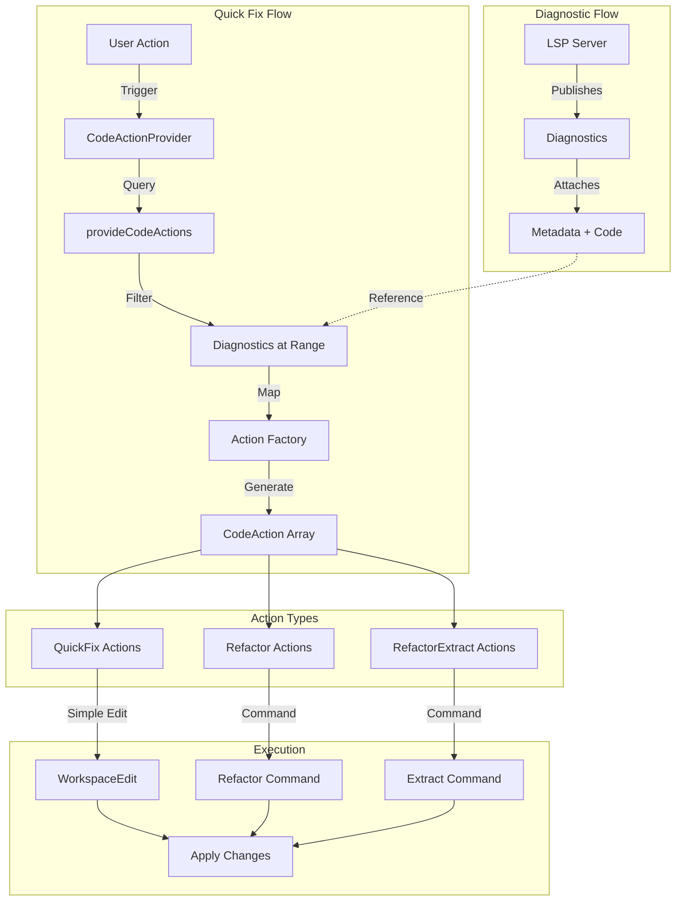
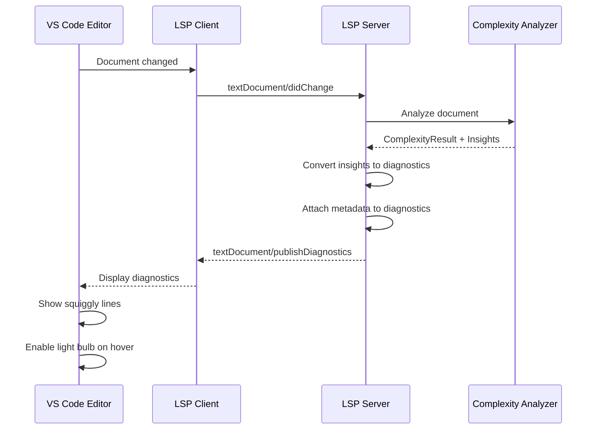

# Phase 8B: Diagnostics and Quick Fixes

**Parent Document:** [Phase Index](./phase-index.md)
**Duration:** 1.5 days
**Complexity:** High
**Status:** Planning

## Overview

Phase 8B implements the `CodeActionProvider` for the Vipr React Analyzer VS Code extension. This phase delivers context-aware quick fixes that transform diagnostics from the analyzer into actionable code improvements. Users will see the VS Code "light bulb" icon on diagnostic lines and can apply automated fixes with a single click.

### Dependencies

| Dependency                | Type      | Description                                   |
| ------------------------- | --------- | --------------------------------------------- |
| Phase 07                  | Required  | LSP foundation providing diagnostic delivery  |
| Quick Fixes Specification | Reference | Detailed transformation specifications        |
| Type Definitions          | Reference | TypeScript interfaces for all data structures |

### Objectives

1. Implement `ViprQuickFixProvider` class with full `CodeActionProvider` interface
2. Map all diagnostic codes to appropriate quick fix actions
3. Support multiple fix options per diagnostic where applicable
4. Mark preferred actions for single-click application
5. Integrate with Phase 8E refactoring commands for complex transformations

## Architecture



## Technical Specification

### ViprQuickFixProvider Class

```typescript
import * as vscode from 'vscode';
import { DiagnosticCode, QuickFixContext, RefactoringType } from './types';

/**
 * Provides quick fixes and refactoring actions for Vipr diagnostics.
 * Implements VS Code CodeActionProvider interface.
 */
export class ViprQuickFixProvider implements vscode.CodeActionProvider {
  public static readonly providedCodeActionKinds = [
    vscode.CodeActionKind.QuickFix,
    vscode.CodeActionKind.Refactor,
    vscode.CodeActionKind.RefactorExtract,
  ];

  private readonly actionFactories: Map<string, ActionFactory>;
  private readonly analysisCache: AnalysisCache;

  constructor(analysisCache: AnalysisCache) {
    this.analysisCache = analysisCache;
    this.actionFactories = this.initializeFactories();
  }

  /**
   * Provides code actions for the given document and range.
   * Called by VS Code when user triggers quick fix (Ctrl+. or light bulb click).
   */
  public provideCodeActions(
    document: vscode.TextDocument,
    range: vscode.Range | vscode.Selection,
    context: vscode.CodeActionContext,
    token: vscode.CancellationToken
  ): vscode.ProviderResult<(vscode.CodeAction | vscode.Command)[]> {
    if (token.isCancellationRequested) {
      return [];
    }

    const viprDiagnostics = context.diagnostics.filter(d => d.source === 'vipr');

    if (viprDiagnostics.length === 0) {
      return [];
    }

    const actions: vscode.CodeAction[] = [];

    for (const diagnostic of viprDiagnostics) {
      const diagnosticCode = this.extractDiagnosticCode(diagnostic);
      if (!diagnosticCode) continue;

      const factory = this.actionFactories.get(diagnosticCode);
      if (!factory) continue;

      const quickFixContext = this.buildContext(document, diagnostic);
      const generatedActions = factory.create(quickFixContext);

      for (const action of generatedActions) {
        action.diagnostics = [diagnostic];
        actions.push(action);
      }
    }

    return actions;
  }

  /**
   * Resolves additional details for a code action.
   * Used for lazy loading of expensive workspace edits.
   */
  public resolveCodeAction(
    codeAction: vscode.CodeAction,
    token: vscode.CancellationToken
  ): vscode.ProviderResult<vscode.CodeAction> {
    if (token.isCancellationRequested) {
      return codeAction;
    }

    // Lazy resolution for complex edits
    if (codeAction.edit === undefined && codeAction.command === undefined) {
      const metadata = codeAction as CodeActionWithMetadata;
      if (metadata.viprMetadata?.lazyResolver) {
        return metadata.viprMetadata.lazyResolver();
      }
    }

    return codeAction;
  }

  private extractDiagnosticCode(diagnostic: vscode.Diagnostic): string | undefined {
    if (typeof diagnostic.code === 'string') {
      return diagnostic.code;
    }
    if (typeof diagnostic.code === 'object' && diagnostic.code?.value) {
      return String(diagnostic.code.value);
    }
    return undefined;
  }

  private buildContext(
    document: vscode.TextDocument,
    diagnostic: vscode.Diagnostic
  ): QuickFixContext {
    const analysisResult = this.analysisCache.get(document.uri.fsPath);

    return {
      document: {
        filePath: document.uri.fsPath,
        content: document.getText(),
        languageId: document.languageId,
        version: document.version,
      },
      diagnostic: {
        code: this.extractDiagnosticCode(diagnostic) ?? '',
        severity: this.mapSeverity(diagnostic.severity),
        message: diagnostic.message,
        range: {
          startLine: diagnostic.range.start.line,
          startColumn: diagnostic.range.start.character,
          endLine: diagnostic.range.end.line,
          endColumn: diagnostic.range.end.character,
        },
        source: 'vipr',
      },
      analysisResult,
    };
  }

  private mapSeverity(
    severity: vscode.DiagnosticSeverity | undefined
  ): 'info' | 'warning' | 'error' {
    switch (severity) {
      case vscode.DiagnosticSeverity.Error:
        return 'error';
      case vscode.DiagnosticSeverity.Warning:
        return 'warning';
      default:
        return 'info';
    }
  }

  private initializeFactories(): Map<string, ActionFactory> {
    const factories = new Map<string, ActionFactory>();

    // Hook-related fixes
    factories.set('vipr.hooks.extract-recommended', new ExtractHookActionFactory());
    factories.set('vipr.hooks.excessive', new ExtractHookActionFactory());

    // Temporal fixes
    factories.set('vipr.temporal.missing-deps', new FixDependenciesActionFactory());
    factories.set('vipr.temporal.excessive-deps', new FixDependenciesActionFactory());
    factories.set('vipr.temporal.missing-cleanup', new AddCleanupActionFactory());
    factories.set('vipr.temporal.timer-no-cleanup', new AddCleanupActionFactory());
    factories.set('vipr.temporal.listener-no-cleanup', new AddCleanupActionFactory());

    // Identity fixes
    factories.set('vipr.identity.inline-function', new ExtractCallbackActionFactory());
    factories.set('vipr.identity.inline-object', new AddMemoizationActionFactory());
    factories.set('vipr.identity.inline-array', new AddMemoizationActionFactory());

    // Structural fixes
    factories.set('vipr.structural.component-in-render', new MoveComponentActionFactory());

    // Accessibility fixes
    factories.set('vipr.a11y.keyboard-access', new AddKeyboardHandlerActionFactory());
    factories.set('vipr.a11y.missing-aria', new AddAriaActionFactory());

    return factories;
  }
}

/**
 * Interface for action factory implementations.
 */
interface ActionFactory {
  create(context: QuickFixContext): vscode.CodeAction[];
}

/**
 * Extended CodeAction with Vipr metadata.
 */
interface CodeActionWithMetadata extends vscode.CodeAction {
  viprMetadata?: {
    lazyResolver?: () => Promise<vscode.CodeAction>;
    refactoringType?: RefactoringType;
  };
}
```

### Provider Registration

```typescript
// In extension.ts activate function
export function activate(context: vscode.ExtensionContext): void {
  const analysisCache = new AnalysisCache();

  const quickFixProvider = new ViprQuickFixProvider(analysisCache);

  const registration = vscode.languages.registerCodeActionsProvider(
    [
      { language: 'typescriptreact', scheme: 'file' },
      { language: 'javascriptreact', scheme: 'file' },
      { language: 'typescript', scheme: 'file' },
      { language: 'javascript', scheme: 'file' },
    ],
    quickFixProvider,
    {
      providedCodeActionKinds: ViprQuickFixProvider.providedCodeActionKinds,
    }
  );

  context.subscriptions.push(registration);
}
```

## Diagnostic Code to Action Mapping

| Diagnostic Code                       | Action Title                        | CodeActionKind  | isPreferred | Command/Edit                    |
| ------------------------------------- | ----------------------------------- | --------------- | ----------- | ------------------------------- |
| `vipr.hooks.extract-recommended`      | Extract to custom hook              | RefactorExtract | true        | Command: `vipr.extractHook`     |
| `vipr.hooks.excessive`                | Extract hooks to custom hook        | RefactorExtract | true        | Command: `vipr.extractHook`     |
| `vipr.temporal.missing-deps`          | Add missing dependencies            | QuickFix        | true        | WorkspaceEdit                   |
| `vipr.temporal.missing-deps`          | Wrap in useRef for stable reference | Refactor        | false       | Command: `vipr.wrapInRef`       |
| `vipr.temporal.excessive-deps`        | Remove unnecessary dependencies     | QuickFix        | false       | WorkspaceEdit                   |
| `vipr.temporal.missing-cleanup`       | Add cleanup function                | QuickFix        | true        | WorkspaceEdit                   |
| `vipr.temporal.timer-no-cleanup`      | Add timer cleanup                   | QuickFix        | true        | WorkspaceEdit                   |
| `vipr.temporal.listener-no-cleanup`   | Add event listener cleanup          | QuickFix        | true        | WorkspaceEdit                   |
| `vipr.identity.inline-function`       | Extract to useCallback              | Refactor        | true        | Command: `vipr.extractCallback` |
| `vipr.identity.inline-object`         | Extract to useMemo                  | Refactor        | false       | Command: `vipr.extractMemo`     |
| `vipr.identity.inline-array`          | Extract to useMemo                  | Refactor        | false       | Command: `vipr.extractMemo`     |
| `vipr.structural.component-in-render` | Move component outside render       | RefactorExtract | true        | Command: `vipr.moveComponent`   |
| `vipr.a11y.keyboard-access`           | Add keyboard handler                | QuickFix        | true        | WorkspaceEdit                   |
| `vipr.a11y.keyboard-access`           | Convert to button element           | Refactor        | false       | WorkspaceEdit                   |
| `vipr.a11y.missing-aria`              | Add aria-label                      | QuickFix        | true        | WorkspaceEdit                   |

## Diagnostic Integration

### Diagnostic Flow from LSP Server



### Attaching Metadata to Diagnostics

Diagnostics carry metadata through the `data` property, enabling rich quick fix generation:

```typescript
interface ViprDiagnosticData {
  /** Original insight from analyzer */
  insight: ComplexityInsight;

  /** Component context for the diagnostic */
  componentContext: {
    componentId: string;
    componentName: string;
    startLine: number;
    endLine: number;
  };

  /** Pre-computed fix suggestions */
  fixSuggestions: Array<{
    type: RefactoringType;
    confidence: 'high' | 'medium' | 'low';
    parameters?: Record<string, unknown>;
  }>;

  /** Related code locations */
  relatedLocations: Array<{
    uri: string;
    range: LocationRange;
    message: string;
  }>;
}

// Server-side diagnostic creation
function createDiagnostic(
  insight: ComplexityInsight,
  componentContext: ComponentContext
): Diagnostic {
  const diagnostic: Diagnostic = {
    range: insight.range,
    message: insight.message,
    severity: mapSeverity(insight.severity),
    source: 'vipr',
    code: insight.code,
    data: {
      insight,
      componentContext,
      fixSuggestions: computeFixSuggestions(insight),
      relatedLocations: insight.relatedLocations ?? [],
    } satisfies ViprDiagnosticData,
  };

  return diagnostic;
}
```

### Diagnostic Code Enumeration

```typescript
/**
 * Complete enumeration of Vipr diagnostic codes.
 * Each code maps to specific quick fix actions.
 */
export const ViprDiagnosticCodes = {
  // Hook-related
  HOOKS_EXCESSIVE: 'vipr.hooks.excessive',
  HOOKS_EXTRACT_RECOMMENDED: 'vipr.hooks.extract-recommended',
  HOOKS_WRONG_ORDER: 'vipr.hooks.wrong-order',

  // Temporal (effect) related
  TEMPORAL_MISSING_DEPS: 'vipr.temporal.missing-deps',
  TEMPORAL_EXCESSIVE_DEPS: 'vipr.temporal.excessive-deps',
  TEMPORAL_MISSING_CLEANUP: 'vipr.temporal.missing-cleanup',
  TEMPORAL_TIMER_NO_CLEANUP: 'vipr.temporal.timer-no-cleanup',
  TEMPORAL_LISTENER_NO_CLEANUP: 'vipr.temporal.listener-no-cleanup',

  // Identity (referential stability) related
  IDENTITY_INLINE_FUNCTION: 'vipr.identity.inline-function',
  IDENTITY_INLINE_OBJECT: 'vipr.identity.inline-object',
  IDENTITY_INLINE_ARRAY: 'vipr.identity.inline-array',

  // Structural related
  STRUCTURAL_COMPONENT_IN_RENDER: 'vipr.structural.component-in-render',
  STRUCTURAL_EXCESSIVE: 'vipr.structural.excessive',

  // Accessibility related
  A11Y_KEYBOARD_ACCESS: 'vipr.a11y.keyboard-access',
  A11Y_MISSING_ARIA: 'vipr.a11y.missing-aria',
} as const;

export type ViprDiagnosticCode = (typeof ViprDiagnosticCodes)[keyof typeof ViprDiagnosticCodes];
```

## Quick Fix Action Implementations

### 1. Extract to Custom Hook (`hooks`)

**Trigger:** `vipr.hooks.excessive` or `vipr.hooks.extract-recommended`

**Action Factory:**

```typescript
class ExtractHookActionFactory implements ActionFactory {
  create(context: QuickFixContext): vscode.CodeAction[] {
    const action = new vscode.CodeAction(
      'Extract to custom hook',
      vscode.CodeActionKind.RefactorExtract
    );

    action.isPreferred = true;
    action.command = {
      command: 'vipr.extractHook',
      title: 'Extract to custom hook',
      arguments: [
        context.document.filePath,
        context.diagnostic.range,
        context.analysisResult?.componentId,
      ],
    };

    return [action];
  }
}
```

**Transformation Logic:**

1. Identify all hook calls within the diagnostic range
2. Analyze dependencies (props/state used by hooks)
3. Prompt user for custom hook name (must start with "use")
4. Generate custom hook function with:
   - Parameters for external dependencies
   - Return object with exposed state/functions
5. Replace original hooks with custom hook call
6. Add import if hook is extracted to separate file

### 2. Add Dependencies / Wrap in useRef (`missing-effect-deps`)

**Trigger:** `vipr.temporal.missing-deps`

**Action Factory:**

```typescript
class FixDependenciesActionFactory implements ActionFactory {
  create(context: QuickFixContext): vscode.CodeAction[] {
    const actions: vscode.CodeAction[] = [];
    const metadata = context.diagnostic.data as ViprDiagnosticData | undefined;
    const missingDeps = metadata?.insight.missingDependencies ?? [];

    // Primary action: Add all missing dependencies
    if (missingDeps.length > 0) {
      const addDepsAction = new vscode.CodeAction(
        `Add missing dependencies: ${missingDeps.join(', ')}`,
        vscode.CodeActionKind.QuickFix
      );
      addDepsAction.isPreferred = true;
      addDepsAction.edit = this.createAddDepsEdit(context, missingDeps);
      actions.push(addDepsAction);
    }

    // Alternative: Wrap callback dependencies in useRef
    const callbackDeps = missingDeps.filter(dep => this.isLikelyCallback(dep, context));

    if (callbackDeps.length > 0) {
      const wrapRefAction = new vscode.CodeAction(
        `Wrap ${callbackDeps.join(', ')} in useRef`,
        vscode.CodeActionKind.Refactor
      );
      wrapRefAction.command = {
        command: 'vipr.wrapInRef',
        title: 'Wrap in useRef',
        arguments: [context.document.filePath, callbackDeps],
      };
      actions.push(wrapRefAction);
    }

    return actions;
  }

  private createAddDepsEdit(context: QuickFixContext, deps: string[]): vscode.WorkspaceEdit {
    const edit = new vscode.WorkspaceEdit();
    const uri = vscode.Uri.file(context.document.filePath);

    // Find the dependency array location
    const depArrayMatch = this.findDependencyArray(context);

    if (depArrayMatch) {
      // Insert into existing array
      const insertPosition = new vscode.Position(depArrayMatch.line, depArrayMatch.insertColumn);
      const depsText = depArrayMatch.isEmpty ? deps.join(', ') : ', ' + deps.join(', ');
      edit.insert(uri, insertPosition, depsText);
    } else {
      // No dependency array - add one
      const closingParen = this.findEffectClosingParen(context);
      if (closingParen) {
        const insertPosition = new vscode.Position(closingParen.line, closingParen.column);
        edit.insert(uri, insertPosition, `, [${deps.join(', ')}]`);
      }
    }

    return edit;
  }

  private isLikelyCallback(dep: string, context: QuickFixContext): boolean {
    // Heuristics: starts with "on", "handle", or ends with "Callback"
    return (
      dep.startsWith('on') ||
      dep.startsWith('handle') ||
      dep.endsWith('Callback') ||
      dep.endsWith('Handler')
    );
  }

  private findDependencyArray(
    context: QuickFixContext
  ): { line: number; insertColumn: number; isEmpty: boolean } | null {
    // Parse effect call to find dependency array
    // Implementation uses AST or regex
    return null; // Placeholder
  }

  private findEffectClosingParen(
    context: QuickFixContext
  ): { line: number; column: number } | null {
    // Find the closing parenthesis of useEffect call
    return null; // Placeholder
  }
}
```

**WorkspaceEdit Construction:**

```typescript
// Before:
useEffect(() => {
  fetchData(userId);
}); // Missing deps

// After (Add dependencies):
useEffect(() => {
  fetchData(userId);
}, [userId]); // Dependencies added

// After (Wrap in useRef - alternative):
const userIdRef = useRef(userId);
useEffect(() => {
  userIdRef.current = userId;
});
useEffect(() => {
  fetchData(userIdRef.current);
}, []); // Stable reference
```

### 3. Add Cleanup Template (`missing-effect-cleanup`)

**Trigger:** `vipr.temporal.missing-cleanup`, `vipr.temporal.timer-no-cleanup`, `vipr.temporal.listener-no-cleanup`

**Action Factory:**

```typescript
class AddCleanupActionFactory implements ActionFactory {
  create(context: QuickFixContext): vscode.CodeAction[] {
    const metadata = context.diagnostic.data as ViprDiagnosticData | undefined;
    const cleanupType = this.determineCleanupType(context.diagnostic.code);

    const action = new vscode.CodeAction(
      this.getActionTitle(cleanupType),
      vscode.CodeActionKind.QuickFix
    );

    action.isPreferred = true;
    action.edit = this.createCleanupEdit(context, cleanupType, metadata);

    return [action];
  }

  private determineCleanupType(code: string): 'timer' | 'interval' | 'listener' | 'generic' {
    if (code.includes('timer')) return 'timer';
    if (code.includes('listener')) return 'listener';
    return 'generic';
  }

  private getActionTitle(type: 'timer' | 'interval' | 'listener' | 'generic'): string {
    switch (type) {
      case 'timer':
        return 'Add clearTimeout cleanup';
      case 'interval':
        return 'Add clearInterval cleanup';
      case 'listener':
        return 'Add removeEventListener cleanup';
      default:
        return 'Add cleanup function';
    }
  }

  private createCleanupEdit(
    context: QuickFixContext,
    type: 'timer' | 'interval' | 'listener' | 'generic',
    metadata?: ViprDiagnosticData
  ): vscode.WorkspaceEdit {
    const edit = new vscode.WorkspaceEdit();
    const uri = vscode.Uri.file(context.document.filePath);

    const cleanupCode = this.generateCleanupCode(type, metadata);
    const insertPosition = this.findCleanupInsertPosition(context);

    if (insertPosition) {
      edit.insert(uri, insertPosition, cleanupCode);
    }

    // May also need to wrap timer/interval in variable
    const variableEdit = this.createVariableCapture(context, type, metadata);
    if (variableEdit) {
      edit.insert(uri, variableEdit.position, variableEdit.text);
    }

    return edit;
  }

  private generateCleanupCode(
    type: 'timer' | 'interval' | 'listener' | 'generic',
    metadata?: ViprDiagnosticData
  ): string {
    switch (type) {
      case 'timer':
        return '\n    return () => clearTimeout(timerId);';
      case 'interval':
        return '\n    return () => clearInterval(intervalId);';
      case 'listener':
        const details = metadata?.insight.listenerDetails;
        return `\n    return () => {\n      ${
          details?.target ?? 'element'
        }.removeEventListener('${details?.eventName ?? 'event'}', ${
          details?.handler ?? 'handler'
        });\n    };`;
      default:
        return '\n    return () => {\n      // Cleanup logic here\n    };';
    }
  }

  private findCleanupInsertPosition(context: QuickFixContext): vscode.Position | null {
    // Find position before closing brace of effect callback
    return null; // Placeholder
  }

  private createVariableCapture(
    context: QuickFixContext,
    type: 'timer' | 'interval' | 'listener' | 'generic',
    metadata?: ViprDiagnosticData
  ): { position: vscode.Position; text: string } | null {
    // If timer/interval is not captured in variable, create capture
    return null; // Placeholder
  }
}
```

**Generated Cleanup Examples:**

```typescript
// Timer cleanup:
useEffect(() => {
  const timerId = setTimeout(() => {
    setVisible(true);
  }, 1000);

  return () => clearTimeout(timerId);
}, []);

// Event listener cleanup:
useEffect(() => {
  window.addEventListener('resize', handleResize);

  return () => {
    window.removeEventListener('resize', handleResize);
  };
}, [handleResize]);

// Multiple cleanups:
useEffect(() => {
  const interval = setInterval(() => tick(), 1000);
  window.addEventListener('focus', handleFocus);

  return () => {
    clearInterval(interval);
    window.removeEventListener('focus', handleFocus);
  };
}, [handleFocus]);
```

### 4. Extract to useCallback (`inline-function-props`)

**Trigger:** `vipr.identity.inline-function`

**Action Factory:**

```typescript
class ExtractCallbackActionFactory implements ActionFactory {
  create(context: QuickFixContext): vscode.CodeAction[] {
    const action = new vscode.CodeAction('Extract to useCallback', vscode.CodeActionKind.Refactor);

    action.isPreferred = true;
    action.command = {
      command: 'vipr.extractCallback',
      title: 'Extract to useCallback',
      arguments: [context.document.filePath, context.diagnostic.range],
    };

    return [action];
  }
}
```

**Transformation:**

```typescript
// Before:
function Parent({ id, onUpdate }) {
  return (
    <Child onClick={() => onUpdate(id)} />
  );
}

// After:
function Parent({ id, onUpdate }) {
  const handleClick = useCallback(() => {
    onUpdate(id);
  }, [id, onUpdate]);

  return (
    <Child onClick={handleClick} />
  );
}
```

### 5. Move Component Outside (`component-in-render`)

**Trigger:** `vipr.structural.component-in-render`

**Action Factory:**

```typescript
class MoveComponentActionFactory implements ActionFactory {
  create(context: QuickFixContext): vscode.CodeAction[] {
    const metadata = context.diagnostic.data as ViprDiagnosticData | undefined;
    const componentName = metadata?.insight.nestedComponentName ?? 'NestedComponent';

    const action = new vscode.CodeAction(
      `Move ${componentName} outside parent component`,
      vscode.CodeActionKind.RefactorExtract
    );

    action.isPreferred = true;
    action.command = {
      command: 'vipr.moveComponent',
      title: 'Move component outside',
      arguments: [context.document.filePath, context.diagnostic.range, componentName],
    };

    return [action];
  }
}
```

**Transformation:**

```typescript
// Before:
function Dashboard({ user }) {
  const [expanded, setExpanded] = useState(false);

  function Sidebar() {
    return <aside>{user.name}</aside>;
  }

  return <Sidebar />;
}

// After:
interface SidebarProps {
  userName: string;
}

function Sidebar({ userName }: SidebarProps) {
  return <aside>{userName}</aside>;
}

function Dashboard({ user }) {
  const [expanded, setExpanded] = useState(false);
  return <Sidebar userName={user.name} />;
}
```

### 6. Add Keyboard Handler (`keyboard-access`)

**Trigger:** `vipr.a11y.keyboard-access`

**Action Factory:**

```typescript
class AddKeyboardHandlerActionFactory implements ActionFactory {
  create(context: QuickFixContext): vscode.CodeAction[] {
    const actions: vscode.CodeAction[] = [];

    // Primary: Add keyboard handler
    const addHandlerAction = new vscode.CodeAction(
      'Add keyboard handler for accessibility',
      vscode.CodeActionKind.QuickFix
    );
    addHandlerAction.isPreferred = true;
    addHandlerAction.edit = this.createKeyboardHandlerEdit(context);
    actions.push(addHandlerAction);

    // Alternative: Convert to semantic element
    const convertAction = new vscode.CodeAction(
      'Convert to <button> element',
      vscode.CodeActionKind.Refactor
    );
    convertAction.edit = this.createButtonConversionEdit(context);
    actions.push(convertAction);

    return actions;
  }

  private createKeyboardHandlerEdit(context: QuickFixContext): vscode.WorkspaceEdit {
    const edit = new vscode.WorkspaceEdit();
    const uri = vscode.Uri.file(context.document.filePath);

    // Add handleKeyDown function before component return
    const handlerCode = `
  const handleKeyDown = (e: React.KeyboardEvent) => {
    if (e.key === 'Enter' || e.key === ' ') {
      e.preventDefault();
      handleClick();
    }
  };
`;

    // Add attributes to element
    const attributesCode = `
      onKeyDown={handleKeyDown}
      tabIndex={0}
      role="button"`;

    // Implementation would insert at correct positions
    return edit;
  }

  private createButtonConversionEdit(context: QuickFixContext): vscode.WorkspaceEdit {
    const edit = new vscode.WorkspaceEdit();
    // Convert <div onClick={...}> to <button onClick={...}>
    return edit;
  }
}
```

**Generated Code:**

```typescript
// Before:
function Card({ onClick }) {
  return (
    <div className="card" onClick={onClick}>
      Click me
    </div>
  );
}

// After (Add keyboard handler):
function Card({ onClick }) {
  const handleKeyDown = (e: React.KeyboardEvent) => {
    if (e.key === 'Enter' || e.key === ' ') {
      e.preventDefault();
      onClick();
    }
  };

  return (
    <div
      className="card"
      onClick={onClick}
      onKeyDown={handleKeyDown}
      tabIndex={0}
      role="button"
    >
      Click me
    </div>
  );
}

// After (Convert to button - alternative):
function Card({ onClick }) {
  return (
    <button className="card" onClick={onClick}>
      Click me
    </button>
  );
}
```

## Implementation Steps

### Step 1: Provider Registration (0.5 hours)

1. Create `src/providers/quickFixProvider.ts` file
2. Implement basic `ViprQuickFixProvider` class skeleton
3. Register provider in `extension.ts` with document selectors
4. Verify light bulb appears on existing diagnostics

### Step 2: Diagnostic Code Extraction (0.5 hours)

1. Implement `extractDiagnosticCode` method
2. Handle both string and object diagnostic codes
3. Create type guards for `ViprDiagnosticData`
4. Test with sample diagnostics from LSP server

### Step 3: Action Factory Framework (1 hour)

1. Define `ActionFactory` interface
2. Create factory registry (`Map<string, ActionFactory>`)
3. Implement factory lookup in `provideCodeActions`
4. Create base `AbstractActionFactory` with shared utilities

### Step 4: Simple WorkspaceEdit Actions (2 hours)

1. Implement `AddCleanupActionFactory` (generates WorkspaceEdit directly)
2. Implement `AddKeyboardHandlerActionFactory`
3. Implement `FixDependenciesActionFactory` (add deps variant)
4. Test edit application and undo support

### Step 5: Command-Based Actions (2 hours)

1. Implement `ExtractHookActionFactory` (delegates to command)
2. Implement `ExtractCallbackActionFactory`
3. Implement `MoveComponentActionFactory`
4. Implement `AddMemoizationActionFactory`
5. Register placeholder commands in `extension.ts`

### Step 6: isPreferred Logic (1 hour)

1. Implement `determinePreferred` function
2. Consider diagnostic severity
3. Consider user configuration preferences
4. Consider action confidence level
5. Ensure only one preferred action per diagnostic

### Step 7: Lazy Resolution (1 hour)

1. Implement `resolveCodeAction` method
2. Add lazy resolver metadata to complex actions
3. Test performance improvement with many diagnostics

### Step 8: Integration with Phase 8E Commands (1 hour)

1. Wire action factories to refactoring commands
2. Ensure command arguments match command signatures
3. Test end-to-end flow from diagnostic to applied refactoring

### Step 9: Configuration Integration (1 hour)

1. Respect `vipr.codeActions.enableQuickFix` setting
2. Respect `vipr.codeActions.preferred` array for user preferences
3. Add telemetry for quick fix usage (opt-in)

### Step 10: Testing and Documentation (2 hours)

1. Write unit tests for each action factory
2. Write integration tests with real diagnostics
3. Document all quick fix behaviors
4. Add inline JSDoc comments

## Acceptance Criteria

### Functional Requirements

- [ ] Light bulb icon appears on all lines with Vipr diagnostics
- [ ] Each supported diagnostic code has at least one quick fix action
- [ ] Clicking a quick fix applies the transformation correctly
- [ ] Multi-option diagnostics show all available fixes in the menu
- [ ] Preferred fixes are marked and appear first in the list
- [ ] Quick fix keyboard shortcut (Ctrl+.) works correctly

### Code Quality Requirements

- [ ] All quick fixes produce syntactically valid TypeScript/JSX
- [ ] Generated code follows project style (quotes, semicolons, indentation)
- [ ] No dangling imports or unused variables after transformation
- [ ] Hook dependencies are correctly computed for useCallback/useMemo

### Undo Support

- [ ] Single Ctrl+Z reverts any applied quick fix
- [ ] Multi-edit actions are grouped as single undo operation
- [ ] Undo works correctly after command-based refactorings

### Performance Requirements

- [ ] `provideCodeActions` completes within 50ms for single file
- [ ] Light bulb appears within 100ms of cursor entering diagnostic line
- [ ] Lazy resolution defers expensive computation until action is selected

### Configuration Requirements

- [ ] Quick fixes respect `vipr.codeActions.enableQuickFix` setting
- [ ] Preferred actions respect `vipr.codeActions.preferred` configuration
- [ ] All settings changes take effect without extension reload

## Testing Instructions

### Test File Setup

Create a test file `test/fixtures/quick-fix-test.tsx`:

```tsx
import React, { useState, useEffect } from 'react';

// Test Case 1: Missing effect dependencies
function MissingDeps({ userId, onLoad }) {
  const [data, setData] = useState(null);

  useEffect(() => {
    fetchData(userId).then(setData);
    onLoad();
  }, []); // Should trigger vipr.temporal.missing-deps

  return <div>{data}</div>;
}

// Test Case 2: Missing cleanup
function MissingCleanup() {
  useEffect(() => {
    const id = setTimeout(() => {
      console.log('fired');
    }, 1000);
    // Missing cleanup - should trigger vipr.temporal.timer-no-cleanup
  }, []);

  return <div>Timer</div>;
}

// Test Case 3: Inline function prop
function InlineCallback({ items, onSelect }) {
  return (
    <ul>
      {items.map(item => (
        // Should trigger vipr.identity.inline-function
        <li key={item.id} onClick={() => onSelect(item.id)}>
          {item.name}
        </li>
      ))}
    </ul>
  );
}

// Test Case 4: Component in render
function ParentComponent({ user }) {
  // Should trigger vipr.structural.component-in-render
  function ChildComponent() {
    return <span>{user.name}</span>;
  }

  return <ChildComponent />;
}

// Test Case 5: Missing keyboard handler
function ClickableDiv({ onClick }) {
  // Should trigger vipr.a11y.keyboard-access
  return (
    <div className="clickable" onClick={onClick}>
      Click me
    </div>
  );
}

// Test Case 6: Multiple hooks (extract candidate)
function ComplexComponent({ id }) {
  const [data, setData] = useState(null);
  const [loading, setLoading] = useState(false);
  const [error, setError] = useState(null);

  useEffect(() => {
    setLoading(true);
    fetch(`/api/${id}`)
      .then(r => r.json())
      .then(setData)
      .catch(setError)
      .finally(() => setLoading(false));
  }, [id]);

  // Should trigger vipr.hooks.extract-recommended
  return loading ? <span>Loading</span> : <div>{data?.name}</div>;
}
```

### Manual Verification Steps

1. **Open test file** and wait for analysis to complete
2. **Verify diagnostics appear** with squiggly underlines
3. **Position cursor on diagnostic line** and verify light bulb appears
4. **Click light bulb** or press Ctrl+. to open quick fix menu
5. **Verify all expected actions** are listed for each diagnostic
6. **Apply each quick fix** and verify the transformation
7. **Press Ctrl+Z** to undo and verify original code is restored
8. **Repeat for each test case** in the fixture file

### Before/After Code Verification

#### Test Case 1: Missing Dependencies

**Before:**

```tsx
useEffect(() => {
  fetchData(userId).then(setData);
  onLoad();
}, []);
```

**After (Add dependencies):**

```tsx
useEffect(() => {
  fetchData(userId).then(setData);
  onLoad();
}, [userId, onLoad]);
```

#### Test Case 2: Missing Cleanup

**Before:**

```tsx
useEffect(() => {
  const id = setTimeout(() => {
    console.log('fired');
  }, 1000);
}, []);
```

**After:**

```tsx
useEffect(() => {
  const timerId = setTimeout(() => {
    console.log('fired');
  }, 1000);

  return () => clearTimeout(timerId);
}, []);
```

#### Test Case 3: Inline Callback

**Before:**

```tsx
<li key={item.id} onClick={() => onSelect(item.id)}>
```

**After:**

```tsx
const handleClick = useCallback((itemId: string) => {
  onSelect(itemId);
}, [onSelect]);

// In JSX:
<li key={item.id} onClick={() => handleClick(item.id)}>
```

#### Test Case 4: Component in Render

**Before:**

```tsx
function ParentComponent({ user }) {
  function ChildComponent() {
    return <span>{user.name}</span>;
  }
  return <ChildComponent />;
}
```

**After:**

```tsx
interface ChildComponentProps {
  userName: string;
}

function ChildComponent({ userName }: ChildComponentProps) {
  return <span>{userName}</span>;
}

function ParentComponent({ user }) {
  return <ChildComponent userName={user.name} />;
}
```

#### Test Case 5: Missing Keyboard Handler

**Before:**

```tsx
<div className="clickable" onClick={onClick}>
```

**After:**

```tsx
const handleKeyDown = (e: React.KeyboardEvent) => {
  if (e.key === 'Enter' || e.key === ' ') {
    e.preventDefault();
    onClick();
  }
};

<div
  className="clickable"
  onClick={onClick}
  onKeyDown={handleKeyDown}
  tabIndex={0}
  role="button"
>
```

## Configuration Schema

```json
{
  "vipr.codeActions.enableQuickFix": {
    "type": "boolean",
    "default": true,
    "description": "Enable quick fix suggestions for Vipr diagnostics"
  },
  "vipr.codeActions.enableRefactor": {
    "type": "boolean",
    "default": true,
    "description": "Enable refactoring suggestions"
  },
  "vipr.codeActions.preferred": {
    "type": "array",
    "items": {
      "type": "string",
      "enum": [
        "extract-hook",
        "add-memo",
        "fix-deps",
        "add-cleanup",
        "extract-callback",
        "move-component",
        "add-keyboard-handler"
      ]
    },
    "default": [],
    "description": "Quick fix categories to mark as preferred"
  },
  "vipr.codeActions.autoFixOnSave": {
    "type": "boolean",
    "default": false,
    "description": "Automatically apply preferred fixes on file save"
  }
}
```

## Error Handling

| Error Scenario                | User Message                                                     | Recovery Action                                 |
| ----------------------------- | ---------------------------------------------------------------- | ----------------------------------------------- |
| Parse error in document       | "Cannot generate quick fix: document has syntax errors"          | Show error notification, do not provide actions |
| Invalid range for refactoring | "Selection does not contain a valid target for this refactoring" | Log warning, skip action generation             |
| Command execution fails       | "Failed to apply refactoring: \{error message\}"                 | Show error notification with details            |
| WorkspaceEdit fails           | "Could not apply edit. The document may have changed."           | Show error notification, suggest retry          |

## File Structure After Implementation

```
vipr-vscode/
    src/
        providers/
            quickFixProvider.ts          # Main provider class
            actionFactories/
                index.ts                  # Factory exports
                extractHookFactory.ts     # Hook extraction
                fixDepsFactory.ts         # Dependency fixes
                addCleanupFactory.ts      # Cleanup generation
                extractCallbackFactory.ts # useCallback extraction
                moveComponentFactory.ts   # Component movement
                a11yFactory.ts            # Accessibility fixes
        utils/
            astHelpers.ts                 # AST parsing utilities
            editBuilder.ts                # WorkspaceEdit builders
            rangeUtils.ts                 # Range calculations
```

---

**Document Version:** 1.0
**Created:** 2026-01-10
**Last Updated:** 2026-01-10
**Status:** Ready for Implementation
