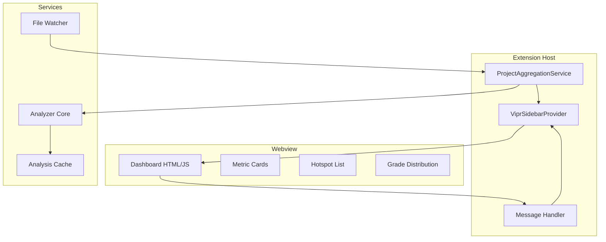
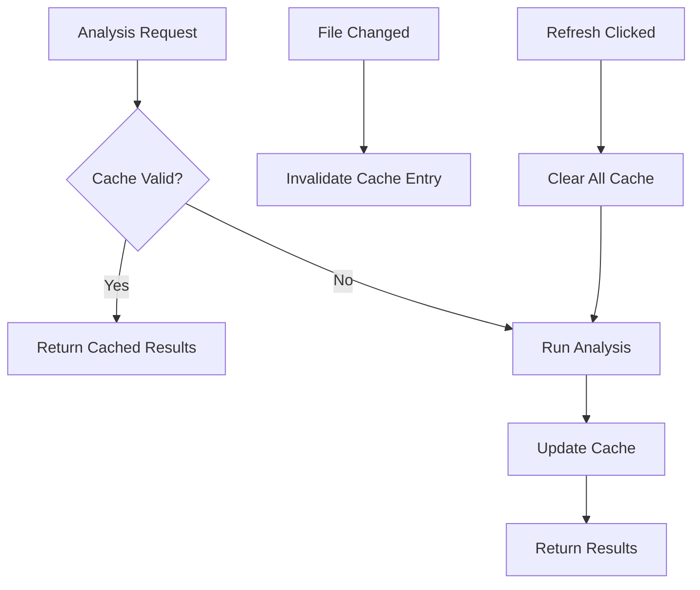

# Phase 8C: Sidebar Panel Implementation

**Parent Document:** [Phase Index](./phase-index.md)
**Duration:** 1.5 days
**Complexity:** High
**Status:** Planning

## Overview

This phase implements the sidebar dashboard for the Vipr React Analyzer extension. The sidebar provides a project-wide view of complexity metrics, enabling developers to quickly identify hotspots and navigate to problematic components.

### Objectives

- Implement `WebviewViewProvider` for sidebar panel integration
- Create a metrics dashboard with VS Code theme integration
- Establish a type-safe bidirectional message protocol
- Build a project aggregation service for workspace-wide analysis

### Dependencies

| Dependency    | Type     | Description                    |
| ------------- | -------- | ------------------------------ |
| Phase 07      | Required | LSP Server + Client foundation |
| `vscode`      | Runtime  | VS Code Extension API          |
| Analyzer Core | Runtime  | Complexity analysis engine     |

### Architecture Context



---

## Technical Specification

### 2.1 ViprSidebarProvider Class

The provider implements `WebviewViewProvider` to create and manage the sidebar panel.

```typescript
import * as vscode from 'vscode';
import { ProjectAggregationService } from '../services/projectAggregation';
import { ExtensionToWebviewMessage, WebviewToExtensionMessage, ProjectMetrics } from '../types';

/**
 * Provides the sidebar webview panel for project-wide complexity metrics.
 * Implements the VS Code WebviewViewProvider interface.
 */
export class ViprSidebarProvider implements vscode.WebviewViewProvider {
  public static readonly viewId = 'vipr.sidebarPanel';

  private _view?: vscode.WebviewView;
  private _disposables: vscode.Disposable[] = [];
  private _lastMetrics?: ProjectMetrics;

  constructor(
    private readonly _extensionUri: vscode.Uri,
    private readonly _aggregationService: ProjectAggregationService
  ) {}

  /**
   * Called when the view becomes visible.
   * Initializes the webview content and message handlers.
   */
  public resolveWebviewView(
    webviewView: vscode.WebviewView,
    context: vscode.WebviewViewResolveContext,
    _token: vscode.CancellationToken
  ): void {
    this._view = webviewView;

    webviewView.webview.options = {
      enableScripts: true,
      localResourceRoots: [
        vscode.Uri.joinPath(this._extensionUri, 'dist', 'webview'),
        vscode.Uri.joinPath(this._extensionUri, 'resources'),
      ],
    };

    webviewView.webview.html = this._getHtmlContent(webviewView.webview);

    // Set up message handling
    this._setWebviewMessageListener(webviewView.webview);

    // Restore persisted state if available
    if (context.state) {
      this._restoreState(context.state);
    }

    // Handle visibility changes
    webviewView.onDidChangeVisibility(() => {
      if (webviewView.visible && this._lastMetrics) {
        this._postMessage({ type: 'update-metrics', payload: { metrics: this._lastMetrics } });
      }
    });

    // Initial analysis
    this._triggerAnalysis();
  }

  /**
   * Updates the dashboard with new project metrics.
   */
  public updateMetrics(metrics: ProjectMetrics): void {
    this._lastMetrics = metrics;
    if (this._view?.visible) {
      this._postMessage({ type: 'update-metrics', payload: { metrics } });
    }
  }

  /**
   * Shows an error message in the dashboard.
   */
  public showError(message: string, details?: string): void {
    this._postMessage({ type: 'show-error', payload: { message, details } });
  }

  /**
   * Disposes all resources.
   */
  public dispose(): void {
    this._disposables.forEach(d => d.dispose());
    this._disposables = [];
  }

  private _postMessage(message: ExtensionToWebviewMessage): void {
    this._view?.webview.postMessage(message);
  }

  private _setWebviewMessageListener(webview: vscode.Webview): void {
    const listener = webview.onDidReceiveMessage(async (message: WebviewToExtensionMessage) => {
      try {
        await this._handleMessage(message);
      } catch (error) {
        const errorMessage = error instanceof Error ? error.message : 'Unknown error';
        this.showError('Failed to process action', errorMessage);
      }
    });
    this._disposables.push(listener);
  }

  private async _handleMessage(message: WebviewToExtensionMessage): Promise<void> {
    switch (message.type) {
      case 'refresh-metrics':
        await this._triggerAnalysis();
        break;

      case 'open-file':
        await this._openFile(message.payload);
        break;

      case 'apply-filter':
        // Handle filter changes
        break;

      case 'export-report':
        await this._exportReport(message.payload.format);
        break;

      case 'change-view':
        // Handle view changes
        break;

      default:
        const exhaustive: never = message;
        console.warn(`Unhandled message type: ${(exhaustive as any).type}`);
    }
  }

  private async _triggerAnalysis(): Promise<void> {
    try {
      const metrics = await this._aggregationService.analyzeWorkspace();
      this.updateMetrics(metrics);
    } catch (error) {
      const errorMessage = error instanceof Error ? error.message : 'Analysis failed';
      this.showError('Workspace analysis failed', errorMessage);
    }
  }

  private async _openFile(payload: {
    filePath: string;
    componentId?: string;
    line?: number;
  }): Promise<void> {
    const uri = vscode.Uri.file(payload.filePath);
    const document = await vscode.workspace.openTextDocument(uri);
    const editor = await vscode.window.showTextDocument(document, { preview: false });

    if (payload.line !== undefined) {
      const position = new vscode.Position(payload.line, 0);
      editor.selection = new vscode.Selection(position, position);
      editor.revealRange(
        new vscode.Range(position, position),
        vscode.TextEditorRevealType.InCenter
      );
    }
  }

  private async _exportReport(format: string): Promise<void> {
    // Implementation for report export
    vscode.window.showInformationMessage(`Report export in ${format} format not yet implemented`);
  }

  private _restoreState(state: unknown): void {
    if (typeof state === 'object' && state !== null && 'metrics' in state) {
      this._lastMetrics = (state as { metrics: ProjectMetrics }).metrics;
    }
  }

  private _getHtmlContent(webview: vscode.Webview): string {
    // Implementation in section 3
    return this._generateDashboardHtml(webview);
  }
}
```

### 2.2 Webview Security (CSP Configuration)

Content Security Policy is critical for webview security. The extension must configure CSP to prevent script injection while allowing legitimate resources.

```typescript
/**
 * Generates the Content Security Policy for the webview.
 * Restricts script and style sources to prevent XSS attacks.
 */
private _generateCsp(webview: vscode.Webview, nonce: string): string {
  const cspSource = webview.cspSource;

  return [
    `default-src 'none'`,
    `style-src ${cspSource} 'unsafe-inline'`,
    `script-src 'nonce-${nonce}'`,
    `font-src ${cspSource}`,
    `img-src ${cspSource} data:`,
    `connect-src ${cspSource}`
  ].join('; ');
}

/**
 * Generates a cryptographically secure nonce.
 */
private _generateNonce(): string {
  const array = new Uint8Array(16);
  crypto.getRandomValues(array);
  return Array.from(array, byte => byte.toString(16).padStart(2, '0')).join('');
}
```

### 2.3 Local Resource Handling

All local resources must be converted to webview-safe URIs using `asWebviewUri`.

```typescript
/**
 * Converts a local resource path to a webview-safe URI.
 */
private _getWebviewUri(webview: vscode.Webview, ...pathSegments: string[]): vscode.Uri {
  return webview.asWebviewUri(
    vscode.Uri.joinPath(this._extensionUri, ...pathSegments)
  );
}

/**
 * Example usage for resource paths.
 */
private _getResourceUris(webview: vscode.Webview) {
  return {
    styles: this._getWebviewUri(webview, 'dist', 'webview', 'dashboard.css'),
    script: this._getWebviewUri(webview, 'dist', 'webview', 'dashboard.js'),
    icons: this._getWebviewUri(webview, 'resources', 'icons')
  };
}
```

### 2.4 State Persistence

The sidebar should persist its state across reloads to provide a seamless user experience.

```typescript
/**
 * State persistence interface for sidebar.
 */
interface SidebarState {
  readonly lastAnalysisTime?: number;
  readonly metrics?: ProjectMetrics;
  readonly activeView: DashboardView;
  readonly filters: AppliedFilters;
}

interface AppliedFilters {
  readonly selectedGrades: Grade[];
  readonly sortBy: 'score' | 'name' | 'recent';
  readonly searchQuery: string;
}

// In the webview JavaScript:
const vscode = acquireVsCodeApi();

function saveState(state: SidebarState): void {
  vscode.setState(state);
}

function getState(): SidebarState {
  return (
    vscode.getState() || {
      activeView: 'overview',
      filters: {
        selectedGrades: ['A', 'B', 'C', 'D', 'F'],
        sortBy: 'score',
        searchQuery: '',
      },
    }
  );
}
```

---

## Dashboard Architecture

### 3.1 HTML Structure

The dashboard uses semantic HTML with data attributes for dynamic updates.

```html
<!DOCTYPE html>
<html lang="en">
  <head>
    <meta charset="UTF-8" />
    <meta name="viewport" content="width=device-width, initial-scale=1.0" />
    <meta http-equiv="Content-Security-Policy" content="${csp}" />
    <link rel="stylesheet" href="${stylesUri}" />
    <title>Vipr Dashboard</title>
  </head>
  <body>
    <div class="dashboard-container">
      <!-- Header Section -->
      <header class="dashboard-header">
        <h1 class="dashboard-title">React Complexity</h1>
        <div class="header-actions">
          <button id="btn-refresh" class="icon-button" title="Refresh Analysis">
            <span class="codicon codicon-refresh"></span>
          </button>
          <button id="btn-settings" class="icon-button" title="Settings">
            <span class="codicon codicon-gear"></span>
          </button>
        </div>
      </header>

      <!-- Loading State -->
      <div id="loading-state" class="loading-container hidden">
        <div class="loading-spinner"></div>
        <p class="loading-text">Analyzing workspace...</p>
        <div class="progress-bar">
          <div class="progress-fill" style="width: 0%"></div>
        </div>
      </div>

      <!-- Error State -->
      <div id="error-state" class="error-container hidden">
        <span class="codicon codicon-error"></span>
        <p class="error-message"></p>
        <button id="btn-retry" class="button-primary">Retry</button>
      </div>

      <!-- Main Content -->
      <main id="main-content" class="dashboard-content">
        <!-- Metric Cards Section -->
        <section class="metric-cards-section">
          <div class="metric-cards-grid">
            <div class="metric-card" data-metric="average-score">
              <div class="card-icon">
                <span class="codicon codicon-graph"></span>
              </div>
              <div class="card-content">
                <h3 class="card-title">Average Score</h3>
                <div class="card-value">
                  <span class="value-number" id="avg-score">--</span>
                  <span class="grade-badge" id="avg-grade">-</span>
                </div>
                <div class="card-trend" id="avg-trend"></div>
              </div>
            </div>

            <div class="metric-card" data-metric="files-analyzed">
              <div class="card-icon">
                <span class="codicon codicon-files"></span>
              </div>
              <div class="card-content">
                <h3 class="card-title">Files Analyzed</h3>
                <div class="card-value">
                  <span class="value-number" id="file-count">--</span>
                </div>
                <div class="card-subtitle" id="component-count">-- components</div>
              </div>
            </div>

            <div class="metric-card" data-metric="overall-grade">
              <div class="card-icon">
                <span class="codicon codicon-star"></span>
              </div>
              <div class="card-content">
                <h3 class="card-title">Overall Grade</h3>
                <div class="card-value">
                  <span class="grade-badge grade-large" id="overall-grade">-</span>
                </div>
                <div class="card-subtitle" id="grade-description">-</div>
              </div>
            </div>
          </div>
        </section>

        <!-- Grade Distribution Section -->
        <section class="grade-distribution-section">
          <h2 class="section-title">Grade Distribution</h2>
          <div class="distribution-bar-container">
            <div class="distribution-bar" id="distribution-bar">
              <!-- Segments added dynamically -->
            </div>
          </div>
          <div class="distribution-legend" id="distribution-legend">
            <!-- Legend items added dynamically -->
          </div>
        </section>

        <!-- Hotspots Section -->
        <section class="hotspots-section">
          <div class="section-header">
            <h2 class="section-title">Complexity Hotspots</h2>
            <select id="hotspot-sort" class="select-control">
              <option value="score">Highest Score</option>
              <option value="trend">Trending Worse</option>
              <option value="recent">Recently Modified</option>
            </select>
          </div>
          <div class="hotspot-list" id="hotspot-list">
            <!-- Hotspot items added dynamically -->
          </div>
          <div class="empty-state hidden" id="no-hotspots">
            <span class="codicon codicon-check"></span>
            <p>No complexity hotspots found</p>
          </div>
        </section>

        <!-- Settings Quick Access -->
        <section class="settings-section">
          <h2 class="section-title">Quick Settings</h2>
          <div class="setting-item">
            <label for="threshold-slider">Hotspot Threshold</label>
            <input type="range" id="threshold-slider" min="30" max="80" value="50" />
            <span id="threshold-value">50</span>
          </div>
          <div class="setting-item">
            <label for="hotspot-count">Max Hotspots</label>
            <select id="hotspot-count" class="select-control">
              <option value="5">5</option>
              <option value="10" selected>10</option>
              <option value="20">20</option>
            </select>
          </div>
        </section>
      </main>
    </div>

    <script nonce="${nonce}" src="${scriptUri}"></script>
  </body>
</html>
```

### 3.2 CSS with VS Code Theme Variables

The stylesheet uses CSS custom properties from VS Code for seamless theme integration.

```css
/* Base styles using VS Code theme variables */
:root {
  /* Grade colors */
  --grade-a-color: #22863a;
  --grade-b-color: #0366d6;
  --grade-c-color: #f9a825;
  --grade-d-color: #f57c00;
  --grade-f-color: #d32f2f;
}

* {
  box-sizing: border-box;
  margin: 0;
  padding: 0;
}

body {
  font-family: var(--vscode-font-family);
  font-size: var(--vscode-font-size);
  color: var(--vscode-foreground);
  background-color: var(--vscode-sideBar-background);
  line-height: 1.4;
  padding: 0;
  margin: 0;
}

.dashboard-container {
  display: flex;
  flex-direction: column;
  height: 100%;
  padding: 12px;
}

/* Header Styles */
.dashboard-header {
  display: flex;
  justify-content: space-between;
  align-items: center;
  padding-bottom: 12px;
  border-bottom: 1px solid var(--vscode-panel-border);
  margin-bottom: 16px;
}

.dashboard-title {
  font-size: 14px;
  font-weight: 600;
  color: var(--vscode-sideBarTitle-foreground);
}

.header-actions {
  display: flex;
  gap: 8px;
}

.icon-button {
  background: transparent;
  border: none;
  color: var(--vscode-icon-foreground);
  cursor: pointer;
  padding: 4px;
  border-radius: 4px;
  display: flex;
  align-items: center;
  justify-content: center;
}

.icon-button:hover {
  background-color: var(--vscode-toolbar-hoverBackground);
}

.icon-button:active {
  background-color: var(--vscode-toolbar-activeBackground);
}

/* Metric Cards */
.metric-cards-section {
  margin-bottom: 20px;
}

.metric-cards-grid {
  display: grid;
  gap: 12px;
}

.metric-card {
  background: var(--vscode-editor-background);
  border: 1px solid var(--vscode-panel-border);
  border-radius: 6px;
  padding: 12px;
  display: flex;
  gap: 12px;
  transition: border-color 0.2s;
}

.metric-card:hover {
  border-color: var(--vscode-focusBorder);
}

.metric-card[data-grade='A'] {
  border-left: 3px solid var(--grade-a-color);
}

.metric-card[data-grade='B'] {
  border-left: 3px solid var(--grade-b-color);
}

.metric-card[data-grade='C'] {
  border-left: 3px solid var(--grade-c-color);
}

.metric-card[data-grade='D'] {
  border-left: 3px solid var(--grade-d-color);
}

.metric-card[data-grade='F'] {
  border-left: 3px solid var(--grade-f-color);
}

.card-icon {
  display: flex;
  align-items: flex-start;
  color: var(--vscode-descriptionForeground);
}

.card-content {
  flex: 1;
}

.card-title {
  font-size: 11px;
  font-weight: 500;
  color: var(--vscode-descriptionForeground);
  text-transform: uppercase;
  letter-spacing: 0.5px;
  margin-bottom: 4px;
}

.card-value {
  display: flex;
  align-items: center;
  gap: 8px;
}

.value-number {
  font-size: 24px;
  font-weight: 600;
  color: var(--vscode-foreground);
}

.card-subtitle {
  font-size: 11px;
  color: var(--vscode-descriptionForeground);
  margin-top: 4px;
}

.card-trend {
  font-size: 11px;
  margin-top: 4px;
}

.card-trend.improving {
  color: var(--grade-a-color);
}

.card-trend.degrading {
  color: var(--grade-f-color);
}

.card-trend.stable {
  color: var(--vscode-descriptionForeground);
}

/* Grade Badges */
.grade-badge {
  display: inline-block;
  padding: 2px 8px;
  border-radius: 4px;
  font-size: 12px;
  font-weight: bold;
  color: white;
}

.grade-badge.grade-large {
  font-size: 28px;
  padding: 4px 16px;
}

.grade-badge.grade-a {
  background-color: var(--grade-a-color);
}
.grade-badge.grade-b {
  background-color: var(--grade-b-color);
}
.grade-badge.grade-c {
  background-color: var(--grade-c-color);
  color: black;
}
.grade-badge.grade-d {
  background-color: var(--grade-d-color);
}
.grade-badge.grade-f {
  background-color: var(--grade-f-color);
}

/* Grade Distribution */
.grade-distribution-section {
  margin-bottom: 20px;
}

.section-title {
  font-size: 12px;
  font-weight: 600;
  color: var(--vscode-foreground);
  margin-bottom: 12px;
}

.distribution-bar-container {
  margin-bottom: 8px;
}

.distribution-bar {
  display: flex;
  height: 24px;
  border-radius: 4px;
  overflow: hidden;
  background: var(--vscode-input-background);
}

.distribution-segment {
  display: flex;
  align-items: center;
  justify-content: center;
  color: white;
  font-size: 10px;
  font-weight: 600;
  cursor: pointer;
  transition: opacity 0.2s;
  min-width: 0;
}

.distribution-segment:hover {
  opacity: 0.85;
}

.distribution-segment.grade-a {
  background-color: var(--grade-a-color);
}
.distribution-segment.grade-b {
  background-color: var(--grade-b-color);
}
.distribution-segment.grade-c {
  background-color: var(--grade-c-color);
  color: black;
}
.distribution-segment.grade-d {
  background-color: var(--grade-d-color);
}
.distribution-segment.grade-f {
  background-color: var(--grade-f-color);
}

.distribution-legend {
  display: flex;
  flex-wrap: wrap;
  gap: 12px;
  font-size: 11px;
  color: var(--vscode-descriptionForeground);
}

.legend-item {
  display: flex;
  align-items: center;
  gap: 4px;
}

.legend-color {
  width: 10px;
  height: 10px;
  border-radius: 2px;
}

/* Hotspots Section */
.hotspots-section {
  margin-bottom: 20px;
}

.section-header {
  display: flex;
  justify-content: space-between;
  align-items: center;
  margin-bottom: 12px;
}

.select-control {
  background: var(--vscode-dropdown-background);
  border: 1px solid var(--vscode-dropdown-border);
  color: var(--vscode-dropdown-foreground);
  padding: 4px 8px;
  border-radius: 4px;
  font-size: 11px;
}

.hotspot-list {
  display: flex;
  flex-direction: column;
  gap: 8px;
}

.hotspot-item {
  background: var(--vscode-editor-background);
  border: 1px solid var(--vscode-panel-border);
  border-radius: 6px;
  padding: 10px;
  cursor: pointer;
  transition:
    border-color 0.2s,
    background-color 0.2s;
}

.hotspot-item:hover {
  border-color: var(--vscode-focusBorder);
  background-color: var(--vscode-list-hoverBackground);
}

.hotspot-item[data-grade='D'],
.hotspot-item[data-grade='F'] {
  border-left: 3px solid var(--grade-f-color);
}

.hotspot-header {
  display: flex;
  align-items: center;
  gap: 8px;
  margin-bottom: 6px;
}

.hotspot-icon {
  font-size: 12px;
}

.hotspot-icon.critical {
  color: var(--grade-f-color);
}
.hotspot-icon.warning {
  color: var(--grade-d-color);
}

.hotspot-name {
  flex: 1;
  font-weight: 500;
  font-size: 12px;
  color: var(--vscode-foreground);
  overflow: hidden;
  text-overflow: ellipsis;
  white-space: nowrap;
}

.hotspot-score {
  font-size: 14px;
  font-weight: 600;
  color: var(--vscode-errorForeground);
}

.hotspot-issues {
  display: flex;
  flex-wrap: wrap;
  gap: 4px;
  margin-top: 6px;
}

.issue-tag {
  background: var(--vscode-badge-background);
  color: var(--vscode-badge-foreground);
  padding: 2px 6px;
  border-radius: 10px;
  font-size: 10px;
}

/* Settings Section */
.settings-section {
  padding-top: 16px;
  border-top: 1px solid var(--vscode-panel-border);
}

.setting-item {
  display: flex;
  align-items: center;
  gap: 12px;
  margin-bottom: 12px;
  font-size: 12px;
}

.setting-item label {
  flex: 1;
  color: var(--vscode-foreground);
}

.setting-item input[type='range'] {
  flex: 2;
}

/* Loading State */
.loading-container {
  display: flex;
  flex-direction: column;
  align-items: center;
  justify-content: center;
  padding: 40px;
  gap: 16px;
}

.loading-spinner {
  width: 32px;
  height: 32px;
  border: 3px solid var(--vscode-progressBar-background);
  border-top-color: var(--vscode-focusBorder);
  border-radius: 50%;
  animation: spin 1s linear infinite;
}

@keyframes spin {
  to {
    transform: rotate(360deg);
  }
}

.loading-text {
  color: var(--vscode-descriptionForeground);
  font-size: 12px;
}

.progress-bar {
  width: 100%;
  max-width: 200px;
  height: 4px;
  background: var(--vscode-progressBar-background);
  border-radius: 2px;
  overflow: hidden;
}

.progress-fill {
  height: 100%;
  background: var(--vscode-focusBorder);
  transition: width 0.3s ease;
}

/* Error State */
.error-container {
  display: flex;
  flex-direction: column;
  align-items: center;
  justify-content: center;
  padding: 40px;
  gap: 12px;
  text-align: center;
}

.error-container .codicon {
  font-size: 32px;
  color: var(--vscode-errorForeground);
}

.error-message {
  color: var(--vscode-errorForeground);
  font-size: 12px;
}

.button-primary {
  background: var(--vscode-button-background);
  color: var(--vscode-button-foreground);
  border: none;
  padding: 6px 16px;
  border-radius: 4px;
  cursor: pointer;
  font-size: 12px;
}

.button-primary:hover {
  background: var(--vscode-button-hoverBackground);
}

/* Empty State */
.empty-state {
  display: flex;
  flex-direction: column;
  align-items: center;
  padding: 24px;
  gap: 8px;
  color: var(--vscode-descriptionForeground);
}

.empty-state .codicon {
  font-size: 24px;
  color: var(--grade-a-color);
}

/* Utility Classes */
.hidden {
  display: none !important;
}

/* Scrollbar Styling */
::-webkit-scrollbar {
  width: 8px;
  height: 8px;
}

::-webkit-scrollbar-track {
  background: transparent;
}

::-webkit-scrollbar-thumb {
  background: var(--vscode-scrollbarSlider-background);
  border-radius: 4px;
}

::-webkit-scrollbar-thumb:hover {
  background: var(--vscode-scrollbarSlider-hoverBackground);
}
```

### 3.3 JavaScript for Interactivity

The webview uses vanilla JavaScript for maximum compatibility and minimal bundle size.

```javascript
// dashboard.js - Webview script (vanilla JS, no framework)
(function () {
  'use strict';

  // Acquire VS Code API
  const vscode = acquireVsCodeApi();

  // State management
  let state = vscode.getState() || {
    activeView: 'overview',
    filters: {
      selectedGrades: ['A', 'B', 'C', 'D', 'F'],
      sortBy: 'score',
      searchQuery: '',
    },
  };

  // DOM Elements
  const elements = {
    loadingState: document.getElementById('loading-state'),
    errorState: document.getElementById('error-state'),
    mainContent: document.getElementById('main-content'),
    errorMessage: document.querySelector('.error-message'),
    progressFill: document.querySelector('.progress-fill'),
    btnRefresh: document.getElementById('btn-refresh'),
    btnSettings: document.getElementById('btn-settings'),
    btnRetry: document.getElementById('btn-retry'),
    avgScore: document.getElementById('avg-score'),
    avgGrade: document.getElementById('avg-grade'),
    avgTrend: document.getElementById('avg-trend'),
    fileCount: document.getElementById('file-count'),
    componentCount: document.getElementById('component-count'),
    overallGrade: document.getElementById('overall-grade'),
    gradeDescription: document.getElementById('grade-description'),
    distributionBar: document.getElementById('distribution-bar'),
    distributionLegend: document.getElementById('distribution-legend'),
    hotspotList: document.getElementById('hotspot-list'),
    hotspotSort: document.getElementById('hotspot-sort'),
    noHotspots: document.getElementById('no-hotspots'),
    thresholdSlider: document.getElementById('threshold-slider'),
    thresholdValue: document.getElementById('threshold-value'),
    hotspotCount: document.getElementById('hotspot-count'),
  };

  // Grade descriptions
  const gradeDescriptions = {
    A: 'Excellent - No action needed',
    B: 'Good - No action needed',
    C: 'Fair - Consider refactoring',
    D: 'Poor - Needs refactoring',
    F: 'Critical - Must refactor',
  };

  // Initialize event listeners
  function init() {
    elements.btnRefresh.addEventListener('click', handleRefresh);
    elements.btnRetry.addEventListener('click', handleRefresh);
    elements.btnSettings.addEventListener('click', handleOpenSettings);
    elements.hotspotSort.addEventListener('change', handleSortChange);
    elements.thresholdSlider.addEventListener('input', handleThresholdChange);
    elements.hotspotCount.addEventListener('change', handleHotspotCountChange);

    // Listen for messages from extension
    window.addEventListener('message', handleMessage);
  }

  // Message handler
  function handleMessage(event) {
    const message = event.data;

    switch (message.type) {
      case 'update-metrics':
        updateDashboard(message.payload.metrics);
        break;

      case 'update-configuration':
        updateConfiguration(message.payload.configuration);
        break;

      case 'show-error':
        showError(message.payload.message, message.payload.details);
        break;

      case 'show-success':
        showSuccess(message.payload.message);
        break;

      case 'analysis-progress':
        updateProgress(message.payload.progress, message.payload.message);
        break;
    }
  }

  // Update dashboard with new metrics
  function updateDashboard(metrics) {
    hideLoading();
    hideError();
    showMainContent();

    // Update metric cards
    updateMetricCards(metrics);

    // Update grade distribution
    updateGradeDistribution(metrics.gradeDistribution, metrics.analyzedFiles);

    // Update hotspots
    updateHotspots(metrics.hotspots);

    // Save state
    state.lastMetrics = metrics;
    vscode.setState(state);
  }

  function updateMetricCards(metrics) {
    // Average score
    const avgScore = metrics.averageComplexity.toFixed(1);
    const grade = calculateGrade(metrics.averageComplexity);

    elements.avgScore.textContent = avgScore;
    elements.avgGrade.textContent = grade;
    elements.avgGrade.className = `grade-badge grade-${grade.toLowerCase()}`;

    // Update card border
    const avgCard = elements.avgScore.closest('.metric-card');
    avgCard.setAttribute('data-grade', grade);

    // Trend indicator
    if (metrics.trends) {
      const trendClass =
        metrics.trends.direction === 'improving'
          ? 'improving'
          : metrics.trends.direction === 'degrading'
            ? 'degrading'
            : 'stable';
      const trendSymbol =
        metrics.trends.direction === 'improving'
          ? '↓'
          : metrics.trends.direction === 'degrading'
            ? '↑'
            : '→';
      const trendValue = Math.abs(metrics.trends.percentageChange).toFixed(1);
      elements.avgTrend.className = `card-trend ${trendClass}`;
      elements.avgTrend.textContent = `${trendSymbol} ${trendValue}% from last analysis`;
    } else {
      elements.avgTrend.textContent = '';
    }

    // File count
    elements.fileCount.textContent = metrics.analyzedFiles;
    elements.componentCount.textContent = `${metrics.totalComponents} components`;

    // Overall grade
    elements.overallGrade.textContent = grade;
    elements.overallGrade.className = `grade-badge grade-large grade-${grade.toLowerCase()}`;
    elements.gradeDescription.textContent = gradeDescriptions[grade];

    // Update overall card
    const overallCard = elements.overallGrade.closest('.metric-card');
    overallCard.setAttribute('data-grade', grade);
  }

  function updateGradeDistribution(distribution, total) {
    elements.distributionBar.innerHTML = '';
    elements.distributionLegend.innerHTML = '';

    const grades = ['A', 'B', 'C', 'D', 'F'];

    grades.forEach(grade => {
      const count = distribution[grade] || 0;
      const percentage = total > 0 ? (count / total) * 100 : 0;

      if (percentage > 0) {
        // Create bar segment
        const segment = document.createElement('div');
        segment.className = `distribution-segment grade-${grade.toLowerCase()}`;
        segment.style.width = `${percentage}%`;
        segment.title = `${grade}: ${count} files (${percentage.toFixed(1)}%)`;
        segment.textContent = percentage >= 8 ? count : '';
        segment.addEventListener('click', () => filterByGrade(grade));
        elements.distributionBar.appendChild(segment);
      }

      // Create legend item
      const legendItem = document.createElement('span');
      legendItem.className = 'legend-item';
      legendItem.innerHTML = `
        <span class="legend-color grade-${grade.toLowerCase()}"></span>
        ${grade}: ${count}
      `;
      elements.distributionLegend.appendChild(legendItem);
    });
  }

  function updateHotspots(hotspots) {
    elements.hotspotList.innerHTML = '';

    if (!hotspots || hotspots.length === 0) {
      elements.hotspotList.classList.add('hidden');
      elements.noHotspots.classList.remove('hidden');
      return;
    }

    elements.hotspotList.classList.remove('hidden');
    elements.noHotspots.classList.add('hidden');

    hotspots.forEach(hotspot => {
      const item = document.createElement('div');
      item.className = 'hotspot-item';
      item.setAttribute('data-grade', hotspot.grade);
      item.setAttribute('data-file', hotspot.filePath);

      const iconClass = hotspot.grade === 'F' ? 'critical' : 'warning';
      const iconType = hotspot.grade === 'F' ? 'error' : 'warning';

      item.innerHTML = `
        <div class="hotspot-header">
          <span class="hotspot-icon ${iconClass} codicon codicon-${iconType}"></span>
          <span class="hotspot-name" title="${hotspot.filePath}">${hotspot.componentName}</span>
          <span class="grade-badge grade-${hotspot.grade.toLowerCase()}">${hotspot.grade}</span>
        </div>
        <div class="hotspot-score">Score: ${hotspot.score.toFixed(1)}</div>
        <div class="hotspot-issues">
          ${hotspot.primaryIssues
            .slice(0, 3)
            .map(issue => `<span class="issue-tag">${issue}</span>`)
            .join('')}
        </div>
      `;

      item.addEventListener('click', () => openFile(hotspot.filePath, hotspot.componentId));
      elements.hotspotList.appendChild(item);
    });
  }

  // Helper functions
  function calculateGrade(score) {
    if (score < 25) return 'A';
    if (score < 45) return 'B';
    if (score < 65) return 'C';
    if (score < 80) return 'D';
    return 'F';
  }

  function showLoading() {
    elements.loadingState.classList.remove('hidden');
    elements.mainContent.classList.add('hidden');
    elements.errorState.classList.add('hidden');
  }

  function hideLoading() {
    elements.loadingState.classList.add('hidden');
  }

  function showMainContent() {
    elements.mainContent.classList.remove('hidden');
  }

  function showError(message, details) {
    hideLoading();
    elements.mainContent.classList.add('hidden');
    elements.errorState.classList.remove('hidden');
    elements.errorMessage.textContent = details || message;
  }

  function hideError() {
    elements.errorState.classList.add('hidden');
  }

  function updateProgress(progress, message) {
    elements.progressFill.style.width = `${progress}%`;
    if (message) {
      document.querySelector('.loading-text').textContent = message;
    }
  }

  // Event handlers
  function handleRefresh() {
    showLoading();
    postMessage({ type: 'refresh-metrics' });
  }

  function handleOpenSettings() {
    postMessage({ type: 'open-settings' });
  }

  function handleSortChange(event) {
    state.filters.sortBy = event.target.value;
    vscode.setState(state);
    postMessage({
      type: 'apply-filter',
      payload: { filterType: 'sort', value: event.target.value },
    });
  }

  function handleThresholdChange(event) {
    const value = event.target.value;
    elements.thresholdValue.textContent = value;
    postMessage({
      type: 'update-settings',
      payload: { complexityThreshold: parseInt(value) },
    });
  }

  function handleHotspotCountChange(event) {
    postMessage({
      type: 'update-settings',
      payload: { hotspotCount: parseInt(event.target.value) },
    });
  }

  function filterByGrade(grade) {
    postMessage({
      type: 'apply-filter',
      payload: { filterType: 'grade', value: grade },
    });
  }

  function openFile(filePath, componentId) {
    postMessage({
      type: 'open-file',
      payload: { filePath, componentId },
    });
  }

  function postMessage(message) {
    vscode.postMessage(message);
  }

  function showSuccess(message) {
    // Could implement a toast notification here
    console.log('Success:', message);
  }

  function updateConfiguration(config) {
    // Update UI based on configuration changes
    if (config.complexityThreshold) {
      elements.thresholdSlider.value = config.complexityThreshold;
      elements.thresholdValue.textContent = config.complexityThreshold;
    }
    if (config.hotspotCount) {
      elements.hotspotCount.value = config.hotspotCount;
    }
  }

  // Initialize on load
  init();
})();
```

---

## Dashboard Sections

### 4.1 Wireframe Layout

```
+------------------------------------------+
|  React Complexity          [Refresh] [Gear] |
+------------------------------------------+
|                                            |
|  +------------------+  +------------------+ |
|  | Average Score    |  | Files Analyzed   | |
|  |     42.3  [B]    |  |      127         | |
|  |  ↓ 3.2          |  |  387 components  | |
|  +------------------+  +------------------+ |
|                                            |
|  +--------------------------------------+  |
|  | Overall Grade                        |  |
|  |            [  B  ]                   |  |
|  |   Good - No action needed            |  |
|  +--------------------------------------+  |
|                                            |
|  Grade Distribution                        |
|  +--------------------------------------+  |
|  |[A: 42][  B: 51  ][C: 23][D:8][F]     |  |
|  +--------------------------------------+  |
|  A: 42  B: 51  C: 23  D: 8  F: 3          |
|                                            |
|  Complexity Hotspots      [Sort: Score v]  |
|  +--------------------------------------+  |
|  | [!] UserDashboard.tsx         [F]   |  |
|  | Score: 87.3                          |  |
|  | [12 effects] [25 branches] [8 ctx]   |  |
|  +--------------------------------------+  |
|  | [!] PaymentForm.tsx           [D]   |  |
|  | Score: 72.1                          |  |
|  | [missing deps] [no cleanup]          |  |
|  +--------------------------------------+  |
|  | ...                                  |  |
|                                            |
|  Quick Settings                            |
|  +--------------------------------------+  |
|  | Hotspot Threshold    [----o----] 50 |  |
|  | Max Hotspots         [10  v]         |  |
|  +--------------------------------------+  |
+------------------------------------------+
```

### 4.2 Metric Cards Specification

| Card             | Data Field                          | Format               | Update Trigger    |
| ---------------- | ----------------------------------- | -------------------- | ----------------- |
| Average Score    | `metrics.averageComplexity`         | `{score} ({grade})`  | Analysis complete |
| Files Analyzed   | `metrics.analyzedFiles`             | `{count}`            | Analysis complete |
| Total Components | `metrics.totalComponents`           | `{count} components` | Analysis complete |
| Overall Grade    | `calculateGrade(averageComplexity)` | Grade badge          | Analysis complete |

### 4.3 Grade Distribution Bar Chart

The distribution bar uses proportional widths based on file counts.

```typescript
interface GradeDistributionData {
  readonly grade: Grade;
  readonly count: number;
  readonly percentage: number;
  readonly color: string;
}

function calculateDistributionData(
  distribution: GradeDistribution,
  total: number
): GradeDistributionData[] {
  const grades: Grade[] = ['A', 'B', 'C', 'D', 'F'];
  const colors = {
    A: '#22863a',
    B: '#0366d6',
    C: '#f9a825',
    D: '#f57c00',
    F: '#d32f2f',
  };

  return grades.map(grade => ({
    grade,
    count: distribution[grade],
    percentage: total > 0 ? (distribution[grade] / total) * 100 : 0,
    color: colors[grade],
  }));
}
```

### 4.4 Hotspots List

The hotspots list displays the top N most complex components with the following information.

| Field          | Source                  | Display                |
| -------------- | ----------------------- | ---------------------- |
| Component Name | `hotspot.componentName` | Truncated with tooltip |
| File Path      | `hotspot.filePath`      | Tooltip on hover       |
| Score          | `hotspot.score`         | Formatted to 1 decimal |
| Grade          | `hotspot.grade`         | Grade badge            |
| Primary Issues | `hotspot.primaryIssues` | Tags (max 3)           |

Click action opens the file and navigates to the component location.

---

## Message Protocol

### 5.1 Extension to Webview Messages

```typescript
/**
 * Messages sent from the extension host to the webview.
 */
type ExtensionToWebviewMessage =
  | UpdateMetricsMessage
  | UpdateConfigurationMessage
  | AnalysisProgressMessage
  | ShowErrorMessage
  | ShowSuccessMessage;

interface UpdateMetricsMessage {
  readonly type: 'update-metrics';
  readonly payload: {
    readonly metrics: ProjectMetrics;
  };
}

interface UpdateConfigurationMessage {
  readonly type: 'update-configuration';
  readonly payload: {
    readonly configuration: ViprConfiguration;
  };
}

interface AnalysisProgressMessage {
  readonly type: 'analysis-progress';
  readonly payload: {
    readonly progress: number; // 0-100
    readonly message: string;
    readonly phase: AnalysisPhase;
  };
}

interface ShowErrorMessage {
  readonly type: 'show-error';
  readonly payload: {
    readonly message: string;
    readonly details?: string;
  };
}

interface ShowSuccessMessage {
  readonly type: 'show-success';
  readonly payload: {
    readonly message: string;
  };
}

type AnalysisPhase = 'discovering' | 'parsing' | 'analyzing' | 'aggregating' | 'complete';
```

### 5.2 Webview to Extension Messages

```typescript
/**
 * Messages sent from the webview to the extension host.
 */
type WebviewToExtensionMessage =
  | RefreshMetricsMessage
  | OpenFileMessage
  | ApplyFilterMessage
  | UpdateSettingsMessage
  | ExportReportMessage
  | ChangeViewMessage
  | OpenSettingsMessage;

interface RefreshMetricsMessage {
  readonly type: 'refresh-metrics';
}

interface OpenFileMessage {
  readonly type: 'open-file';
  readonly payload: {
    readonly filePath: string;
    readonly componentId?: string;
    readonly line?: number;
  };
}

interface ApplyFilterMessage {
  readonly type: 'apply-filter';
  readonly payload: {
    readonly filterType: 'grade' | 'sort' | 'search';
    readonly value: unknown;
  };
}

interface UpdateSettingsMessage {
  readonly type: 'update-settings';
  readonly payload: Partial<{
    readonly complexityThreshold: number;
    readonly hotspotCount: number;
    readonly showAllGrades: boolean;
  }>;
}

interface ExportReportMessage {
  readonly type: 'export-report';
  readonly payload: {
    readonly format: 'json' | 'html' | 'markdown' | 'csv';
  };
}

interface ChangeViewMessage {
  readonly type: 'change-view';
  readonly payload: {
    readonly view: 'overview' | 'hotspots' | 'trends' | 'details';
  };
}

interface OpenSettingsMessage {
  readonly type: 'open-settings';
}
```

### 5.3 Error Handling for Message Failures

```typescript
/**
 * Wraps message posting with error handling.
 */
class MessageHandler {
  private readonly _maxRetries = 3;
  private readonly _retryDelay = 1000;

  constructor(private readonly _view: vscode.WebviewView) {}

  async postMessage(message: ExtensionToWebviewMessage): Promise<boolean> {
    let attempts = 0;

    while (attempts < this._maxRetries) {
      try {
        const success = await this._view.webview.postMessage(message);
        if (success) return true;

        attempts++;
        if (attempts < this._maxRetries) {
          await this._delay(this._retryDelay * attempts);
        }
      } catch (error) {
        attempts++;
        console.error(`Message post failed (attempt ${attempts}):`, error);
      }
    }

    console.error(`Failed to post message after ${this._maxRetries} attempts:`, message.type);
    return false;
  }

  private _delay(ms: number): Promise<void> {
    return new Promise(resolve => setTimeout(resolve, ms));
  }
}

/**
 * Validates incoming messages from webview.
 */
function validateWebviewMessage(message: unknown): message is WebviewToExtensionMessage {
  if (typeof message !== 'object' || message === null) {
    return false;
  }

  const msg = message as Record<string, unknown>;

  if (typeof msg.type !== 'string') {
    return false;
  }

  const validTypes = [
    'refresh-metrics',
    'open-file',
    'apply-filter',
    'update-settings',
    'export-report',
    'change-view',
    'open-settings',
  ];

  return validTypes.includes(msg.type);
}
```

---

## Project Aggregation Service

### 6.1 Service Implementation

```typescript
import * as vscode from 'vscode';
import { ComponentAnalysisResult, ProjectMetrics, Hotspot, GradeDistribution } from '../types';

/**
 * Service for aggregating analysis results across the workspace.
 */
export class ProjectAggregationService {
  private _cache: Map<string, ComponentAnalysisResult[]> = new Map();
  private _lastAnalysisTime?: number;
  private _disposables: vscode.Disposable[] = [];

  constructor(
    private readonly _analyzer: AnalyzerAdapter,
    private readonly _configuration: ViprConfiguration
  ) {
    this._setupFileWatcher();
  }

  /**
   * Analyzes the entire workspace and returns aggregated metrics.
   */
  async analyzeWorkspace(options?: AnalyzeWorkspaceOptions): Promise<ProjectMetrics> {
    const startTime = Date.now();

    // Find all React files
    const files = await this._discoverFiles();
    const totalFiles = files.length;

    // Report progress
    if (options?.onProgress) {
      options.onProgress({
        phase: 'discovering',
        progress: 0,
        message: `Found ${totalFiles} files`,
      });
    }

    // Analyze files in parallel with concurrency limit
    const results = await this._analyzeFilesParallel(files, options);

    // Aggregate results
    const metrics = this._aggregateResults(results, totalFiles);

    // Update cache timestamp
    this._lastAnalysisTime = Date.now();

    // Report complete
    if (options?.onProgress) {
      options.onProgress({
        phase: 'complete',
        progress: 100,
        message: `Analyzed ${metrics.analyzedFiles} files in ${Date.now() - startTime}ms`,
      });
    }

    return metrics;
  }

  /**
   * Gets cached results for a file if available and valid.
   */
  getCachedResults(filePath: string): ComponentAnalysisResult[] | undefined {
    const cached = this._cache.get(filePath);
    if (cached && this._isCacheValid(filePath)) {
      return cached;
    }
    return undefined;
  }

  /**
   * Invalidates cache for specific files.
   */
  invalidateCache(filePaths: string[]): void {
    filePaths.forEach(path => this._cache.delete(path));
  }

  /**
   * Clears all cached results.
   */
  clearCache(): void {
    this._cache.clear();
    this._lastAnalysisTime = undefined;
  }

  dispose(): void {
    this._disposables.forEach(d => d.dispose());
    this._disposables = [];
    this.clearCache();
  }

  private async _discoverFiles(): Promise<string[]> {
    const include = '**/*.{tsx,jsx}';
    const exclude = this._configuration.exclude.join(',');

    const uris = await vscode.workspace.findFiles(include, `{${exclude}}`);
    return uris.map(uri => uri.fsPath);
  }

  private async _analyzeFilesParallel(
    files: string[],
    options?: AnalyzeWorkspaceOptions
  ): Promise<Map<string, ComponentAnalysisResult[]>> {
    const results = new Map<string, ComponentAnalysisResult[]>();
    const concurrencyLimit = this._configuration.performance.concurrencyLimit || 4;

    // Process files in batches
    for (let i = 0; i < files.length; i += concurrencyLimit) {
      const batch = files.slice(i, i + concurrencyLimit);

      const batchResults = await Promise.all(
        batch.map(async file => {
          try {
            // Check cache first
            const cached = this.getCachedResults(file);
            if (cached && options?.useCache !== false) {
              return { file, results: cached };
            }

            // Analyze file
            const analysisResults = await this._analyzer.analyzeFile(file);

            // Update cache
            this._cache.set(file, analysisResults);

            return { file, results: analysisResults };
          } catch (error) {
            console.error(`Failed to analyze ${file}:`, error);
            return { file, results: [] };
          }
        })
      );

      // Store results
      batchResults.forEach(({ file, results: fileResults }) => {
        results.set(file, fileResults);
      });

      // Report progress
      if (options?.onProgress) {
        const progress = Math.round(((i + batch.length) / files.length) * 100);
        options.onProgress({
          phase: 'analyzing',
          progress,
          message: `Analyzing files... ${i + batch.length}/${files.length}`,
        });
      }
    }

    return results;
  }

  private _aggregateResults(
    results: Map<string, ComponentAnalysisResult[]>,
    totalFiles: number
  ): ProjectMetrics {
    const allComponents: ComponentAnalysisResult[] = [];
    let analyzedFiles = 0;

    results.forEach((fileResults, _filePath) => {
      if (fileResults.length > 0) {
        analyzedFiles++;
        allComponents.push(...fileResults);
      }
    });

    // Calculate metrics
    const scores = allComponents.map(c => c.complexity.total);
    const sortedScores = [...scores].sort((a, b) => a - b);

    const averageComplexity =
      scores.length > 0 ? scores.reduce((a, b) => a + b, 0) / scores.length : 0;

    const medianComplexity =
      scores.length > 0 ? sortedScores[Math.floor(sortedScores.length / 2)] : 0;

    // Grade distribution
    const gradeDistribution = this._calculateGradeDistribution(allComponents);

    // Dimension averages
    const dimensionAverages = this._calculateDimensionAverages(allComponents);

    // Hotspots
    const hotspots = this._detectHotspots(allComponents);

    return {
      totalFiles,
      analyzedFiles,
      totalComponents: allComponents.length,
      averageComplexity,
      medianComplexity,
      gradeDistribution,
      dimensionAverages,
      hotspots,
      metadata: {
        generatedAt: Date.now(),
        workspacePath: vscode.workspace.workspaceFolders?.[0]?.uri.fsPath || '',
        includePatterns: ['**/*.tsx', '**/*.jsx'],
        excludePatterns: this._configuration.exclude,
      },
    };
  }

  private _calculateGradeDistribution(components: ComponentAnalysisResult[]): GradeDistribution {
    const distribution: GradeDistribution = { A: 0, B: 0, C: 0, D: 0, F: 0 };

    components.forEach(component => {
      const grade = component.complexity.grade;
      distribution[grade]++;
    });

    return distribution;
  }

  private _calculateDimensionAverages(components: ComponentAnalysisResult[]): DimensionAverages {
    if (components.length === 0) {
      return { structural: 0, hooks: 0, temporal: 0, coupling: 0, identity: 0 };
    }

    const sums = { structural: 0, hooks: 0, temporal: 0, coupling: 0, identity: 0 };

    components.forEach(c => {
      sums.structural += c.complexity.structural.score;
      sums.hooks += c.complexity.hooks.score;
      sums.temporal += c.complexity.temporal.score;
      sums.coupling += c.complexity.coupling.score;
      sums.identity += c.complexity.identity.score;
    });

    const count = components.length;
    return {
      structural: sums.structural / count,
      hooks: sums.hooks / count,
      temporal: sums.temporal / count,
      coupling: sums.coupling / count,
      identity: sums.identity / count,
    };
  }

  private _detectHotspots(components: ComponentAnalysisResult[]): Hotspot[] {
    const threshold = this._configuration.complexityThreshold;
    const maxHotspots = this._configuration.hotspotCount || 10;

    return components
      .filter(c => c.complexity.total >= threshold)
      .sort((a, b) => b.complexity.total - a.complexity.total)
      .slice(0, maxHotspots)
      .map(c => ({
        componentId: c.componentId,
        filePath: c.filePath,
        componentName: this._extractComponentName(c.componentId),
        score: c.complexity.total,
        grade: c.complexity.grade,
        primaryIssues: this._extractPrimaryIssues(c),
      }));
  }

  private _extractComponentName(componentId: string): string {
    // Format: ComponentName@startLine-endLine
    return componentId.split('@')[0];
  }

  private _extractPrimaryIssues(result: ComponentAnalysisResult): string[] {
    const issues: string[] = [];
    const c = result.complexity;

    if (c.hooks.totalHooks > 10) {
      issues.push(`${c.hooks.totalHooks} hooks`);
    }
    if (c.structural.cyclomaticComplexity > 15) {
      issues.push(`${c.structural.cyclomaticComplexity} branches`);
    }
    if (c.temporal.effectCount > 5) {
      issues.push(`${c.temporal.effectCount} effects`);
    }
    if (c.coupling.contextCount > 5) {
      issues.push(`${c.coupling.contextCount} contexts`);
    }

    return issues.slice(0, 4);
  }

  private _isCacheValid(filePath: string): boolean {
    if (!this._lastAnalysisTime) return false;

    const ttl = this._configuration.cache.ttl;
    return Date.now() - this._lastAnalysisTime < ttl;
  }

  private _setupFileWatcher(): void {
    const watcher = vscode.workspace.createFileSystemWatcher('**/*.{tsx,jsx}');

    watcher.onDidChange(uri => {
      this.invalidateCache([uri.fsPath]);
    });

    watcher.onDidCreate(uri => {
      this.invalidateCache([uri.fsPath]);
    });

    watcher.onDidDelete(uri => {
      this._cache.delete(uri.fsPath);
    });

    this._disposables.push(watcher);
  }
}

interface AnalyzeWorkspaceOptions {
  useCache?: boolean;
  onProgress?: (progress: ProgressReport) => void;
}

interface ProgressReport {
  phase: AnalysisPhase;
  progress: number;
  message: string;
}

type AnalysisPhase = 'discovering' | 'parsing' | 'analyzing' | 'aggregating' | 'complete';
```

### 6.2 Workspace File Scanning

The service uses VS Code's `workspace.findFiles` for efficient file discovery.

```typescript
/**
 * File discovery with glob pattern support.
 */
async function discoverReactFiles(config: ViprConfiguration): Promise<vscode.Uri[]> {
  const includePattern = '**/*.{tsx,jsx}';

  // Build exclude pattern
  const excludePatterns = ['**/node_modules/**', '**/dist/**', '**/build/**', ...config.exclude];
  const excludePattern = `{${excludePatterns.join(',')}}`;

  return vscode.workspace.findFiles(includePattern, excludePattern);
}
```

### 6.3 Caching Strategy

| Strategy             | Description                      | TTL          |
| -------------------- | -------------------------------- | ------------ |
| In-Memory Cache      | Fast access for repeated queries | 5 minutes    |
| File Hash Validation | Invalidate on content change     | On file save |
| Manual Refresh       | User-triggered full refresh      | N/A          |



### 6.4 Progress Reporting

The service reports progress during analysis for UI feedback.

```typescript
interface ProgressReporter {
  report(value: { message?: string; increment?: number }): void;
}

async function analyzeWithProgress(
  service: ProjectAggregationService,
  reporter: ProgressReporter
): Promise<ProjectMetrics> {
  return service.analyzeWorkspace({
    onProgress: progress => {
      reporter.report({
        message: progress.message,
        increment: progress.progress,
      });
    },
  });
}

// Usage with VS Code progress
vscode.window.withProgress(
  {
    location: vscode.ProgressLocation.Notification,
    title: 'Analyzing React Complexity',
    cancellable: true,
  },
  async (progress, token) => {
    token.onCancellationRequested(() => {
      console.log('Analysis cancelled');
    });

    return analyzeWithProgress(aggregationService, progress);
  }
);
```

---

## Implementation Steps

### Step 1: View Container Contribution

Add the view container and view to `package.json`.

```json
{
  "contributes": {
    "viewsContainers": {
      "activitybar": [
        {
          "id": "vipr-explorer",
          "title": "React Complexity",
          "icon": "resources/icons/vipr-activity.svg"
        }
      ]
    },
    "views": {
      "vipr-explorer": [
        {
          "type": "webview",
          "id": "vipr.sidebarPanel",
          "name": "Dashboard",
          "contextualTitle": "React Complexity Dashboard"
        }
      ]
    }
  }
}
```

### Step 2: Provider Registration

Register the provider in the extension activation.

```typescript
// extension.ts
import * as vscode from 'vscode';
import { ViprSidebarProvider } from './views/sidebarPanel';
import { ProjectAggregationService } from './services/projectAggregation';

export function activate(context: vscode.ExtensionContext) {
  // Initialize services
  const aggregationService = new ProjectAggregationService(analyzerAdapter, getConfiguration());

  // Register sidebar provider
  const sidebarProvider = new ViprSidebarProvider(context.extensionUri, aggregationService);

  context.subscriptions.push(
    vscode.window.registerWebviewViewProvider(ViprSidebarProvider.viewId, sidebarProvider, {
      webviewOptions: {
        retainContextWhenHidden: true,
      },
    })
  );

  // Register refresh command
  context.subscriptions.push(
    vscode.commands.registerCommand('vipr.refreshDashboard', () => {
      sidebarProvider.triggerRefresh();
    })
  );

  // Listen for configuration changes
  context.subscriptions.push(
    vscode.workspace.onDidChangeConfiguration(e => {
      if (e.affectsConfiguration('vipr')) {
        sidebarProvider.updateConfiguration(getConfiguration());
      }
    })
  );
}

function getConfiguration(): ViprConfiguration {
  const config = vscode.workspace.getConfiguration('vipr');
  return {
    enable: config.get('enable', true),
    complexityThreshold: config.get('complexityThreshold', 50),
    hotspotCount: config.get('sidebarRefreshOnSave', 10),
    exclude: config.get('exclude', ['**/node_modules/**']),
    cache: {
      enabled: config.get('cache.enabled', true),
      ttl: config.get('cache.ttl', 300000),
      maxSize: config.get('cache.maxSize', 50),
    },
    performance: {
      debounceDelay: config.get('performance.debounceDelay', 500),
      maxFileSize: config.get('performance.maxFileSize', 1048576),
      incrementalAnalysis: config.get('performance.incrementalAnalysis', true),
    },
  };
}
```

### Step 3: HTML Template Creation

Create the HTML generation method in the provider.

```typescript
private _generateDashboardHtml(webview: vscode.Webview): string {
  const nonce = this._generateNonce();
  const csp = this._generateCsp(webview, nonce);

  const stylesUri = this._getWebviewUri(webview, 'dist', 'webview', 'dashboard.css');
  const scriptUri = this._getWebviewUri(webview, 'dist', 'webview', 'dashboard.js');
  const codiconsUri = this._getWebviewUri(
    webview,
    'node_modules',
    '@vscode',
    'codicons',
    'dist',
    'codicon.css'
  );

  return `<!DOCTYPE html>
<html lang="en">
<head>
  <meta charset="UTF-8">
  <meta name="viewport" content="width=device-width, initial-scale=1.0">
  <meta http-equiv="Content-Security-Policy" content="${csp}">
  <link rel="stylesheet" href="${codiconsUri}">
  <link rel="stylesheet" href="${stylesUri}">
  <title>Vipr Dashboard</title>
</head>
<body>
  <!-- Dashboard HTML content here -->
  <script nonce="${nonce}" src="${scriptUri}"></script>
</body>
</html>`;
}
```

### Step 4: Message Handler Setup

Implement the complete message handling logic.

```typescript
private _setWebviewMessageListener(webview: vscode.Webview): void {
  const listener = webview.onDidReceiveMessage(
    async (message: unknown) => {
      // Validate message
      if (!validateWebviewMessage(message)) {
        console.warn('Invalid message received:', message);
        return;
      }

      try {
        await this._handleMessage(message);
      } catch (error) {
        const errorMessage = error instanceof Error
          ? error.message
          : 'An unexpected error occurred';

        this.showError('Action failed', errorMessage);

        // Log for debugging
        console.error('Message handling error:', error);
      }
    }
  );

  this._disposables.push(listener);
}
```

---

## Acceptance Criteria

### Functional Requirements

- [ ] Sidebar visible in Activity Bar with Vipr icon
- [ ] Dashboard loads and displays "Analyzing..." on first open
- [ ] Metrics display correctly after workspace analysis completes
- [ ] Average score shows with correct grade badge color
- [ ] File count and component count update accurately
- [ ] Grade distribution bar segments are proportional to counts
- [ ] Grade distribution segments are clickable (filter action)
- [ ] Hotspot list shows top N most complex components
- [ ] Hotspot click navigates to file and highlights component
- [ ] Refresh button triggers re-analysis
- [ ] Settings gear opens VS Code settings for vipr
- [ ] Quick settings (threshold slider, hotspot count) work
- [ ] Error state displays with retry button on analysis failure

### Visual Requirements

- [ ] Theme colors match VS Code light theme
- [ ] Theme colors match VS Code dark theme
- [ ] Theme colors match VS Code high contrast theme
- [ ] Grade badges use correct colors (A=green, B=blue, C=yellow, D=orange, F=red)
- [ ] Icons render correctly (codicons)
- [ ] Scrollbar styling matches VS Code
- [ ] Loading spinner animates smoothly

### Security Requirements

- [ ] CSP configured correctly (no inline script violations)
- [ ] No console CSP errors in Developer Tools
- [ ] All resources loaded via webview URIs
- [ ] No external resource loading

### Performance Requirements

- [ ] Initial sidebar load < 500ms
- [ ] Analysis of 100 files < 5 seconds
- [ ] UI remains responsive during analysis
- [ ] Memory usage stable (no leaks on repeated analysis)

---

## Testing Instructions

### Manual Testing Checklist

1. **Sidebar Visibility**
   - Open VS Code with extension installed
   - Verify Vipr icon appears in Activity Bar
   - Click icon to open sidebar
   - Verify dashboard loads

2. **Analysis Flow**
   - Open a React project with TSX/JSX files
   - Click Refresh button
   - Verify loading state appears with progress
   - Verify metrics display after completion

3. **Hotspot Navigation**
   - Click on a hotspot item
   - Verify file opens in editor
   - Verify cursor is at component location

4. **Theme Switching**
   - Open Command Palette > Preferences: Color Theme
   - Switch between light, dark, and high contrast themes
   - Verify all colors update appropriately
   - Screenshot each theme for documentation

5. **Large Workspace Performance**
   - Open a project with 500+ React files
   - Trigger analysis
   - Monitor VS Code performance (no freezing)
   - Verify analysis completes within acceptable time

6. **Error Handling**
   - Disconnect from LSP server (if applicable)
   - Click Refresh
   - Verify error message displays
   - Click Retry
   - Verify recovery works

### Theme Testing Matrix

| Theme               | Background | Text | Borders | Badges | Status |
| ------------------- | ---------- | ---- | ------- | ------ | ------ |
| Light (Default)     |            |      |         |        |        |
| Dark (Default)      |            |      |         |        |        |
| Light High Contrast |            |      |         |        |        |
| Dark High Contrast  |            |      |         |        |        |
| Monokai             |            |      |         |        |        |
| Solarized Light     |            |      |         |        |        |
| Solarized Dark      |            |      |         |        |        |

### Performance Benchmarks

| Metric             | Target  | Measurement Method          |
| ------------------ | ------- | --------------------------- |
| Sidebar Load       | < 500ms | Chrome DevTools Performance |
| 100 Files Analysis | < 5s    | Console timing              |
| 500 Files Analysis | < 20s   | Console timing              |
| Memory (Idle)      | < 50MB  | Chrome DevTools Memory      |
| Memory (Analysis)  | < 150MB | Chrome DevTools Memory      |

---

## File Structure

After implementation, the following files should exist:

```
vipr-vscode/
    src/
        views/
            sidebarPanel.ts           # ViprSidebarProvider class
            webview/
                index.html            # Dashboard HTML template
                dashboard.css         # Styles with VS Code variables
                dashboard.js          # Vanilla JS interactivity
        services/
            projectAggregation.ts     # Workspace analysis service
        types/
            messages.ts               # Message protocol types
    resources/
        icons/
            vipr-activity.svg         # Activity bar icon
```

---

## Related Documents

- [Phase Index](./phase-index.md) - Master phase overview
- [Metrics Visualization](./metrics-visualization.md) - Design specifications
- [Type Definitions](./type-definitions.md) - Complete type system

---

**Document Version:** 1.0
**Created:** 2026-01-10
**Last Updated:** 2026-01-10
**Status:** Ready for Implementation
