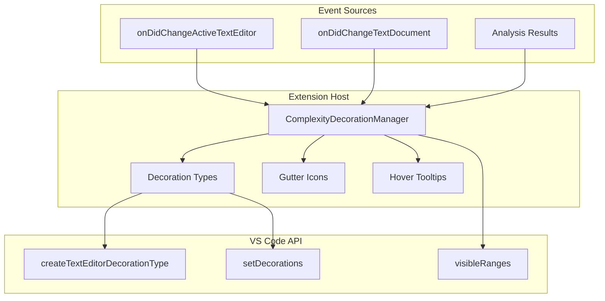
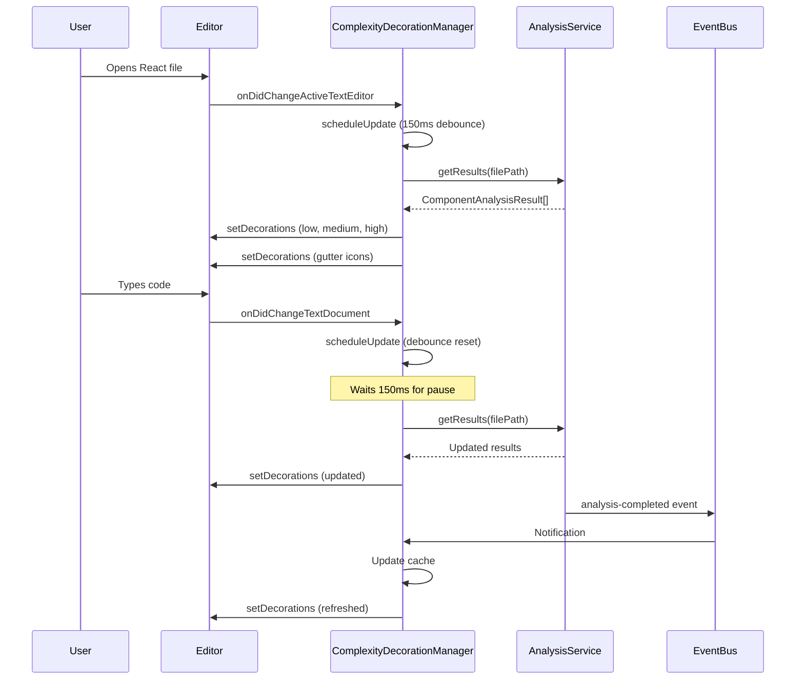

# Phase 8D: Editor Decorations

**Parent Document:** `phase-index.md`
**Duration:** 1 day
**Complexity:** Medium
**Dependencies:** Phase 07 (LSP Foundation), Phase 8C (Sidebar Panel)
**Primary Agent:** vscode-plugin-engineer
**Status:** Planned

## Overview

Phase 8D implements visual editor decorations that highlight code regions based on complexity scores. This includes background highlighting for complex functions, gutter icons indicating complexity grades, and rich hover tooltips with detailed breakdowns. The decorations integrate with the analyzer results from Phase 8C's aggregation service and provide real-time visual feedback as developers work.

### Objectives

1. Create `TextEditorDecorationType` instances for low, medium, and high complexity levels
2. Apply background highlighting to React component function bodies
3. Display gutter icons with grade indicators (A through F)
4. Provide hover tooltips with complexity dimension breakdowns
5. Optimize performance to prevent typing lag

### Key Deliverables

| Deliverable                   | Description                                                         |
| ----------------------------- | ------------------------------------------------------------------- |
| `ComplexityDecorationManager` | Central class managing all decoration operations                    |
| Decoration Types              | Three background decoration types plus gutter icon decorations      |
| SVG Gutter Icons              | Five grade-specific icons (A, B, C, D, F) as data URIs              |
| Configuration Integration     | Respects `vipr.showDecorations` and `vipr.decorationStyle` settings |

---

## Technical Specification

### Architecture Overview



### ComplexityDecorationManager Class

```typescript
/**
 * Manages editor decorations for complexity visualization.
 * Creates and applies decorations based on analysis results.
 */
class ComplexityDecorationManager implements vscode.Disposable {
  /**
   * Decoration types for each complexity level.
   */
  private readonly lowDecorationType: vscode.TextEditorDecorationType;
  private readonly mediumDecorationType: vscode.TextEditorDecorationType;
  private readonly highDecorationType: vscode.TextEditorDecorationType;

  /**
   * Gutter icon decoration types for each grade.
   */
  private readonly gutterDecorationTypes: Map<Grade, vscode.TextEditorDecorationType>;

  /**
   * Analysis results cache for current documents.
   */
  private readonly resultsCache: Map<string, ComponentAnalysisResult[]>;

  /**
   * Debounce timer for update operations.
   */
  private updateDebounceTimer: NodeJS.Timeout | undefined;

  /**
   * Disposables for cleanup.
   */
  private readonly disposables: vscode.Disposable[] = [];

  constructor(
    private readonly context: vscode.ExtensionContext,
    private readonly analysisService: AnalysisService,
    private readonly eventBus: EventBus
  ) {
    // Initialize decoration types
    this.lowDecorationType = this.createLowDecorationType();
    this.mediumDecorationType = this.createMediumDecorationType();
    this.highDecorationType = this.createHighDecorationType();
    this.gutterDecorationTypes = this.createGutterDecorationTypes();
    this.resultsCache = new Map();

    // Register event handlers
    this.registerEventHandlers();
  }

  /**
   * Update decorations for the active editor.
   */
  public async updateDecorations(editor: vscode.TextEditor): Promise<void> {
    // Implementation details below
  }

  /**
   * Clear all decorations from an editor.
   */
  public clearDecorations(editor: vscode.TextEditor): void {
    editor.setDecorations(this.lowDecorationType, []);
    editor.setDecorations(this.mediumDecorationType, []);
    editor.setDecorations(this.highDecorationType, []);

    for (const gutterType of this.gutterDecorationTypes.values()) {
      editor.setDecorations(gutterType, []);
    }
  }

  /**
   * Dispose of all resources.
   */
  public dispose(): void {
    this.lowDecorationType.dispose();
    this.mediumDecorationType.dispose();
    this.highDecorationType.dispose();

    for (const gutterType of this.gutterDecorationTypes.values()) {
      gutterType.dispose();
    }

    if (this.updateDebounceTimer) {
      clearTimeout(this.updateDebounceTimer);
    }

    this.disposables.forEach(d => d.dispose());
  }
}
```

---

## Decoration Types

### Low Complexity Decoration

Applied to components with scores below 30 (grades A and B).

```typescript
private createLowDecorationType(): vscode.TextEditorDecorationType {
  return vscode.window.createTextEditorDecorationType({
    backgroundColor: 'rgba(76, 175, 80, 0.1)',
    isWholeLine: false,
    rangeBehavior: vscode.DecorationRangeBehavior.ClosedClosed,
    overviewRulerColor: 'rgba(76, 175, 80, 0.6)',
    overviewRulerLane: vscode.OverviewRulerLane.Right,
    light: {
      backgroundColor: 'rgba(76, 175, 80, 0.08)'
    },
    dark: {
      backgroundColor: 'rgba(76, 175, 80, 0.12)'
    }
  });
}
```

### Medium Complexity Decoration

Applied to components with scores between 30 and 50 (grade C).

```typescript
private createMediumDecorationType(): vscode.TextEditorDecorationType {
  return vscode.window.createTextEditorDecorationType({
    backgroundColor: 'rgba(255, 193, 7, 0.1)',
    isWholeLine: false,
    rangeBehavior: vscode.DecorationRangeBehavior.ClosedClosed,
    overviewRulerColor: 'rgba(255, 193, 7, 0.6)',
    overviewRulerLane: vscode.OverviewRulerLane.Right,
    light: {
      backgroundColor: 'rgba(249, 168, 37, 0.08)'
    },
    dark: {
      backgroundColor: 'rgba(253, 216, 53, 0.12)'
    }
  });
}
```

### High Complexity Decoration

Applied to components with scores 50 and above (grades D and F).

```typescript
private createHighDecorationType(): vscode.TextEditorDecorationType {
  return vscode.window.createTextEditorDecorationType({
    backgroundColor: 'rgba(244, 67, 54, 0.1)',
    isWholeLine: false,
    rangeBehavior: vscode.DecorationRangeBehavior.ClosedClosed,
    overviewRulerColor: 'rgba(244, 67, 54, 0.6)',
    overviewRulerLane: vscode.OverviewRulerLane.Right,
    light: {
      backgroundColor: 'rgba(211, 47, 47, 0.10)'
    },
    dark: {
      backgroundColor: 'rgba(255, 82, 82, 0.14)'
    }
  });
}
```

### DecorationRenderOptions Reference

| Property             | Low (Green)              | Medium (Yellow)          | High (Red)               |
| -------------------- | ------------------------ | ------------------------ | ------------------------ |
| `backgroundColor`    | `rgba(76, 175, 80, 0.1)` | `rgba(255, 193, 7, 0.1)` | `rgba(244, 67, 54, 0.1)` |
| `overviewRulerColor` | `rgba(76, 175, 80, 0.6)` | `rgba(255, 193, 7, 0.6)` | `rgba(244, 67, 54, 0.6)` |
| Score Threshold      | < 30                     | 30 - 49                  | >= 50                    |
| Grades               | A, B                     | C                        | D, F                     |

---

## Gutter Icons

### SVG Icon Specifications

All gutter icons are 16x16 pixels, rendered as inline data URIs for portability.

#### Grade A Icon (Green Checkmark)

```svg
<svg width="16" height="16" viewBox="0 0 16 16" xmlns="http://www.w3.org/2000/svg">
  <circle cx="8" cy="8" r="7" fill="#22863a" opacity="0.9"/>
  <path d="M5 8 L7 10 L11 6" stroke="white" stroke-width="1.5" fill="none" stroke-linecap="round" stroke-linejoin="round"/>
</svg>
```

#### Grade B Icon (Blue Circle)

```svg
<svg width="16" height="16" viewBox="0 0 16 16" xmlns="http://www.w3.org/2000/svg">
  <circle cx="8" cy="8" r="7" fill="#0366d6" opacity="0.9"/>
  <text x="8" y="11" font-size="9" fill="white" text-anchor="middle" font-weight="bold" font-family="system-ui">B</text>
</svg>
```

#### Grade C Icon (Yellow Warning)

```svg
<svg width="16" height="16" viewBox="0 0 16 16" xmlns="http://www.w3.org/2000/svg">
  <path d="M8 2 L15 14 L1 14 Z" fill="#f9a825" opacity="0.9"/>
  <text x="8" y="12" font-size="8" fill="#000" text-anchor="middle" font-weight="bold" font-family="system-ui">!</text>
</svg>
```

#### Grade D Icon (Orange Warning)

```svg
<svg width="16" height="16" viewBox="0 0 16 16" xmlns="http://www.w3.org/2000/svg">
  <circle cx="8" cy="8" r="7" fill="#f57c00" opacity="0.9"/>
  <text x="8" y="11" font-size="9" fill="white" text-anchor="middle" font-weight="bold" font-family="system-ui">!</text>
</svg>
```

#### Grade F Icon (Red Error)

```svg
<svg width="16" height="16" viewBox="0 0 16 16" xmlns="http://www.w3.org/2000/svg">
  <circle cx="8" cy="8" r="7" fill="#d32f2f" opacity="0.9"/>
  <path d="M5 5 L11 11 M11 5 L5 11" stroke="white" stroke-width="1.5" stroke-linecap="round"/>
</svg>
```

### Gutter Icon Implementation

```typescript
private createGutterDecorationTypes(): Map<Grade, vscode.TextEditorDecorationType> {
  const types = new Map<Grade, vscode.TextEditorDecorationType>();

  const iconData: Record<Grade, string> = {
    A: this.createGutterIconDataUri('A'),
    B: this.createGutterIconDataUri('B'),
    C: this.createGutterIconDataUri('C'),
    D: this.createGutterIconDataUri('D'),
    F: this.createGutterIconDataUri('F')
  };

  for (const [grade, dataUri] of Object.entries(iconData)) {
    types.set(grade as Grade, vscode.window.createTextEditorDecorationType({
      gutterIconPath: vscode.Uri.parse(dataUri),
      gutterIconSize: 'contain'
    }));
  }

  return types;
}

private createGutterIconDataUri(grade: Grade): string {
  const svgContent = this.getGutterIconSvg(grade);
  const encoded = Buffer.from(svgContent).toString('base64');
  return `data:image/svg+xml;base64,${encoded}`;
}

private getGutterIconSvg(grade: Grade): string {
  const icons: Record<Grade, string> = {
    A: `<svg width="16" height="16" viewBox="0 0 16 16" xmlns="http://www.w3.org/2000/svg">
          <circle cx="8" cy="8" r="7" fill="#22863a" opacity="0.9"/>
          <path d="M5 8 L7 10 L11 6" stroke="white" stroke-width="1.5" fill="none" stroke-linecap="round" stroke-linejoin="round"/>
        </svg>`,
    B: `<svg width="16" height="16" viewBox="0 0 16 16" xmlns="http://www.w3.org/2000/svg">
          <circle cx="8" cy="8" r="7" fill="#0366d6" opacity="0.9"/>
          <text x="8" y="11" font-size="9" fill="white" text-anchor="middle" font-weight="bold" font-family="system-ui">B</text>
        </svg>`,
    C: `<svg width="16" height="16" viewBox="0 0 16 16" xmlns="http://www.w3.org/2000/svg">
          <path d="M8 2 L15 14 L1 14 Z" fill="#f9a825" opacity="0.9"/>
          <text x="8" y="12" font-size="8" fill="#000" text-anchor="middle" font-weight="bold" font-family="system-ui">!</text>
        </svg>`,
    D: `<svg width="16" height="16" viewBox="0 0 16 16" xmlns="http://www.w3.org/2000/svg">
          <circle cx="8" cy="8" r="7" fill="#f57c00" opacity="0.9"/>
          <text x="8" y="11" font-size="9" fill="white" text-anchor="middle" font-weight="bold" font-family="system-ui">!</text>
        </svg>`,
    F: `<svg width="16" height="16" viewBox="0 0 16 16" xmlns="http://www.w3.org/2000/svg">
          <circle cx="8" cy="8" r="7" fill="#d32f2f" opacity="0.9"/>
          <path d="M5 5 L11 11 M11 5 L5 11" stroke="white" stroke-width="1.5" stroke-linecap="round"/>
        </svg>`
  };
  return icons[grade];
}
```

### Icon Color Reference

| Grade | Fill Color | Icon Type          | Description                 |
| ----- | ---------- | ------------------ | --------------------------- |
| A     | `#22863a`  | Checkmark          | Excellent - no issues       |
| B     | `#0366d6`  | Letter B           | Good - minor concerns       |
| C     | `#f9a825`  | Warning triangle   | Fair - consider refactoring |
| D     | `#f57c00`  | Exclamation circle | Poor - needs attention      |
| F     | `#d32f2f`  | X mark             | Critical - must refactor    |

---

## Hover Tooltips

### MarkdownString Content Structure

Hover tooltips provide detailed complexity breakdowns using VS Code's MarkdownString API.

```typescript
private createHoverTooltip(result: ComponentAnalysisResult): vscode.MarkdownString {
  const md = new vscode.MarkdownString();
  md.isTrusted = true;
  md.supportHtml = true;

  // Header with score and grade
  md.appendMarkdown(`### Complexity: ${result.complexity.total.toFixed(1)} (Grade ${result.complexity.grade})\n\n`);

  // Dimension breakdown table
  md.appendMarkdown(`**Dimension Scores:**\n\n`);
  md.appendMarkdown(`| Dimension | Score | Weight | Contribution |\n`);
  md.appendMarkdown(`|-----------|-------|--------|-------------|\n`);

  const dimensions = [
    { name: 'Structural', score: result.complexity.structural.score, weight: 0.20 },
    { name: 'Hooks', score: result.complexity.hooks.score, weight: 0.25 },
    { name: 'Temporal', score: result.complexity.temporal.score, weight: 0.25 },
    { name: 'Coupling', score: result.complexity.coupling.score, weight: 0.15 },
    { name: 'Identity', score: result.complexity.identity.score, weight: 0.15 }
  ];

  for (const dim of dimensions) {
    const contribution = (dim.score * dim.weight).toFixed(1);
    md.appendMarkdown(`| ${dim.name} | ${dim.score.toFixed(1)} | ${(dim.weight * 100).toFixed(0)}% | ${contribution} |\n`);
  }

  // Primary issues
  if (result.complexity.insights.length > 0) {
    md.appendMarkdown(`\n**Primary Issues:**\n\n`);
    const topIssues = result.complexity.insights.slice(0, 3);
    for (const insight of topIssues) {
      md.appendMarkdown(`- ${insight.message}\n`);
    }
  }

  // Action links
  md.appendMarkdown(`\n---\n\n`);
  md.appendMarkdown(`[View Full Report](command:vipr.showComponentDetails?${encodeURIComponent(JSON.stringify({ componentId: result.componentId }))}) | `);
  md.appendMarkdown(`[Show Suggestions](command:vipr.showRefactoringSuggestions?${encodeURIComponent(JSON.stringify({ componentId: result.componentId }))})`);

  return md;
}
```

### Tooltip Example Output

```
### Complexity: 58.3 (Grade C)

**Dimension Scores:**

| Dimension  | Score | Weight | Contribution |
|------------|-------|--------|--------------|
| Structural | 18.2  | 20%    | 3.6          |
| Hooks      | 15.4  | 25%    | 3.9          |
| Temporal   | 12.1  | 25%    | 3.0          |
| Coupling   | 8.3   | 15%    | 1.2          |
| Identity   | 4.3   | 15%    | 0.6          |

**Primary Issues:**

- Component uses 12 hooks - consider extracting to custom hook
- 3 effects with missing dependency arrays
- Deep nesting detected (5 levels)

---

[View Full Report] | [Show Suggestions]
```

---

## Performance Optimization

### Debounced Decoration Updates

Updates are debounced to prevent excessive recomputation during typing.

```typescript
private scheduleUpdate(editor: vscode.TextEditor): void {
  if (this.updateDebounceTimer) {
    clearTimeout(this.updateDebounceTimer);
  }

  this.updateDebounceTimer = setTimeout(() => {
    this.performUpdate(editor);
  }, 150); // 150ms debounce delay
}

private async performUpdate(editor: vscode.TextEditor): Promise<void> {
  const config = vscode.workspace.getConfiguration('vipr');
  if (!config.get<boolean>('showDecorations', true)) {
    this.clearDecorations(editor);
    return;
  }

  const filePath = editor.document.uri.fsPath;

  // Get analysis results (from cache or fresh analysis)
  const results = await this.analysisService.getResults(filePath);
  if (!results || results.length === 0) {
    return;
  }

  // Apply decorations within visible viewport
  await this.applyDecorations(editor, results);
}
```

### Viewport-Only Decoration

Only decorate components within the visible viewport plus a buffer zone.

```typescript
private async applyDecorations(
  editor: vscode.TextEditor,
  results: ComponentAnalysisResult[]
): Promise<void> {
  // Get visible ranges with 50-line buffer
  const visibleRanges = this.getBufferedVisibleRanges(editor, 50);

  // Filter results to only visible components
  const visibleResults = results.filter(result =>
    this.isRangeVisible(result.range, visibleRanges)
  );

  // Group by complexity level
  const lowDecorations: vscode.DecorationOptions[] = [];
  const mediumDecorations: vscode.DecorationOptions[] = [];
  const highDecorations: vscode.DecorationOptions[] = [];
  const gutterDecorations = new Map<Grade, vscode.DecorationOptions[]>();

  for (const result of visibleResults) {
    const range = this.toVsCodeRange(result.range);
    const hoverMessage = this.createHoverTooltip(result);

    const decoration: vscode.DecorationOptions = {
      range,
      hoverMessage
    };

    // Categorize by score
    const score = result.complexity.total;
    if (score < 30) {
      lowDecorations.push(decoration);
    } else if (score < 50) {
      mediumDecorations.push(decoration);
    } else {
      highDecorations.push(decoration);
    }

    // Add gutter icon at component start line
    const grade = result.complexity.grade;
    const gutterRange = new vscode.Range(
      result.range.startLine,
      0,
      result.range.startLine,
      0
    );

    if (!gutterDecorations.has(grade)) {
      gutterDecorations.set(grade, []);
    }
    gutterDecorations.get(grade)!.push({ range: gutterRange, hoverMessage });
  }

  // Apply all decorations
  editor.setDecorations(this.lowDecorationType, lowDecorations);
  editor.setDecorations(this.mediumDecorationType, mediumDecorations);
  editor.setDecorations(this.highDecorationType, highDecorations);

  for (const [grade, decorations] of gutterDecorations) {
    const decorationType = this.gutterDecorationTypes.get(grade);
    if (decorationType) {
      editor.setDecorations(decorationType, decorations);
    }
  }
}

private getBufferedVisibleRanges(
  editor: vscode.TextEditor,
  buffer: number
): vscode.Range[] {
  return editor.visibleRanges.map(range => {
    const startLine = Math.max(0, range.start.line - buffer);
    const endLine = Math.min(
      editor.document.lineCount - 1,
      range.end.line + buffer
    );
    return new vscode.Range(startLine, 0, endLine, Number.MAX_SAFE_INTEGER);
  });
}

private isRangeVisible(
  componentRange: LocationRange,
  visibleRanges: vscode.Range[]
): boolean {
  return visibleRanges.some(visible =>
    componentRange.startLine `<=` visible.end.line &&
    componentRange.endLine >= visible.start.line
  );
}
```

### Efficient Decoration Clearing

```typescript
public clearDecorations(editor: vscode.TextEditor): void {
  // Clear background decorations
  editor.setDecorations(this.lowDecorationType, []);
  editor.setDecorations(this.mediumDecorationType, []);
  editor.setDecorations(this.highDecorationType, []);

  // Clear all gutter decorations
  for (const decorationType of this.gutterDecorationTypes.values()) {
    editor.setDecorations(decorationType, []);
  }
}
```

---

## Event Handling

### Event Registration

```typescript
private registerEventHandlers(): void {
  // Active editor changed
  this.disposables.push(
    vscode.window.onDidChangeActiveTextEditor(editor => {
      if (editor && this.isReactFile(editor.document)) {
        this.scheduleUpdate(editor);
      }
    })
  );

  // Document content changed
  this.disposables.push(
    vscode.workspace.onDidChangeTextDocument(event => {
      const editor = vscode.window.activeTextEditor;
      if (editor && editor.document === event.document && this.isReactFile(event.document)) {
        this.scheduleUpdate(editor);
      }
    })
  );

  // Visible ranges changed (scrolling)
  this.disposables.push(
    vscode.window.onDidChangeTextEditorVisibleRanges(event => {
      if (this.isReactFile(event.textEditor.document)) {
        this.scheduleUpdate(event.textEditor);
      }
    })
  );

  // Analysis results updated
  this.disposables.push(
    this.eventBus.on('analysis-completed', (event) => {
      const editor = vscode.window.activeTextEditor;
      if (editor && editor.document.uri.fsPath === event.payload.filePath) {
        this.resultsCache.set(event.payload.filePath, event.payload.results);
        this.scheduleUpdate(editor);
      }
    })
  );

  // Configuration changed
  this.disposables.push(
    vscode.workspace.onDidChangeConfiguration(event => {
      if (event.affectsConfiguration('vipr.showDecorations') ||
          event.affectsConfiguration('vipr.decorationStyle')) {
        const editor = vscode.window.activeTextEditor;
        if (editor) {
          this.scheduleUpdate(editor);
        }
      }
    })
  );
}

private isReactFile(document: vscode.TextDocument): boolean {
  return ['typescriptreact', 'javascriptreact'].includes(document.languageId);
}
```

### Event Flow Diagram



---

## Implementation Steps

### Step 1: Create Decoration Types (2 hours)

1. Create `src/decorations/complexityDecorations.ts`
2. Define `DecorationRenderOptions` for low, medium, and high complexity
3. Implement light and dark theme variants
4. Add overview ruler lane indicators

### Step 2: Build Gutter Icons (1 hour)

1. Create `src/decorations/gutterIcons.ts`
2. Define SVG templates for each grade (A through F)
3. Implement data URI generation
4. Create gutter decoration types

### Step 3: Implement Decoration Manager (3 hours)

1. Create `ComplexityDecorationManager` class
2. Implement debounced update scheduling
3. Add viewport-aware decoration application
4. Integrate with analysis results cache

### Step 4: Add Hover Tooltips (1 hour)

1. Implement `createHoverTooltip` method
2. Format dimension breakdown as markdown table
3. Add command links for detailed view
4. Handle edge cases (empty insights, missing data)

### Step 5: Register Event Handlers (1 hour)

1. Subscribe to `onDidChangeActiveTextEditor`
2. Subscribe to `onDidChangeTextDocument`
3. Subscribe to `onDidChangeTextEditorVisibleRanges`
4. Subscribe to analysis completed events

### Step 6: Integrate Configuration Support (1 hour)

1. Read `vipr.showDecorations` setting
2. Read `vipr.decorationStyle` setting
3. Handle configuration change events
4. Apply settings to decoration behavior

### Step 7: Testing and Optimization (2 hours)

1. Test with large files (1000+ lines)
2. Measure typing latency impact
3. Verify decoration cleanup on editor close
4. Test theme switching behavior

---

## Configuration Options

### Settings Schema

```typescript
interface DecorationConfiguration {
  /**
   * Enable/disable editor decorations.
   * @default true
   */
  showDecorations: boolean;

  /**
   * Decoration display style.
   * @default 'background'
   */
  decorationStyle: 'background' | 'border' | 'gutter';

  /**
   * Minimum grade to decorate.
   * @default 'C'
   */
  minimumGrade: Grade;

  /**
   * Debounce delay in milliseconds.
   * @default 150
   */
  decorationDebounceDelay: number;
}
```

### package.json Configuration Contribution

```json
{
  "contributes": {
    "configuration": {
      "title": "Vipr React Analyzer",
      "properties": {
        "vipr.showDecorations": {
          "type": "boolean",
          "default": true,
          "description": "Show background highlighting for complex code regions"
        },
        "vipr.decorationStyle": {
          "type": "string",
          "enum": ["background", "border", "gutter"],
          "default": "background",
          "description": "Style of complexity decorations"
        },
        "vipr.minimumGradeForDecoration": {
          "type": "string",
          "enum": ["A", "B", "C", "D", "F"],
          "default": "C",
          "description": "Minimum grade to show decorations (decorations shown for this grade and worse)"
        }
      }
    }
  }
}
```

---

## Acceptance Criteria

- [ ] Background highlighting applies to React component function bodies based on complexity score
- [ ] Gutter icons display the correct grade indicator (A, B, C, D, F) at component declaration lines
- [ ] Hovering over decorated regions shows complexity breakdown with dimension scores
- [ ] Hover tooltips include links to view full report and refactoring suggestions
- [ ] No visible typing lag when editing decorated files (target: < 16ms per keystroke)
- [ ] Decorations update within 300ms of document change completion
- [ ] Decorations clear properly when files are closed or extension is deactivated
- [ ] Respects `vipr.showDecorations` configuration toggle
- [ ] Respects `vipr.decorationStyle` configuration option
- [ ] Works correctly with both light and dark VS Code themes
- [ ] Overview ruler shows colored indicators for decorated regions
- [ ] Scrolling through large files does not cause performance degradation

---

## Testing Instructions

### Visual Verification

1. Open a React component file with known complexity scores
2. Verify background highlighting appears on component function bodies
3. Confirm colors match specification:
   - Green background for low complexity (score < 30)
   - Yellow background for medium complexity (30 `<=` score < 50)
   - Red background for high complexity (score >= 50)
4. Verify gutter icons appear at component declaration lines
5. Hover over decorated region and verify tooltip content

### Performance Measurement

1. Open a large React file (500+ lines, multiple components)
2. Use VS Code Developer Tools (Help > Toggle Developer Tools)
3. Open Performance tab and start recording
4. Type rapidly in the editor for 10 seconds
5. Stop recording and analyze:
   - Frame rate should stay above 60fps
   - No individual frame should exceed 16ms
   - Decoration update operations should complete within 150ms

### Theme Compatibility

1. Switch between light and dark themes
2. Verify decoration colors adjust appropriately
3. Confirm gutter icons remain visible in both themes
4. Check overview ruler indicators are visible

### Configuration Testing

1. Disable `vipr.showDecorations` and verify decorations disappear
2. Re-enable and verify decorations return
3. Change `vipr.decorationStyle` and verify behavior changes
4. Modify `vipr.minimumGradeForDecoration` and verify filter applies

### Edge Cases

1. Test with file containing zero React components
2. Test with file containing single-line components
3. Test with file open in multiple editor tabs
4. Test with split editor view
5. Test decoration behavior during undo/redo operations

---

## File Structure

```
vipr-vscode/
    src/
        decorations/
            index.ts                      # Barrel export
            complexityDecorations.ts      # ComplexityDecorationManager class
            gutterIcons.ts                # Gutter icon SVG definitions
            decorationTypes.ts            # Decoration type factory functions
            hoverTooltip.ts               # Hover tooltip content generation
        types/
            decorations.ts                # DecorationRange and related types
```

---

## Related Documents

| Document                    | Relationship                                 |
| --------------------------- | -------------------------------------------- |
| `phase-index.md`            | Parent document with dependency graph        |
| `metrics-visualization.md`  | Color specifications and grade thresholds    |
| `type-definitions.md`       | DecorationRange and related type definitions |
| `phase-8c-sidebar-panel.md` | Analysis service integration                 |

---

**Document Version:** 1.0
**Created:** 2026-01-10
**Last Updated:** 2026-01-10
**Status:** Ready for Implementation
