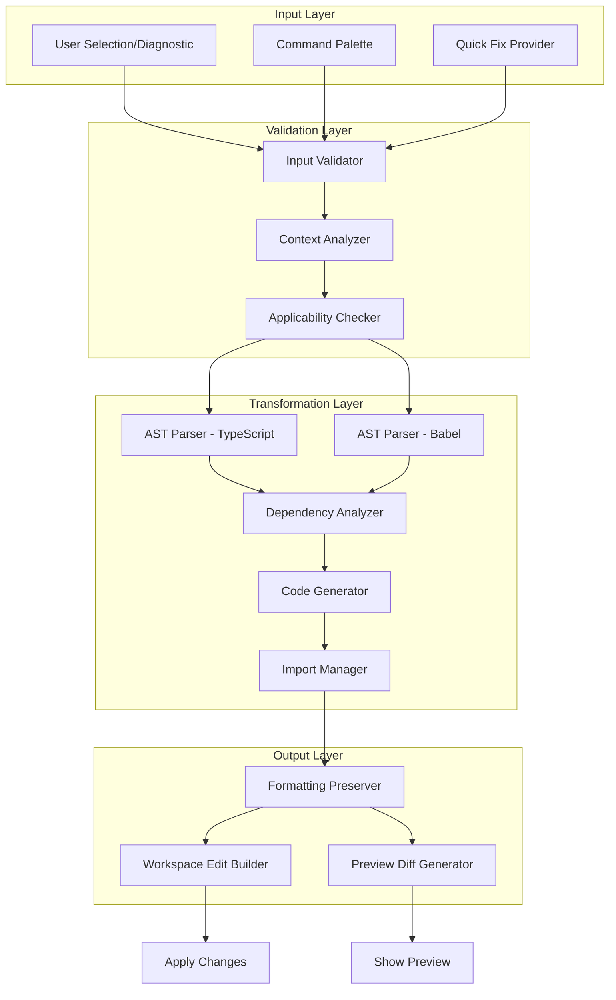

# Phase 8E: Refactoring Commands

**Parent Phase:** Phase 08 - VS Code Extension Features
**Duration:** 2 days
**Complexity:** Very High
**Dependencies:** Phase 8A (CodeLens), Phase 8B (Diagnostics and Quick Fixes)
**Primary Agent:** react-engineer
**Status:** Planning

## Overview

Phase 8E implements AST-based code transformation commands that enable automated refactoring of React components. These commands integrate with the quick fix provider (Phase 8B) and CodeLens actions (Phase 8A) to provide seamless code improvement workflows.

The refactoring engine uses TypeScript's compiler API combined with Babel AST parsing to perform safe, reversible transformations that preserve user formatting preferences while producing idiomatic React 18+ code.

### Core Objectives

1. Implement a robust AST transformation engine with formatting preservation
2. Deliver six core refactoring commands with input validation and error handling
3. Provide preview mode for diff visualization before applying changes
4. Ensure all refactorings produce valid TypeScript/JSX with proper imports
5. Maintain single-undo capability for atomic operations

### Success Metrics

| Metric                  | Target                                  | Measurement Method                     |
| ----------------------- | --------------------------------------- | -------------------------------------- |
| Transformation accuracy | 100% valid output                       | Automated TypeScript compilation tests |
| Import correctness      | 100% auto-updated                       | Static analysis verification           |
| Undo atomicity          | Single Ctrl+Z reverses all changes      | Manual testing                         |
| Error clarity           | User can fix 90% of errors without docs | User testing feedback                  |
| Performance             | Transform + preview < 500ms             | Performance profiling                  |

## Refactoring Engine Architecture



### TypeScript AST Parsing Strategy

The refactoring engine uses a dual-parser approach:

1. **TypeScript Compiler API** (`ts.createSourceFile`):
   - Primary parser for type information and symbol resolution
   - Used for dependency analysis and scope detection
   - Provides accurate type narrowing for validation

2. **Babel Parser** (`@babel/parser`, `@babel/traverse`):
   - Secondary parser for JSX transformation patterns
   - Used for hook detection and React-specific patterns
   - Provides flexible AST mutation capabilities

```typescript
interface RefactoringContext {
  // TypeScript AST for type analysis
  readonly tsSourceFile: ts.SourceFile;
  readonly tsProgram: ts.Program;
  readonly tsChecker: ts.TypeChecker;

  // Babel AST for transformations
  readonly babelAst: t.File;
  readonly babelPath: NodePath<t.Program>;

  // Source preservation
  readonly originalText: string;
  readonly formattingConfig: FormattingConfig;
}
```

### Source Transformation Approach

All transformations follow this pipeline:

1. **Parse**: Create both TypeScript and Babel ASTs from source
2. **Validate**: Ensure transformation is applicable and safe
3. **Analyze**: Identify dependencies, captured variables, and scope
4. **Generate**: Create new code using Babel builders (`t.functionDeclaration`, etc.)
5. **Preserve**: Apply user formatting preferences (semicolons, quotes, indentation)
6. **Import**: Update import statements automatically
7. **Build**: Create VS Code WorkspaceEdit with all changes
8. **Preview**: Generate diff for user review (if preview mode enabled)

### Formatting Preservation

The engine detects and preserves user formatting preferences:

```typescript
interface FormattingConfig {
  // Detected from source file
  readonly useSemicolons: boolean; // Detect trailing semicolons
  readonly quoteStyle: 'single' | 'double'; // Detect quote preference
  readonly indentStyle: 'tabs' | 'spaces'; // Detect indentation
  readonly indentSize: number; // Count spaces/tab width
  readonly lineEnding: '\n' | '\r\n'; // OS line ending
  readonly trailingComma: boolean; // Detect in objects/arrays
}

function detectFormatting(source: string): FormattingConfig {
  return {
    useSemicolons: /;\s*$/m.test(source),
    quoteStyle:
      (source.match(/'/g)?.length ?? 0) > (source.match(/"/g)?.length ?? 0) ? 'single' : 'double',
    indentStyle: /^\t/m.test(source) ? 'tabs' : 'spaces',
    indentSize: source.match(/^ +/m)?.[0].length ?? 2,
    lineEnding: source.includes('\r\n') ? '\r\n' : '\n',
    trailingComma: /,\s*[}\]]/m.test(source),
  };
}
```

### Import Management

Import statements are automatically updated using an import manager:

```typescript
interface ImportManager {
  /**
   * Add named import to existing or new import statement
   */
  addNamedImport(moduleSpecifier: string, importName: string): void;

  /**
   * Add default import if not present
   */
  addDefaultImport(moduleSpecifier: string, localName: string): void;

  /**
   * Remove unused imports after refactoring
   */
  removeUnusedImports(): void;

  /**
   * Generate import statement edits
   */
  getImportEdits(): TextEdit[];
}
```

Example usage:

```typescript
// Before refactoring
import { useState } from 'react';

// Refactoring adds useCallback usage
const manager = new ImportManager(sourceFile);
manager.addNamedImport('react', 'useCallback');

// After refactoring - import automatically updated
import { useState, useCallback } from 'react';
```

## Command Specifications

### Command: vipr.extractHook

**Purpose**: Extract selected hook calls into a custom hook file.

**Command ID**: `vipr.extractHook`

**Input Parameters**:

```typescript
interface ExtractHookInput {
  // Selected range containing hooks
  readonly range: vscode.Range;

  // Custom hook name (prompted from user)
  readonly hookName: string;

  // Target location for new hook file
  readonly targetFile?: 'new-file' | 'same-file';
}
```

#### AST Analysis Process

1. **Identify Hooks**: Traverse selected range to find all hook calls

   ```typescript
   const hookCalls: HookCall[] = [];
   traverse(babelAst, {
     CallExpression(path) {
       const hookName = getHookName(path);
       if (hookName && isInSelectedRange(path)) {
         hookCalls.push({
           type: hookName,
           variableName: getAssignedVariable(path),
           startLine: path.node.loc.start.line,
           code: generate(path.node).code,
         });
       }
     },
   });
   ```

2. **Find Dependencies**: Analyze variables referenced by hooks

   ```typescript
   const dependencies = new Set<string>();
   hookCalls.forEach(call => {
     traverse(call.ast, {
       Identifier(path) {
         if (isExternalReference(path, componentScope)) {
           dependencies.add(path.node.name);
         }
       },
     });
   });
   ```

3. **Determine Parameters**: External dependencies become hook parameters

   ```typescript
   const hookParams = Array.from(dependencies).map(dep => ({
     name: dep,
     type: inferType(dep, tsChecker),
   }));
   ```

4. **Determine Return Value**: Collected state/refs become return value

   ```typescript
   const returnValues = hookCalls.filter(call => call.variableName).map(call => call.variableName);

   const returnType =
     returnValues.length === 1
       ? inferType(returnValues[0], tsChecker)
       : `{ ${returnValues.join(', ')} }`;
   ```

#### Output Generation

```typescript
interface ExtractHookOutput {
  // New custom hook function
  readonly hookFunction: string;

  // Updated component with hook call
  readonly updatedComponent: string;

  // Import statements to add
  readonly imports: ImportChange[];

  // File changes
  readonly fileChanges: FileChange[];
}
```

#### Edge Cases

| Edge Case                               | Detection                              | Resolution                                 |
| --------------------------------------- | -------------------------------------- | ------------------------------------------ |
| Multiple interdependent hooks           | Analyze dependency graph between hooks | Include all dependent hooks in extraction  |
| Hook references props                   | Find prop usage in hook bodies         | Add props as hook parameters               |
| Hook modifies state used by other hooks | Track state variable references        | Include in return value with proper naming |
| Early returns in hook                   | Check for conditional hook calls       | Error - violates Rules of Hooks            |
| Hook uses closure over props            | Analyze scope chain                    | Destructure props in hook parameters       |

#### Transformation Example

**Before**:

```typescript
function UserProfile({ userId, apiUrl }: Props) {
  const [data, setData] = useState<User | null>(null);
  const [loading, setLoading] = useState(false);
  const [error, setError] = useState<Error | null>(null);

  useEffect(() => {
    setLoading(true);
    fetch(`${apiUrl}/users/${userId}`)
      .then(res => res.json())
      .then(setData)
      .catch(setError)
      .finally(() => setLoading(false));
  }, [userId, apiUrl]);

  return <div>{loading ? 'Loading...' : data?.name}</div>;
}
```

**After** (user inputs hook name: "useUserData"):

```typescript
// New file: hooks/useUserData.ts
import { useState, useEffect } from 'react';

interface UseUserDataParams {
  userId: string;
  apiUrl: string;
}

interface UseUserDataReturn {
  data: User | null;
  loading: boolean;
  error: Error | null;
}

function useUserData({ userId, apiUrl }: UseUserDataParams): UseUserDataReturn {
  const [data, setData] = useState<User | null>(null);
  const [loading, setLoading] = useState(false);
  const [error, setError] = useState<Error | null>(null);

  useEffect(() => {
    setLoading(true);
    fetch(`${apiUrl}/users/${userId}`)
      .then(res => res.json())
      .then(setData)
      .catch(setError)
      .finally(() => setLoading(false));
  }, [userId, apiUrl]);

  return { data, loading, error };
}

export default useUserData;

// Updated component file
import useUserData from './hooks/useUserData';

function UserProfile({ userId, apiUrl }: Props) {
  const { data, loading, error } = useUserData({ userId, apiUrl });
  return <div>{loading ? 'Loading...' : data?.name}</div>;
}
```

---

### Command: vipr.addDependencies

**Purpose**: Add missing dependencies to useEffect/useMemo/useCallback dependency arrays.

**Command ID**: `vipr.addDependencies`

**Input Parameters**:

```typescript
interface AddDependenciesInput {
  // Effect location from diagnostic
  readonly effectRange: vscode.Range;

  // Auto-detected missing dependencies
  readonly missingDeps: string[];
}
```

#### AST Analysis Process

1. **Find Hook Call**: Locate the useEffect/useCallback/useMemo call

   ```typescript
   traverse(babelAst, {
     CallExpression(path) {
       const hookName = getHookName(path);
       if (hookName && isEffectHook(hookName) && inRange(path, effectRange)) {
         targetHook = path;
       }
     },
   });
   ```

2. **Analyze Callback Body**: Find all variable references

   ```typescript
   const referencedVars = new Set<string>();
   const callback = targetHook.node.arguments[0];

   traverse(callback, {
     Identifier(path) {
       // Exclude: function params, local vars, built-ins
       if (!isLocalToCallback(path) && !isBuiltIn(path.node.name)) {
         referencedVars.add(path.node.name);
       }
     },
   });
   ```

3. **Filter to Props/State/Context**: Exclude constants and functions not needing deps

   ```typescript
   const dependencies = Array.from(referencedVars).filter(name => {
     const binding = scope.getBinding(name);
     // Include: props, useState results, useContext results
     // Exclude: constants, stable functions (marked with useCallback)
     return isReactiveDependency(binding);
   });
   ```

4. **Build Dependency Array**: Create or update array expression
   ```typescript
   const depArray = t.arrayExpression(dependencies.map(dep => t.identifier(dep)));
   ```

#### Edge Cases

| Edge Case                      | Detection                                 | Resolution                          |
| ------------------------------ | ----------------------------------------- | ----------------------------------- |
| No dependency array            | `args.length < 2`                         | Insert new array as second argument |
| Empty array `[]`               | `args[1].elements.length === 0`           | Replace with dependencies           |
| Partial dependencies           | Compare suggested vs. existing            | Merge and deduplicate               |
| Function dependencies          | Check if function is stable (useCallback) | Warn to wrap in useCallback first   |
| Object dependencies            | Check if object is memoized               | Suggest destructuring or useMemo    |
| Deep property access `user.id` | Detect member expressions                 | Add root object `user`              |

#### Transformation Example

**Before**:

```typescript
function SearchBox({ onSearch, defaultValue }) {
  const [query, setQuery] = useState(defaultValue);

  useEffect(() => {
    const timeoutId = setTimeout(() => {
      onSearch(query);
    }, 300);
    return () => clearTimeout(timeoutId);
  }); // Missing dependency array

  return <input value={query} onChange={e => setQuery(e.target.value)} />;
}
```

**After** (Option 1 - Add all dependencies):

```typescript
function SearchBox({ onSearch, defaultValue }) {
  const [query, setQuery] = useState(defaultValue);

  useEffect(() => {
    const timeoutId = setTimeout(() => {
      onSearch(query);
    }, 300);
    return () => clearTimeout(timeoutId);
  }, [onSearch, query]); // Added dependencies

  return <input value={query} onChange={e => setQuery(e.target.value)} />;
}
```

**After** (Option 2 - useRef pattern for callback):

```typescript
import { useState, useEffect, useRef } from 'react';

function SearchBox({ onSearch, defaultValue }) {
  const [query, setQuery] = useState(defaultValue);
  const onSearchRef = useRef(onSearch);

  useEffect(() => {
    onSearchRef.current = onSearch;
  });

  useEffect(() => {
    const timeoutId = setTimeout(() => {
      onSearchRef.current(query);
    }, 300);
    return () => clearTimeout(timeoutId);
  }, [query]); // Only query dependency

  return <input value={query} onChange={e => setQuery(e.target.value)} />;
}
```

---

### Command: vipr.extractCallback

**Purpose**: Extract inline function in JSX to useCallback hook.

**Command ID**: `vipr.extractCallback`

**Input Parameters**:

```typescript
interface ExtractCallbackInput {
  // Range of inline function expression
  readonly functionRange: vscode.Range;

  // Prop name (e.g., "onClick")
  readonly propName: string;
}
```

#### AST Analysis Process

1. **Extract Function Body**: Locate JSX attribute with inline function

   ```typescript
   traverse(babelAst, {
     JSXAttribute(path) {
       if (path.node.name.name === propName) {
         const value = path.node.value;
         if (t.isJSXExpressionContainer(value)) {
           const expr = value.expression;
           if (t.isArrowFunctionExpression(expr) || t.isFunctionExpression(expr)) {
             inlineFunction = expr;
           }
         }
       }
     },
   });
   ```

2. **Find Captured Variables**: Analyze closure dependencies

   ```typescript
   const capturedVars = new Set<string>();
   traverse(inlineFunction.body, {
     Identifier(path) {
       if (isExternalToFunction(path, inlineFunction)) {
         capturedVars.add(path.node.name);
       }
     },
   });
   ```

3. **Generate Callback Name**: Convert prop name to handler name

   ```typescript
   function generateCallbackName(propName: string): string {
     // onClick -> handleClick
     // onSubmit -> handleSubmit
     // onChange -> handleChange
     if (propName.startsWith('on')) {
       return 'handle' + propName.slice(2);
     }
     return 'handle' + capitalize(propName);
   }
   ```

4. **Build useCallback**: Create hook with dependencies

   ```typescript
   const callbackName = generateCallbackName(propName);
   const deps = Array.from(capturedVars);

   const useCallbackNode = t.variableDeclaration('const', [
     t.variableDeclarator(
       t.identifier(callbackName),
       t.callExpression(t.identifier('useCallback'), [
         inlineFunction,
         t.arrayExpression(deps.map(d => t.identifier(d))),
       ])
     ),
   ]);
   ```

#### Edge Cases

| Edge Case                       | Detection                                     | Resolution                                |
| ------------------------------- | --------------------------------------------- | ----------------------------------------- |
| Callback references props/state | Find identifiers in outer scope               | Add to useCallback dependencies           |
| Callback modifies state         | Check for `setState` calls                    | Ensure setter is in dependencies (stable) |
| Multiple similar callbacks      | Find other inline functions in same component | Suggest extracting all in one operation   |
| Async function                  | Check `async` keyword on function             | Preserve `async` in useCallback           |
| Event parameter usage           | Check function parameters                     | Preserve parameter names and types        |

#### Transformation Example

**Before**:

```typescript
function TodoItem({ id, text, onUpdate, onDelete }: Props) {
  const [editing, setEditing] = useState(false);

  return (
    <div>
      <span>{text}</span>
      <button onClick={() => onUpdate(id, text)}>Edit</button>
      <button onClick={() => onDelete(id)}>Delete</button>
      <button onClick={() => setEditing(!editing)}>Toggle</button>
    </div>
  );
}
```

**After**:

```typescript
import { useState, useCallback } from 'react';

function TodoItem({ id, text, onUpdate, onDelete }: Props) {
  const [editing, setEditing] = useState(false);

  const handleClick = useCallback(() => {
    onUpdate(id, text);
  }, [id, text, onUpdate]);

  const handleClick2 = useCallback(() => {
    onDelete(id);
  }, [id, onDelete]);

  const handleClick3 = useCallback(() => {
    setEditing(!editing);
  }, [editing]);

  return (
    <div>
      <span>{text}</span>
      <button onClick={handleClick}>Edit</button>
      <button onClick={handleClick2}>Delete</button>
      <button onClick={handleClick3}>Toggle</button>
    </div>
  );
}
```

---

### Command: vipr.moveComponent

**Purpose**: Move nested component definition to module scope.

**Command ID**: `vipr.moveComponent`

**Input Parameters**:

```typescript
interface MoveComponentInput {
  // Range of nested component definition
  readonly componentRange: vscode.Range;

  // Parent component name
  readonly parentComponent: string;
}
```

#### AST Analysis Process

1. **Find Parent Component**: Locate containing component function

   ```typescript
   let parentPath: NodePath | null = null;
   let nestedPath: NodePath | null = null;

   traverse(babelAst, {
     FunctionDeclaration(path) {
       if (isReactComponent(path.node) && containsRange(path, componentRange)) {
         nestedPath = findNestedComponent(path, componentRange);
         parentPath = path;
       }
     },
   });
   ```

2. **Extract Nested Component**: Get component definition

   ```typescript
   const nestedComponent = nestedPath.node;
   const componentName = nestedComponent.id?.name || 'UnnamedComponent';
   ```

3. **Analyze Captured Variables**: Find parent scope references

   ```typescript
   const capturedFromParent = new Set<string>();

   traverse(nestedComponent, {
     Identifier(path) {
       const binding = path.scope.getBinding(path.node.name);
       if (binding && isDefinedInParent(binding, parentPath)) {
         capturedFromParent.add(path.node.name);
       }
     },
   });
   ```

4. **Convert to Props Interface**: Create TypeScript interface

   ```typescript
   interface PropsInterfaceBuilder {
     build(capturedVars: Set<string>, tsChecker: ts.TypeChecker): string;
   }

   const propsInterface = `
   interface ${componentName}Props {
     ${Array.from(capturedVars)
       .map(v => `${v}: ${inferType(v, tsChecker)};`)
       .join('\n  ')}
   }
   `;
   ```

5. **Update Component Signature**: Add props parameter

   ```typescript
   // Before: function ChildComponent() { ... }
   // After: function ChildComponent({ prop1, prop2 }: ChildComponentProps) { ... }

   const propsParam = t.identifier('props');
   propsParam.typeAnnotation = t.tsTypeAnnotation(
     t.tsTypeReference(t.identifier(`${componentName}Props`))
   );

   nestedComponent.params = [propsParam];
   ```

6. **Update JSX Usage**: Pass captured values as props

   ```typescript
   // Before: <ChildComponent />
   // After: <ChildComponent prop1={prop1} prop2={prop2} />

   const jsxAttributes = Array.from(capturedVars).map(v =>
     t.jsxAttribute(t.jsxIdentifier(v), t.jsxExpressionContainer(t.identifier(v)))
   );
   ```

#### Edge Cases

| Edge Case                    | Detection                             | Resolution                             |
| ---------------------------- | ------------------------------------- | -------------------------------------- |
| Uses parent props            | Check binding scope                   | Pass as props to nested component      |
| Uses parent state            | Check for useState results            | Pass state and setter as props         |
| Modifies parent state        | Find `setState` calls                 | Pass setter function as prop           |
| Multiple nested components   | Count component definitions in parent | Extract all, resolve interdependencies |
| Nested component is memoized | Check for `React.memo` wrapper        | Preserve memo wrapper after move       |
| Uses parent context          | Check for `useContext` calls          | Keep context usage in nested component |

#### Transformation Example

**Before**:

```typescript
function Dashboard({ user, theme }: Props) {
  const [collapsed, setCollapsed] = useState(false);

  function Sidebar() {
    return (
      <aside className={theme}>
        <h2>{user.name}</h2>
        <button onClick={() => setCollapsed(!collapsed)}>
          Toggle
        </button>
      </aside>
    );
  }

  return (
    <div>
      <Sidebar />
      {!collapsed && <MainContent />}
    </div>
  );
}
```

**After**:

```typescript
import { useState, useCallback } from 'react';

interface SidebarProps {
  userName: string;
  theme: string;
  collapsed: boolean;
  onToggle: () => void;
}

function Sidebar({ userName, theme, collapsed, onToggle }: SidebarProps) {
  return (
    <aside className={theme}>
      <h2>{userName}</h2>
      <button onClick={onToggle}>
        Toggle
      </button>
    </aside>
  );
}

function Dashboard({ user, theme }: Props) {
  const [collapsed, setCollapsed] = useState(false);

  const handleToggle = useCallback(() => {
    setCollapsed(!collapsed);
  }, [collapsed]);

  return (
    <div>
      <Sidebar
        userName={user.name}
        theme={theme}
        collapsed={collapsed}
        onToggle={handleToggle}
      />
      {!collapsed && <MainContent />}
    </div>
  );
}
```

---

### Command: vipr.addCleanup

**Purpose**: Add cleanup function to useEffect hook.

**Command ID**: `vipr.addCleanup`

**Input Parameters**:

```typescript
interface AddCleanupInput {
  // Effect location without cleanup
  readonly effectRange: vscode.Range;

  // Cleanup type (auto-detected)
  readonly cleanupType: 'timer' | 'interval' | 'listener' | 'subscription' | 'generic';
}
```

#### AST Analysis Process

1. **Detect Cleanup Pattern**: Identify what needs cleanup

   ```typescript
   const cleanupPatterns = {
     timer: /setTimeout\s*\(/,
     interval: /setInterval\s*\(/,
     listener: /addEventListener\s*\(/,
     subscription: /\.subscribe\s*\(/,
   };

   function detectCleanupType(effectBody: string): CleanupType {
     for (const [type, pattern] of Object.entries(cleanupPatterns)) {
       if (pattern.test(effectBody)) {
         return type as CleanupType;
       }
     }
     return 'generic';
   }
   ```

2. **Find Cleanup Target**: Extract variable or call expression

   ```typescript
   // For timers: find setTimeout/setInterval call
   let cleanupTarget: t.CallExpression | null = null;

   traverse(effectCallback.body, {
     CallExpression(path) {
       if (t.isIdentifier(path.node.callee)) {
         if (['setTimeout', 'setInterval'].includes(path.node.callee.name)) {
           cleanupTarget = path.node;
         }
       }
     },
   });
   ```

3. **Generate Cleanup Code**: Create appropriate cleanup

   ```typescript
   function generateCleanup(type: CleanupType, target: CleanupTarget): t.Statement {
     switch (type) {
       case 'timer':
         return t.expressionStatement(
           t.callExpression(t.identifier('clearTimeout'), [t.identifier(target.varName)])
         );
       case 'interval':
         return t.expressionStatement(
           t.callExpression(t.identifier('clearInterval'), [t.identifier(target.varName)])
         );
       case 'listener':
         return t.expressionStatement(
           t.callExpression(
             t.memberExpression(t.identifier(target.element), t.identifier('removeEventListener')),
             [t.stringLiteral(target.eventName), t.identifier(target.handler)]
           )
         );
     }
   }
   ```

4. **Insert Return Statement**: Add cleanup to effect

   ```typescript
   const cleanupFunction = t.arrowFunctionExpression([], t.blockStatement([cleanupStatement]));

   const returnStatement = t.returnStatement(cleanupFunction);
   effectBody.body.push(returnStatement);
   ```

#### Cleanup Templates

| Pattern         | Detection               | Template                                            |
| --------------- | ----------------------- | --------------------------------------------------- |
| Timer           | `setTimeout(...)`       | `return () => clearTimeout(timerId);`               |
| Interval        | `setInterval(...)`      | `return () => clearInterval(intervalId);`           |
| Event Listener  | `addEventListener(...)` | `return () => removeEventListener(event, handler);` |
| Subscription    | `.subscribe(...)`       | `return () => subscription.unsubscribe();`          |
| AbortController | `new AbortController()` | `return () => controller.abort();`                  |

#### Edge Cases

| Edge Case                     | Detection                   | Resolution                          |
| ----------------------------- | --------------------------- | ----------------------------------- |
| Effect already has return     | Check for return statement  | Don't override existing cleanup     |
| Multiple timers/listeners     | Count cleanup-needing calls | Clean up all in one return function |
| Timer ID not stored           | No variable assignment      | Create variable to store ID         |
| Listener uses inline function | Function is not named       | Extract function to variable first  |
| Conditional cleanup needed    | Effect has branches         | Add cleanup only to relevant branch |

#### Transformation Example

**Before** (Timer without cleanup):

```typescript
function AutoSave({ data, onSave }) {
  useEffect(() => {
    setTimeout(() => {
      onSave(data);
    }, 5000);
  }, [data, onSave]);
}
```

**After**:

```typescript
function AutoSave({ data, onSave }) {
  useEffect(() => {
    const timerId = setTimeout(() => {
      onSave(data);
    }, 5000);

    return () => clearTimeout(timerId);
  }, [data, onSave]);
}
```

**Before** (Event listener without cleanup):

```typescript
function WindowSize() {
  const [size, setSize] = useState({ width: 0, height: 0 });

  useEffect(() => {
    const handleResize = () => {
      setSize({ width: window.innerWidth, height: window.innerHeight });
    };

    window.addEventListener('resize', handleResize);
  }, []);

  return <div>{size.width} x {size.height}</div>;
}
```

**After**:

```typescript
function WindowSize() {
  const [size, setSize] = useState({ width: 0, height: 0 });

  useEffect(() => {
    const handleResize = () => {
      setSize({ width: window.innerWidth, height: window.innerHeight });
    };

    window.addEventListener('resize', handleResize);

    return () => {
      window.removeEventListener('resize', handleResize);
    };
  }, []);

  return <div>{size.width} x {size.height}</div>;
}
```

---

### Command: vipr.wrapInRef

**Purpose**: Convert variable to useRef to avoid dependency issues.

**Command ID**: `vipr.wrapInRef`

**Input Parameters**:

```typescript
interface WrapInRefInput {
  // Variable causing dependency issues
  readonly variableName: string;

  // Effect that uses the variable
  readonly effectRange: vscode.Range;
}
```

#### AST Analysis Process

1. **Find Variable Declaration**: Locate the variable definition

   ```typescript
   let declarationPath: NodePath | null = null;

   traverse(babelAst, {
     VariableDeclarator(path) {
       if (t.isIdentifier(path.node.id) && path.node.id.name === variableName) {
         declarationPath = path;
       }
     },
   });
   ```

2. **Determine Variable Type**: Infer TypeScript type

   ```typescript
   const originalType = tsChecker.getTypeAtLocation(tsNode);
   const typeString = tsChecker.typeToString(originalType);
   ```

3. **Create useRef Wrapper**: Replace declaration with ref

   ```typescript
   const refDeclaration = t.variableDeclaration('const', [
     t.variableDeclarator(
       t.identifier(`${variableName}Ref`),
       t.callExpression(t.identifier('useRef'), [declarationPath.node.init])
     ),
   ]);
   ```

4. **Add Sync Effect**: Keep ref.current updated

   ```typescript
   const syncEffect = `
   useEffect(() => {
     ${variableName}Ref.current = ${variableName};
   });
   `;
   ```

5. **Update References**: Change usages to `.current`
   ```typescript
   traverse(effectBody, {
     Identifier(path) {
       if (path.node.name === variableName && !path.parentPath.isVariableDeclarator()) {
         path.replaceWith(
           t.memberExpression(t.identifier(`${variableName}Ref`), t.identifier('current'))
         );
       }
     },
   });
   ```

#### Transformation Example

**Before**:

```typescript
function DataFetcher({ onSuccess, onError }) {
  const [data, setData] = useState(null);

  useEffect(() => {
    fetch('/api/data')
      .then(res => res.json())
      .then(result => {
        setData(result);
        onSuccess(result); // onSuccess missing from deps
      })
      .catch(onError); // onError missing from deps
  }, []); // Empty deps - callbacks not included

  return <div>{JSON.stringify(data)}</div>;
}
```

**After**:

```typescript
import { useState, useEffect, useRef } from 'react';

function DataFetcher({ onSuccess, onError }) {
  const [data, setData] = useState(null);
  const onSuccessRef = useRef(onSuccess);
  const onErrorRef = useRef(onError);

  useEffect(() => {
    onSuccessRef.current = onSuccess;
  });

  useEffect(() => {
    onErrorRef.current = onError;
  });

  useEffect(() => {
    fetch('/api/data')
      .then(res => res.json())
      .then(result => {
        setData(result);
        onSuccessRef.current(result);
      })
      .catch(onErrorRef.current);
  }, []); // No callback dependencies needed

  return <div>{JSON.stringify(data)}</div>;
}
```

## Implementation Steps

### Step 1: RefactoringEngine Class Skeleton (2 hours)

Create the core refactoring engine with shared utilities:

```typescript
// src/commands/refactoringEngine.ts

import * as ts from 'typescript';
import * as t from '@babel/types';
import { parse } from '@babel/parser';
import traverse, { NodePath } from '@babel/traverse';
import generate from '@babel/generator';
import * as vscode from 'vscode';

export class RefactoringEngine {
  private tsProgram: ts.Program;
  private formattingConfig: FormattingConfig;

  constructor(
    private document: vscode.TextDocument,
    private config: vscode.WorkspaceConfiguration
  ) {
    this.tsProgram = this.createTsProgram();
    this.formattingConfig = this.detectFormatting();
  }

  /**
   * Parse document into dual AST representation
   */
  private parseDocument(): RefactoringContext {
    const sourceText = this.document.getText();

    // TypeScript AST
    const tsSourceFile = ts.createSourceFile(
      this.document.fileName,
      sourceText,
      ts.ScriptTarget.Latest,
      true
    );

    // Babel AST
    const babelAst = parse(sourceText, {
      sourceType: 'module',
      plugins: ['typescript', 'jsx'],
    });

    return {
      tsSourceFile,
      tsProgram: this.tsProgram,
      tsChecker: this.tsProgram.getTypeChecker(),
      babelAst,
      originalText: sourceText,
      formattingConfig: this.formattingConfig,
    };
  }

  /**
   * Detect user formatting preferences from source
   */
  private detectFormatting(): FormattingConfig {
    const source = this.document.getText();
    return detectFormatting(source);
  }

  /**
   * Generate code with user formatting preferences
   */
  protected generateCode(node: t.Node): string {
    const { code } = generate(node, {
      retainLines: false,
      compact: false,
      quotes: this.formattingConfig.quoteStyle === 'single' ? 'single' : 'double',
    });

    let formatted = code;

    // Apply semicolon preference
    if (!this.formattingConfig.useSemicolons) {
      formatted = formatted.replace(/;$/gm, '');
    }

    return formatted;
  }

  /**
   * Build WorkspaceEdit from file changes
   */
  protected buildWorkspaceEdit(changes: FileChange[]): vscode.WorkspaceEdit {
    const edit = new vscode.WorkspaceEdit();

    for (const change of changes) {
      const uri = vscode.Uri.file(change.filePath);

      for (const textEdit of change.edits) {
        const range = new vscode.Range(
          textEdit.range.startLine,
          textEdit.range.startColumn,
          textEdit.range.endLine,
          textEdit.range.endColumn
        );

        edit.replace(uri, range, textEdit.newText);
      }
    }

    return edit;
  }

  /**
   * Validate that refactoring is applicable
   */
  protected validateContext(range: vscode.Range): RefactoringError | null {
    // Override in subclasses
    return null;
  }

  /**
   * Execute refactoring with error handling
   */
  async execute(): Promise<RefactoringResult> {
    try {
      const context = this.parseDocument();
      const validation = this.validateContext(this.targetRange);

      if (validation) {
        return {
          success: false,
          changes: [],
          summary: { description: '', complexityImpact: null },
          error: validation,
        };
      }

      const changes = await this.performTransformation(context);
      const summary = this.buildSummary(changes);

      return {
        success: true,
        changes,
        summary,
      };
    } catch (error) {
      return {
        success: false,
        changes: [],
        summary: { description: '', complexityImpact: null },
        error: {
          message: error.message,
          code: 'UNKNOWN_ERROR',
          stack: error.stack,
        },
      };
    }
  }

  /**
   * Override in subclasses to implement transformation
   */
  protected async performTransformation(context: RefactoringContext): Promise<FileChange[]> {
    throw new Error('Not implemented');
  }

  /**
   * Generate human-readable summary
   */
  protected buildSummary(changes: FileChange[]): RefactoringSummary {
    // Calculate line changes
    let linesAdded = 0;
    let linesRemoved = 0;

    for (const change of changes) {
      for (const edit of change.edits) {
        const oldLines = edit.range.endLine - edit.range.startLine + 1;
        const newLines = edit.newText.split('\n').length;

        linesAdded += newLines;
        linesRemoved += oldLines;
      }
    }

    return {
      description: this.getDescription(),
      complexityImpact: this.estimateComplexityImpact(),
      filesAffected: changes.length,
      lineChanges: {
        added: linesAdded,
        removed: linesRemoved,
        net: linesAdded - linesRemoved,
      },
    };
  }

  protected abstract getDescription(): string;
  protected abstract estimateComplexityImpact(): ComplexityImpact | null;
}
```

### Step 2: Individual Command Implementations (8 hours)

Implement each refactoring command as a subclass:

```typescript
// src/commands/extractHook.ts

export class ExtractHookRefactoring extends RefactoringEngine {
  constructor(
    document: vscode.TextDocument,
    private range: vscode.Range,
    private hookName: string,
    config: vscode.WorkspaceConfiguration
  ) {
    super(document, config);
  }

  protected async performTransformation(context: RefactoringContext): Promise<FileChange[]> {
    // Implementation from command spec above
    const hookCalls = this.findHookCalls(context, this.range);
    const dependencies = this.analyzeDependencies(context, hookCalls);
    const hookFunction = this.generateHookFunction(hookCalls, dependencies);
    const updatedComponent = this.updateComponentWithHookCall(context, hookCalls);

    return [
      {
        filePath: this.document.fileName,
        edits: [
          /* component update edits */
        ],
        metadata: { isNewFile: false },
      },
      {
        filePath: this.getHookFilePath(),
        edits: [
          /* new hook file edits */
        ],
        metadata: {
          isNewFile: true,
          exports: [{ type: 'add', exportName: this.hookName, isDefault: true }],
        },
      },
    ];
  }

  protected getDescription(): string {
    return `Extracted hooks to custom hook '${this.hookName}'`;
  }

  protected estimateComplexityImpact(): ComplexityImpact {
    // Estimate based on number of hooks extracted
    const reduction = hookCalls.length * 2.5;
    return {
      before: originalComplexity,
      after: originalComplexity - reduction,
      reduction,
      percentageReduction: (reduction / originalComplexity) * 100,
    };
  }
}
```

Repeat similar implementations for:

- `AddDependenciesRefactoring`
- `ExtractCallbackRefactoring`
- `MoveComponentRefactoring`
- `AddCleanupRefactoring`
- `WrapInRefRefactoring`

### Step 3: Input Validation and Error Handling (2 hours)

Add robust validation for each command:

```typescript
export class RefactoringValidator {
  /**
   * Validate extract hook preconditions
   */
  static validateExtractHook(
    range: vscode.Range,
    hookName: string,
    context: RefactoringContext
  ): RefactoringError | null {
    // Check hook name format
    if (!hookName.startsWith('use')) {
      return {
        message: "Custom hook name must start with 'use' (e.g., useFormValidation)",
        code: 'INVALID_HOOK_NAME',
      };
    }

    // Check for camelCase
    if (!/^use[A-Z][a-zA-Z0-9]*$/.test(hookName)) {
      return {
        message: 'Hook name must be in camelCase (e.g., useUserData, not use_user_data)',
        code: 'INVALID_HOOK_NAME',
      };
    }

    // Check selection contains hooks
    const hookCalls = findHookCalls(context, range);
    if (hookCalls.length === 0) {
      return {
        message: 'Selection must contain at least one React hook call (useState, useEffect, etc.)',
        code: 'NO_HOOKS_FOUND',
      };
    }

    // Check hooks are at component top level (Rules of Hooks)
    for (const hook of hookCalls) {
      if (isInConditional(hook) || isInLoop(hook)) {
        return {
          message:
            'Cannot extract hooks that are called conditionally or in loops (violates Rules of Hooks)',
          code: 'CONDITIONAL_HOOK',
          location: getLocation(hook),
        };
      }
    }

    return null;
  }

  /**
   * Validate add dependencies preconditions
   */
  static validateAddDependencies(
    effectRange: vscode.Range,
    context: RefactoringContext
  ): RefactoringError | null {
    const effectCall = findEffectCall(context, effectRange);

    if (!effectCall) {
      return {
        message: 'No useEffect, useCallback, or useMemo found at this location',
        code: 'NO_EFFECT_HOOK',
      };
    }

    // Check if already has correct dependencies
    const current = getCurrentDependencies(effectCall);
    const suggested = analyzeDependencies(effectCall);

    if (arraysEqual(current, suggested)) {
      return {
        message: 'This hook already has all necessary dependencies',
        code: 'ALREADY_CORRECT',
      };
    }

    return null;
  }

  // Similar validators for other commands...
}
```

### Step 4: Preview Mode Implementation (2 hours)

Add diff preview capability:

```typescript
export class RefactoringPreview {
  /**
   * Generate diff preview for refactoring
   */
  static async showPreview(result: RefactoringResult): Promise<boolean> {
    if (!result.success) {
      vscode.window.showErrorMessage(result.error.message);
      return false;
    }

    // Create diff document
    const diffs = this.generateDiffs(result.changes);

    // Show in diff editor
    const accepted = await this.showDiffEditor(diffs);

    return accepted;
  }

  private static generateDiffs(changes: FileChange[]): DiffView[] {
    return changes.map(change => {
      const original = fs.readFileSync(change.filePath, 'utf-8');
      const modified = this.applyEditsToString(original, change.edits);

      return {
        filePath: change.filePath,
        original,
        modified,
        diff: this.computeDiff(original, modified),
      };
    });
  }

  private static async showDiffEditor(diffs: DiffView[]): Promise<boolean> {
    for (const diff of diffs) {
      const originalUri = vscode.Uri.parse(`refactoring-original:${diff.filePath}`);
      const modifiedUri = vscode.Uri.parse(`refactoring-modified:${diff.filePath}`);

      // Register text document content providers
      vscode.workspace.registerTextDocumentContentProvider('refactoring-original', {
        provideTextDocumentContent: () => diff.original,
      });

      vscode.workspace.registerTextDocumentContentProvider('refactoring-modified', {
        provideTextDocumentContent: () => diff.modified,
      });

      // Show diff
      await vscode.commands.executeCommand(
        'vscode.diff',
        originalUri,
        modifiedUri,
        `Refactoring Preview: ${path.basename(diff.filePath)}`
      );
    }

    // Prompt user to accept
    const choice = await vscode.window.showInformationMessage(
      'Apply this refactoring?',
      { modal: true },
      'Apply',
      'Cancel'
    );

    return choice === 'Apply';
  }
}
```

## Acceptance Criteria

- [ ] Each refactoring produces syntactically valid TypeScript/JSX code
- [ ] Generated code passes TypeScript compiler with no errors
- [ ] Import statements are automatically added when new hooks are used
- [ ] React imports updated when hooks are added (e.g., `useCallback` added to imports)
- [ ] Existing code formatting is preserved (semicolons, quotes, indentation)
- [ ] Single Ctrl+Z (Cmd+Z) undoes the entire refactoring atomically
- [ ] Clear, actionable error messages when refactoring is not applicable
- [ ] Preview mode shows accurate diff before applying changes
- [ ] All six commands work correctly on complex real-world components
- [ ] Refactoring commands integrate with quick fix provider (appear in lightbulb menu)
- [ ] Commands accessible via Command Palette
- [ ] Commands provide appropriate user prompts (e.g., hook name input)
- [ ] Escape key cancels ongoing refactoring during prompts
- [ ] Performance: Refactoring completes in < 500ms for components < 500 LOC

## Testing Instructions

### Test Suite 1: Extract Hook

**Test Case 1.1: Basic Data Fetching Pattern**

Input component:

```typescript
function UserProfile({ userId }) {
  const [data, setData] = useState(null);
  const [loading, setLoading] = useState(false);

  useEffect(() => {
    setLoading(true);
    fetch(`/api/users/${userId}`)
      .then(res => res.json())
      .then(setData)
      .finally(() => setLoading(false));
  }, [userId]);

  return <div>{loading ? 'Loading...' : data?.name}</div>;
}
```

Expected result:

- New file created: `hooks/useUserData.ts`
- Custom hook with proper TypeScript types
- Component updated with hook call
- Imports added correctly

**Test Case 1.2: Error Case - Conditional Hook**

Input:

```typescript
function MyComponent({ condition }) {
  if (condition) {
    useState(0); // Invalid - hook in conditional
  }
}
```

Expected error:

```
Cannot extract hooks that are called conditionally or in loops (violates Rules of Hooks)
```

### Test Suite 2: Add Dependencies

**Test Case 2.1: Missing Dependencies**

Input:

```typescript
useEffect(() => {
  fetchData(userId, query);
}, []); // Missing: userId, query
```

Expected result:

```typescript
useEffect(() => {
  fetchData(userId, query);
}, [userId, query]); // Dependencies added
```

**Test Case 2.2: Function Dependency (Warning)**

Input:

```typescript
const handleClick = () => {}; // Not wrapped in useCallback
useEffect(() => {
  handleClick();
}, []); // Missing: handleClick
```

Expected result:

- Dependency added: `[handleClick]`
- Warning shown: "Consider wrapping handleClick in useCallback for stability"

### Test Suite 3: Extract Callback

**Test Case 3.1: Simple Event Handler**

Input:

```typescript
<button onClick={() => handleDelete(id)}>Delete</button>
```

Expected result:

```typescript
const handleClick = useCallback(() => {
  handleDelete(id);
}, [id, handleDelete]);

return <button onClick={handleClick}>Delete</button>;
```

### Test Suite 4: Move Component

**Test Case 4.1: Nested Component with Props Usage**

Input:

```typescript
function Parent({ theme }) {
  const [count, setCount] = useState(0);

  function Child() {
    return <div className={theme}>{count}</div>;
  }

  return <Child />;
}
```

Expected result:

```typescript
interface ChildProps {
  theme: string;
  count: number;
}

function Child({ theme, count }: ChildProps) {
  return <div className={theme}>{count}</div>;
}

function Parent({ theme }) {
  const [count, setCount] = useState(0);
  return <Child theme={theme} count={count} />;
}
```

### Test Suite 5: Add Cleanup

**Test Case 5.1: Timer Cleanup**

Input:

```typescript
useEffect(() => {
  setTimeout(() => console.log('tick'), 1000);
}, []);
```

Expected result:

```typescript
useEffect(() => {
  const timerId = setTimeout(() => console.log('tick'), 1000);

  return () => clearTimeout(timerId);
}, []);
```

### Test Suite 6: Wrap in Ref

**Test Case 6.1: Callback Stability**

Input:

```typescript
function Component({ onComplete }) {
  useEffect(() => {
    doWork().then(onComplete);
  }, []); // Missing: onComplete
}
```

Expected result:

```typescript
function Component({ onComplete }) {
  const onCompleteRef = useRef(onComplete);

  useEffect(() => {
    onCompleteRef.current = onComplete;
  });

  useEffect(() => {
    doWork().then(onCompleteRef.current);
  }, []); // No dependency needed
}
```

## React-Specific Considerations

### Hook Rules Compliance

All refactorings must enforce React's Rules of Hooks:

1. **Only call hooks at the top level** - Reject extractions of hooks inside conditionals/loops
2. **Only call hooks from React functions** - Verify context is a component or custom hook
3. **Hook names must start with "use"** - Validate custom hook naming

```typescript
function validateRulesOfHooks(hookCall: NodePath): boolean {
  // Check top-level
  if (isInConditional(hookCall) || isInLoop(hookCall)) {
    return false;
  }

  // Check React function context
  const containingFunction = hookCall.getFunctionParent();
  if (!isReactFunction(containingFunction)) {
    return false;
  }

  return true;
}
```

### Dependency Array Correctness

The `addDependencies` command must implement React's exhaustive-deps lint rule:

```typescript
function computeExhaustiveDeps(effectCallback: t.Function, scope: Scope): string[] {
  const deps = new Set<string>();

  traverse(effectCallback.body, {
    Identifier(path) {
      // Include if:
      // 1. Not a local variable
      // 2. Not a function parameter
      // 3. Is props, state, or context value
      // 4. Is a function not wrapped in useCallback
      const binding = scope.getBinding(path.node.name);

      if (!binding) return; // Global or undefined
      if (binding.scope === effectCallback.scope) return; // Local to effect

      const bindingType = getBindingType(binding);
      if (['prop', 'state', 'context', 'unstable-function'].includes(bindingType)) {
        deps.add(path.node.name);
      }
    },
  });

  return Array.from(deps).sort();
}
```

### Memoization Best Practices

The `extractCallback` command should follow React performance best practices:

1. **Only memoize when necessary** - Don't wrap every function
2. **Prefer useCallback for functions passed to memoized components**
3. **Include all dependencies** - Never omit deps to "fix" re-renders

```typescript
function shouldMemoizeCallback(jsxAttribute: JSXAttributePath, componentAst: t.Node): boolean {
  // Memoize if:
  // 1. Passed to React.memo component
  // 2. Passed to memoized child (detected via props)
  // 3. Component has 5+ event handlers (organization)

  const element = jsxAttribute.parentPath.parentPath; // JSXOpeningElement
  const componentName = getComponentName(element);

  if (isMemoizedComponent(componentName, componentAst)) {
    return true;
  }

  const eventHandlerCount = countEventHandlers(componentAst);
  if (eventHandlerCount >= 5) {
    return true;
  }

  return false;
}
```

## Integration with Quick Fix Provider

Refactoring commands integrate with the Quick Fix Provider from Phase 8B:

```typescript
// In quickFixProvider.ts
export class ViprQuickFixProvider implements vscode.CodeActionProvider {
  provideCodeActions(
    document: vscode.TextDocument,
    range: vscode.Range,
    context: vscode.CodeActionContext
  ): vscode.CodeAction[] {
    const actions: vscode.CodeAction[] = [];

    for (const diagnostic of context.diagnostics) {
      if (diagnostic.source !== 'vipr') continue;

      switch (diagnostic.code) {
        case 'vipr/hooks/too-many':
          actions.push(this.createExtractHookAction(document, range, diagnostic));
          break;

        case 'vipr/temporal/missing-deps':
          actions.push(this.createAddDepsAction(document, range, diagnostic));
          break;

        case 'vipr/identity/inline-function':
          actions.push(this.createExtractCallbackAction(document, range, diagnostic));
          break;

        case 'vipr/structural/component-in-render':
          actions.push(this.createMoveComponentAction(document, range, diagnostic));
          break;

        case 'vipr/temporal/missing-cleanup':
          actions.push(this.createAddCleanupAction(document, range, diagnostic));
          break;
      }
    }

    return actions;
  }

  private createExtractHookAction(
    document: vscode.TextDocument,
    range: vscode.Range,
    diagnostic: vscode.Diagnostic
  ): vscode.CodeAction {
    const action = new vscode.CodeAction(
      'Extract to custom hook',
      vscode.CodeActionKind.RefactorExtract
    );

    action.command = {
      command: 'vipr.extractHook',
      title: 'Extract to custom hook',
      arguments: [document.uri, range],
    };

    action.isPreferred = true; // Show first in list
    action.diagnostics = [diagnostic];

    return action;
  }

  // Similar methods for other actions...
}
```

## File Structure

After implementation:

```
vipr-vscode/
  src/
    commands/
      refactoringEngine.ts          # Base engine class
      extractHook.ts                # Extract custom hook refactoring
      addDependencies.ts            # Fix dependency arrays
      extractCallback.ts            # Extract inline functions
      moveComponent.ts              # Move nested components
      addCleanup.ts                 # Add effect cleanup
      wrapInRef.ts                  # Wrap in useRef
      refactoringValidator.ts       # Input validation
      refactoringPreview.ts         # Diff preview
    utils/
      astHelpers.ts                 # Shared AST utilities
      importManager.ts              # Import statement management
      formattingDetector.ts         # User preference detection
      typeInference.ts              # TypeScript type helpers
    providers/
      quickFixProvider.ts           # Phase 8B - updated with command integration
```

## Error Messages

All error messages must be actionable and educational:

| Scenario                      | Error Message                                                                                                                                                                                 |
| ----------------------------- | --------------------------------------------------------------------------------------------------------------------------------------------------------------------------------------------- |
| Invalid hook selection        | "Selection must contain at least one React hook call (useState, useEffect, etc.). Learn more: [React Hooks Documentation](https://react.dev/reference/react)"                                 |
| Hook name invalid             | "Custom hook name must start with 'use' and be in camelCase (e.g., useFormValidation, not use_form_validation)"                                                                               |
| Cannot determine dependencies | "Unable to automatically determine dependencies for this effect. Please add dependency array manually. See: [useEffect dependencies](https://react.dev/reference/react/useEffect#parameters)" |
| Circular dependency           | "This refactoring would create a circular dependency between hooks. Consider restructuring your component."                                                                                   |
| Nested hook violation         | "Cannot extract hooks from nested functions. React hooks must be called at the component's top level. See: [Rules of Hooks](https://react.dev/reference/rules/rules-of-hooks)"                |
| Type inference failed         | "Unable to infer TypeScript types for extracted hook. Please add type annotations manually after refactoring."                                                                                |

## Performance Optimization

Refactoring operations must be fast and non-blocking:

```typescript
export class RefactoringPerformance {
  /**
   * Debounce preview updates to avoid excessive re-computation
   */
  private static previewDebouncer = debounce(result => {
    RefactoringPreview.showPreview(result);
  }, 150);

  /**
   * Cache AST parsing results
   */
  private static astCache = new Map<string, CachedAst>();

  /**
   * Parse document with caching
   */
  static parseDocumentCached(document: vscode.TextDocument): RefactoringContext {
    const key = `${document.uri.toString()}-${document.version}`;

    if (this.astCache.has(key)) {
      return this.astCache.get(key)!.context;
    }

    const context = parseDocument(document);
    this.astCache.set(key, {
      context,
      timestamp: Date.now(),
    });

    // Clean up old cache entries
    this.cleanCache();

    return context;
  }

  /**
   * Limit AST cache size
   */
  private static cleanCache(): void {
    if (this.astCache.size > 50) {
      const oldest = Array.from(this.astCache.entries())
        .sort((a, b) => a[1].timestamp - b[1].timestamp)
        .slice(0, 25);

      oldest.forEach(([key]) => this.astCache.delete(key));
    }
  }
}
```

## Documentation and Examples

Each command should have inline JSDoc with examples:

````typescript
/**
 * Extract selected hooks into a custom hook.
 *
 * @example
 * ```typescript
 * // Before
 * function MyComponent({ userId }) {
 *   const [data, setData] = useState(null);
 *   useEffect(() => {
 *     fetch(`/api/users/${userId}`).then(res => setData(res));
 *   }, [userId]);
 * }
 *
 * // Select the useState and useEffect, run "Extract to Custom Hook"
 * // Enter hook name: "useUserData"
 *
 * // After - new file hooks/useUserData.ts created
 * function useUserData(userId: string) {
 *   const [data, setData] = useState(null);
 *   useEffect(() => {
 *     fetch(`/api/users/${userId}`).then(res => setData(res));
 *   }, [userId]);
 *   return data;
 * }
 *
 * // Component updated
 * function MyComponent({ userId }) {
 *   const data = useUserData(userId);
 * }
 * ```
 *
 * @param uri - Document URI
 * @param range - Selected range containing hooks
 */
export async function extractHook(uri: vscode.Uri, range: vscode.Range): Promise<void> {
  // Implementation
}
````

---

**Document Version:** 1.0
**Created:** 2026-01-10
**Status:** Ready for Implementation
**Estimated Completion:** 2 days (16 hours development + testing)
