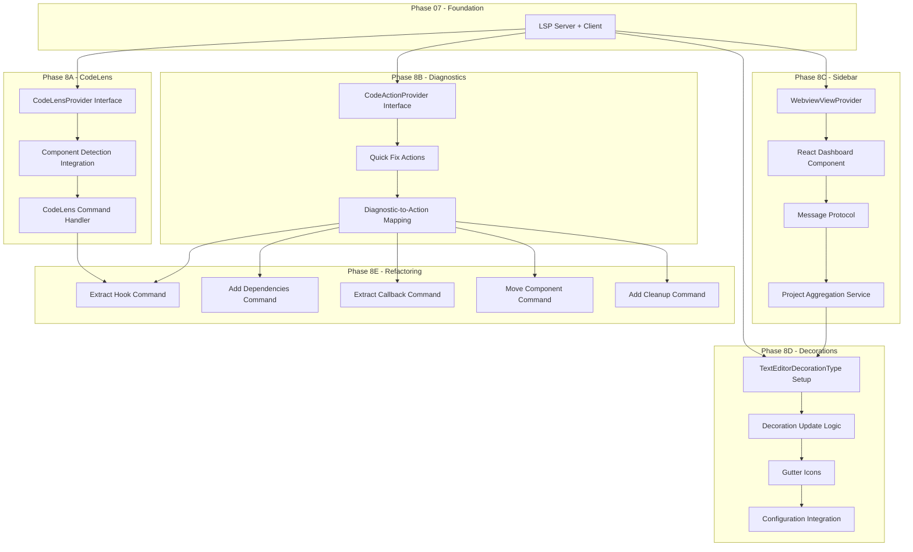
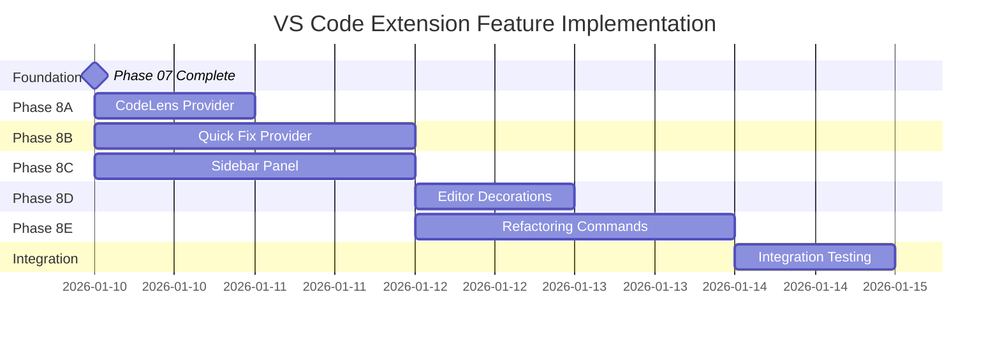

# VS Code Extension Feature Phases

**Parent Phase:** Phase 08 - VS Code Extension Features
**Foundation Dependency:** Phase 07 - VS Code Extension Foundation
**Total Duration:** 5-7 days
**Status:** Planning

## Overview

This document provides the master index and dependency map for implementing VS Code extension features. These phases build upon the LSP foundation established in Phase 07, adding CodeLens, quick fixes, webview panels, editor decorations, and refactoring commands.

The implementation is divided into 5 sub-phases that can be partially parallelized based on their dependencies.

## Directory Structure

```
docs/vscode-extension/
    phase-index.md              # This document - master index
    phase-8a-codelens.md        # CodeLens provider implementation
    phase-8b-diagnostics.md     # Enhanced diagnostics and quick fixes
    phase-8c-sidebar-panel.md   # Webview sidebar dashboard
    phase-8d-decorations.md     # Editor decorations and gutter icons
    phase-8e-refactoring.md     # AST-based refactoring commands
```

## Phase Dependency Graph



## Phase Summary Table

| Phase | Name                        | Duration | Dependencies | Primary Agent          | Status  |
| ----- | --------------------------- | -------- | ------------ | ---------------------- | ------- |
| 8A    | CodeLens Integration        | 1 day    | Phase 07     | vscode-plugin-engineer | Planned |
| 8B    | Diagnostics and Quick Fixes | 1.5 days | Phase 07     | vscode-plugin-engineer | Planned |
| 8C    | Sidebar Panel               | 1.5 days | Phase 07     | vscode-plugin-engineer | Planned |
| 8D    | Editor Decorations          | 1 day    | Phase 07, 8C | vscode-plugin-engineer | Planned |
| 8E    | Refactoring Commands        | 2 days   | 8A, 8B       | react-engineer         | Planned |

## Phase 8A: CodeLens Integration

**Document:** `phase-8a-codelens.md`
**Duration:** 1 day
**Complexity:** Medium

### Objectives

- Implement `CodeLensProvider` to display complexity scores above React components
- Integrate with analyzer output to show real-time metrics
- Create clickable CodeLens items that reveal detailed breakdowns

### VS Code APIs

| API                                         | Purpose                                   |
| ------------------------------------------- | ----------------------------------------- |
| `vscode.languages.registerCodeLensProvider` | Register provider for TSX/JSX             |
| `CodeLensProvider.provideCodeLenses`        | Generate lens items                       |
| `CodeLensProvider.resolveCodeLens`          | Lazy resolution of commands               |
| `EventEmitter<void>`                        | Trigger re-computation on analysis change |

### Key Deliverables

1. `ViprCodeLensProvider` class implementation
2. Component range detection from analyzer results
3. `vipr.showComponentDetails` command integration
4. Grade-based visual differentiation (color/icon)

### Acceptance Criteria

- CodeLens appears above every function component and class component
- Score and grade displayed in format: `Complexity: 45 (C)`
- Click navigates to detailed breakdown panel
- Updates within 300ms of document change
- Respects `vipr.showCodeLens` configuration setting

---

## Phase 8B: Diagnostics and Quick Fixes

**Document:** `phase-8b-diagnostics.md`
**Duration:** 1.5 days
**Complexity:** High

### Objectives

- Implement `CodeActionProvider` for context-aware quick fixes
- Map diagnostic codes to actionable refactoring suggestions
- Support multiple fix options per diagnostic

### VS Code APIs

| API                                            | Purpose                                           |
| ---------------------------------------------- | ------------------------------------------------- |
| `vscode.languages.registerCodeActionsProvider` | Register quick fix provider                       |
| `CodeActionProvider.provideCodeActions`        | Generate actions from diagnostics                 |
| `CodeAction`                                   | Represents a single fix option                    |
| `CodeActionKind`                               | Categorize as QuickFix, Refactor, RefactorExtract |
| `WorkspaceEdit`                                | Programmatic document modifications               |

### Diagnostic Code Mapping

| Diagnostic Code          | Quick Fix Action(s)              |
| ------------------------ | -------------------------------- |
| `hooks`                  | Extract to custom hook           |
| `missing-effect-deps`    | Add dependencies, Wrap in useRef |
| `missing-effect-cleanup` | Add cleanup function template    |
| `inline-function-props`  | Extract to useCallback           |
| `component-in-render`    | Move component outside           |
| `keyboard-access`        | Add keyboard handler             |
| `excessive-state`        | Split into multiple states       |

### Key Deliverables

1. `ViprQuickFixProvider` class with code action kinds
2. Individual action creators for each diagnostic type
3. Command registration for complex refactors
4. Preferred action marking for single-click fixes

### Acceptance Criteria

- Light bulb appears on lines with Vipr diagnostics
- At least one quick fix available for each supported diagnostic
- Preferred fixes apply with single click or keyboard shortcut
- Actions correctly modify source code without introducing errors
- Undo support via standard VS Code undo stack

---

## Phase 8C: Sidebar Panel

**Document:** `phase-8c-sidebar-panel.md`
**Duration:** 1.5 days
**Complexity:** High

### Objectives

- Implement `WebviewViewProvider` for sidebar dashboard
- Create React-based UI for project-wide metrics visualization
- Establish bidirectional message protocol between extension and webview

### VS Code APIs

| API                                         | Purpose                    |
| ------------------------------------------- | -------------------------- |
| `vscode.window.registerWebviewViewProvider` | Register sidebar view      |
| `WebviewViewProvider.resolveWebviewView`    | Initialize webview content |
| `Webview.postMessage`                       | Send data to webview       |
| `Webview.onDidReceiveMessage`               | Handle webview commands    |
| `WebviewOptions.localResourceRoots`         | Security configuration     |

### Dashboard Sections

| Section            | Content                                                 |
| ------------------ | ------------------------------------------------------- |
| Summary            | Total files analyzed, average complexity, overall grade |
| Grade Distribution | Bar chart showing A/B/C/D/F distribution                |
| Hotspots           | Top 10 most complex files with click-to-navigate        |
| Trends             | Complexity changes over time (if git available)         |
| Configuration      | Quick settings access                                   |

### Message Protocol

```typescript
// Extension to Webview
type ExtensionMessage =
  | { type: 'updateMetrics'; payload: ProjectMetrics }
  | { type: 'analysisStarted' }
  | { type: 'analysisComplete'; payload: AnalysisResult };

// Webview to Extension
type WebviewMessage =
  | { type: 'openFile'; path: string }
  | { type: 'refresh' }
  | { type: 'updateSettings'; settings: Partial<ViprSettings> };
```

### Key Deliverables

1. `ViprSidebarProvider` webview view provider
2. HTML/CSS dashboard with VS Code theme integration
3. Project aggregation service for workspace analysis
4. Message handlers for file navigation and refresh

### Acceptance Criteria

- Sidebar visible in Activity Bar under Vipr icon
- Dashboard displays metrics after workspace analysis
- Clicking hotspot opens corresponding file
- Refresh button triggers re-analysis
- Theme colors match VS Code current theme
- CSP properly configured (no inline scripts/styles violations)

---

## Phase 8D: Editor Decorations

**Document:** `phase-8d-decorations.md`
**Duration:** 1 day
**Complexity:** Medium

### Objectives

- Create `TextEditorDecorationType` instances for complexity levels
- Apply background highlighting to complex code regions
- Add gutter icons for issue indicators

### VS Code APIs

| API                                            | Purpose                     |
| ---------------------------------------------- | --------------------------- |
| `vscode.window.createTextEditorDecorationType` | Define decoration styles    |
| `TextEditor.setDecorations`                    | Apply decorations to editor |
| `vscode.window.onDidChangeActiveTextEditor`    | Track editor switches       |
| `DecorationRenderOptions`                      | Configure visual appearance |

### Decoration Types

| Level  | Background Color         | Gutter Icon    | Threshold          |
| ------ | ------------------------ | -------------- | ------------------ |
| Low    | `rgba(76, 175, 80, 0.1)` | Green check    | score < 30         |
| Medium | `rgba(255, 193, 7, 0.1)` | Yellow warning | 30 `<=` score < 50 |
| High   | `rgba(244, 67, 54, 0.1)` | Red alert      | score >= 50        |

### Key Deliverables

1. `ComplexityDecorationManager` class
2. Three decoration types with hover messages
3. SVG gutter icons embedded as data URIs
4. Configuration-based decoration toggling

### Acceptance Criteria

- Decorations apply to function body ranges, not just header
- Hover over decoration shows complexity breakdown
- Decorations update on document change (debounced 150ms)
- Decorations cleared when file closes
- Performance: no visible lag when typing
- Respects `vipr.showDecorations` configuration

---

## Phase 8E: Refactoring Commands

**Document:** `phase-8e-refactoring.md`
**Duration:** 2 days
**Complexity:** Very High

### Objectives

- Implement AST-based code transformations for React patterns
- Create safe, reversible refactoring operations
- Integrate with quick fix provider for seamless UX

### VS Code APIs

| API                               | Purpose                       |
| --------------------------------- | ----------------------------- |
| `vscode.commands.registerCommand` | Register refactoring commands |
| `vscode.window.showInputBox`      | Prompt for hook names         |
| `vscode.window.showQuickPick`     | Select refactoring options    |
| `TextEditor.edit`                 | Apply document changes        |
| `WorkspaceEdit`                   | Multi-file refactoring        |

### Refactoring Commands

| Command ID             | Description                                       | Input Required       |
| ---------------------- | ------------------------------------------------- | -------------------- |
| `vipr.extractHook`     | Extract selected hooks to custom hook             | Hook name            |
| `vipr.addDependencies` | Add missing deps to useEffect/useMemo/useCallback | None (auto-detected) |
| `vipr.addCleanup`      | Add cleanup return to useEffect                   | None                 |
| `vipr.extractCallback` | Extract inline function to useCallback            | Variable name        |
| `vipr.moveComponent`   | Move nested component definition outside parent   | None                 |
| `vipr.wrapInRef`       | Convert variable to useRef for stable reference   | None                 |

### AST Integration

The refactoring commands require deep integration with TypeScript AST:

1. Parse source using TypeScript compiler API
2. Locate target nodes based on cursor position
3. Generate replacement code preserving formatting
4. Apply transformation via WorkspaceEdit

### Key Deliverables

1. `RefactoringEngine` class with AST utilities
2. Individual command implementations
3. Input validation with user-friendly error messages
4. Preview mode showing diff before apply

### Acceptance Criteria

- Each refactoring produces valid TypeScript/JSX
- Imports updated automatically (add React hooks if needed)
- Refactoring respects existing code style (semicolons, quotes)
- User can cancel via Escape during input prompts
- Clear error message if refactoring not applicable at cursor
- All refactorings are undoable with single Ctrl+Z

---

## Agent Responsibilities

| Agent                  | Primary Phases | Responsibilities                                                        |
| ---------------------- | -------------- | ----------------------------------------------------------------------- |
| vscode-plugin-engineer | 8A, 8B, 8C, 8D | VS Code API integration, provider implementations, webview architecture |
| react-engineer         | 8E             | AST manipulation, React pattern recognition, transformation logic       |
| typescript-engineer    | 8B, 8E         | Type safety, AST parsing, code generation                               |
| frontend-engineer      | 8C             | Webview React components, CSS theming                                   |

## Parallelization Strategy



**Parallel Execution:**

- Phase 8A, 8B, and 8C can start simultaneously after Phase 07
- Phase 8D depends on 8C (uses aggregation service patterns)
- Phase 8E depends on 8A and 8B (commands triggered via CodeLens/Quick Fix)

## Configuration Schema Additions

These settings extend the Phase 07 foundation:

```typescript
interface ViprExtendedSettings {
  // Phase 8A
  showCodeLens: boolean; // default: true
  codeLensPosition: 'above' | 'inline'; // default: 'above'

  // Phase 8B
  enableQuickFixes: boolean; // default: true
  preferredFixBehavior: 'apply' | 'preview'; // default: 'apply'

  // Phase 8C
  sidebarRefreshOnSave: boolean; // default: true
  hotspotCount: number; // default: 10

  // Phase 8D
  showDecorations: boolean; // default: true
  decorationStyle: 'background' | 'border' | 'gutter'; // default: 'background'

  // Phase 8E
  refactorPreview: boolean; // default: false
  preserveFormatting: boolean; // default: true
}
```

## File Structure After Implementation

```
vipr-vscode/
    src/
        extension.ts                    # Updated with new registrations
        client/
            index.ts
            statusBar.ts
        server/
            server.ts                   # Updated with CodeLens support
            analyzer.ts
            diagnostics.ts
        providers/
            codeLensProvider.ts         # Phase 8A
            quickFixProvider.ts         # Phase 8B
        views/
            sidebarPanel.ts             # Phase 8C
            webview/
                index.html
                dashboard.css
                dashboard.js
        decorations/
            complexityDecorations.ts    # Phase 8D
            gutterIcons.ts
        commands/
            refactorCommands.ts         # Phase 8E
            extractHook.ts
            addDependencies.ts
            extractCallback.ts
            moveComponent.ts
            addCleanup.ts
        services/
            projectAggregation.ts       # Phase 8C
            refactoringEngine.ts        # Phase 8E
        utils/
            astHelpers.ts
            formatting.ts
```

## Testing Strategy

| Phase | Test Type   | Key Test Cases                            |
| ----- | ----------- | ----------------------------------------- |
| 8A    | Unit        | CodeLens generation, range calculation    |
| 8A    | Integration | CodeLens visibility on file open          |
| 8B    | Unit        | Action generation per diagnostic code     |
| 8B    | Integration | Quick fix application and undo            |
| 8C    | Unit        | Message serialization/deserialization     |
| 8C    | E2E         | Sidebar open, metrics display, navigation |
| 8D    | Unit        | Decoration range calculation              |
| 8D    | Performance | Typing lag measurement                    |
| 8E    | Unit        | AST transformation correctness            |
| 8E    | Integration | Multi-file refactoring                    |

## Risk Assessment

| Risk                         | Likelihood | Impact | Mitigation                                 |
| ---------------------------- | ---------- | ------ | ------------------------------------------ |
| AST manipulation breaks code | Medium     | High   | Preview mode, extensive test cases         |
| Webview CSP issues           | Medium     | Medium | Pre-configure CSP, test in Cursor/Windsurf |
| Performance degradation      | Low        | High   | Debouncing, worker threads for analysis    |
| Cross-IDE incompatibility    | Medium     | Medium | Feature detection, graceful degradation    |

## Success Metrics

| Metric               | Target              | Measurement           |
| -------------------- | ------------------- | --------------------- |
| CodeLens render time | < 100ms             | Performance profiling |
| Quick fix accuracy   | > 95% valid output  | Automated test suite  |
| Sidebar load time    | < 500ms             | Performance profiling |
| User adoption        | 70% enable features | Telemetry (opt-in)    |
| Crash rate           | < 0.1%              | Error tracking        |

---

**Document Version:** 1.0
**Created:** 2026-01-10
**Last Updated:** 2026-01-10
**Status:** Planning Complete - Ready for Phase Document Creation
