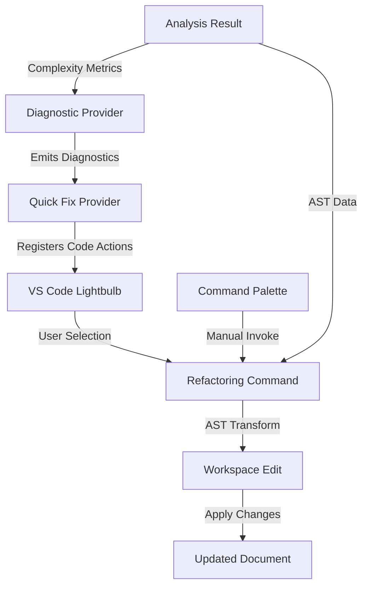

# Quick Fixes and Refactoring Specification

**Version:** 1.0
**Created:** January 10, 2026
**Status:** Ready for Implementation

## Overview

This document specifies the Quick Fix and Refactoring system for the VS Code extension. Quick fixes provide automated transformations triggered by diagnostics, while refactoring commands offer manual code improvements. All transformations produce idiomatic, type-safe React code.

## Architecture



## Diagnostic Codes

All quick fixes are triggered by specific diagnostic codes emitted by the analyzer. These map directly to complexity insights.

| Diagnostic Code                       | Severity | Category      | Description                             |
| ------------------------------------- | -------- | ------------- | --------------------------------------- |
| `vipr.hooks.excessive`                | Warning  | Hook          | Too many hooks in component             |
| `vipr.hooks.extract-recommended`      | Info     | Hook          | Pattern suggests custom hook extraction |
| `vipr.temporal.missing-deps`          | Critical | Temporal      | useEffect missing dependency array      |
| `vipr.temporal.excessive-deps`        | Warning  | Temporal      | useEffect with too many dependencies    |
| `vipr.temporal.missing-cleanup`       | Critical | Temporal      | Effect needs cleanup function           |
| `vipr.temporal.timer-no-cleanup`      | Critical | Temporal      | setTimeout/setInterval without cleanup  |
| `vipr.temporal.listener-no-cleanup`   | Critical | Temporal      | Event listener without cleanup          |
| `vipr.identity.inline-function`       | Info     | Identity      | Inline function in JSX prop             |
| `vipr.identity.inline-object`         | Warning  | Identity      | Inline object in JSX prop               |
| `vipr.identity.inline-array`          | Info     | Identity      | Inline array in JSX prop                |
| `vipr.structural.component-in-render` | Warning  | Structural    | Component defined inside render         |
| `vipr.coupling.excessive-props`       | Warning  | Coupling      | Too many props                          |
| `vipr.a11y.keyboard-access`           | Warning  | Accessibility | Click handler without keyboard support  |
| `vipr.a11y.missing-aria`              | Info     | Accessibility | Missing ARIA attributes                 |

## Quick Fix Categories

### 1. Hook-Related Fixes

#### 1.1 Extract Custom Hook

**Diagnostic Code:** `vipr.hooks.extract-recommended`

**Trigger Conditions:**

- Component has 3+ useState and 2+ useEffect
- Or component has useRef + useEffect (DOM interaction pattern)
- Or component has 3+ useCallback (event handler pattern)

**Implementation:**

```typescript
interface ExtractHookContext {
  componentName: string;
  startLine: number;
  endLine: number;
  hookCalls: HookCall[];
  dependencies: string[];
}

interface HookCall {
  type: 'useState' | 'useEffect' | 'useRef' | 'useCallback' | 'useMemo';
  variableName?: string;
  startLine: number;
  endLine: number;
  code: string;
}
```

**AST Transformation:**

1. Identify all hook calls in the selected range
2. Extract variable dependencies (props, state used by hooks)
3. Determine hook parameters (what needs to be passed in)
4. Determine hook return value (what needs to be returned)
5. Generate new custom hook function
6. Replace original hooks with custom hook call

**Edge Cases:**

- Hook dependencies reference props → include as hook parameters
- Hook modifies state used by other hooks → ensure proper return
- Hook has early returns → validate control flow
- Hook uses closure over props → destructure props in hook parameters

**Before/After Example:**

```typescript
// BEFORE
function MyComponent({ userId, apiUrl }) {
  const [data, setData] = useState(null);
  const [loading, setLoading] = useState(false);
  const [error, setError] = useState(null);

  useEffect(() => {
    setLoading(true);
    fetch(`${apiUrl}/users/${userId}`)
      .then(res => res.json())
      .then(setData)
      .catch(setError)
      .finally(() => setLoading(false));
  }, [userId, apiUrl]);

  return <div>{loading ? 'Loading...' : data?.name}</div>;
}

// AFTER
function useUserData(userId: string, apiUrl: string) {
  const [data, setData] = useState(null);
  const [loading, setLoading] = useState(false);
  const [error, setError] = useState(null);

  useEffect(() => {
    setLoading(true);
    fetch(`${apiUrl}/users/${userId}`)
      .then(res => res.json())
      .then(setData)
      .catch(setError)
      .finally(() => setLoading(false));
  }, [userId, apiUrl]);

  return { data, loading, error };
}

function MyComponent({ userId, apiUrl }) {
  const { data, loading, error } = useUserData(userId, apiUrl);
  return <div>{loading ? 'Loading...' : data?.name}</div>;
}
```

#### 1.2 Fix Effect Dependencies

**Diagnostic Code:** `vipr.temporal.missing-deps`, `vipr.temporal.excessive-deps`

**Trigger Conditions:**

- useEffect has no dependency array
- useEffect dependency array is empty but uses props/state
- useEffect has dependencies but ESLint exhaustive-deps rule would warn

**Implementation:**

```typescript
interface FixDependenciesContext {
  effectStartLine: number;
  effectEndLine: number;
  currentDeps: string[] | null; // null = no array, [] = empty array
  suggestedDeps: string[];
  usedVariables: string[];
}
```

**AST Transformation:**

1. Parse effect callback body
2. Identify all referenced variables (excludes: function params, local vars)
3. Filter to only props, state, and context values
4. Generate new dependency array
5. Insert or replace dependency array

**Edge Cases:**

- No dependency array → Insert `[dep1, dep2]` after callback
- Empty array `[]` → Replace with `[dep1, dep2]`
- Existing deps → Merge with suggested deps (deduplicate)
- Function dependencies → Suggest useCallback wrapping
- Object dependencies → Suggest destructuring or useMemo

**Before/After Example:**

```typescript
// BEFORE
function MyComponent({ userId }) {
  useEffect(() => {
    fetchUser(userId);
  }); // Missing deps

// AFTER
function MyComponent({ userId }) {
  useEffect(() => {
    fetchUser(userId);
  }, [userId]); // Added deps
```

**Alternative Fix: Wrap in useRef**

For cases where dependency should NOT trigger effect re-run:

```typescript
// BEFORE
function MyComponent({ onSuccess }) {
  useEffect(() => {
    fetchData().then(onSuccess);
  }, []); // Missing onSuccess

// AFTER (Option 1: Add dep)
function MyComponent({ onSuccess }) {
  useEffect(() => {
    fetchData().then(onSuccess);
  }, [onSuccess]); // Added - effect re-runs when callback changes

// AFTER (Option 2: useRef)
function MyComponent({ onSuccess }) {
  const onSuccessRef = useRef(onSuccess);

  useEffect(() => {
    onSuccessRef.current = onSuccess;
  });

  useEffect(() => {
    fetchData().then(() => onSuccessRef.current());
  }, []); // No dependency needed
```

#### 1.3 Add Effect Cleanup

**Diagnostic Code:** `vipr.temporal.missing-cleanup`, `vipr.temporal.timer-no-cleanup`, `vipr.temporal.listener-no-cleanup`

**Trigger Conditions:**

- Effect uses setTimeout without clearTimeout return
- Effect uses setInterval without clearInterval return
- Effect uses addEventListener without removeEventListener return
- Effect creates subscription without unsubscribe return

**Implementation:**

```typescript
interface AddCleanupContext {
  effectStartLine: number;
  effectEndLine: number;
  cleanupType: 'timer' | 'interval' | 'listener' | 'subscription' | 'generic';
  cleanupTarget?: string; // Variable name to clean up
  listenerDetails?: {
    target: string;
    eventName: string;
    handler: string;
  };
}
```

**AST Transformation:**

1. Detect cleanup pattern (timer, listener, subscription)
2. Generate appropriate cleanup code
3. Insert return statement at end of effect callback
4. Handle existing return statements (merge or replace)

**Edge Cases:**

- Effect already has return statement → Don't override
- Multiple timers/listeners in one effect → Clean up all
- Timer ID not stored in variable → Create variable
- Listener uses inline function → Extract to variable

**Before/After Examples:**

```typescript
// BEFORE: Timer
function MyComponent() {
  useEffect(() => {
    setTimeout(() => {
      console.log('delayed');
    }, 1000);
  }, []);

// AFTER: Timer
function MyComponent() {
  useEffect(() => {
    const timerId = setTimeout(() => {
      console.log('delayed');
    }, 1000);

    return () => clearTimeout(timerId);
  }, []);
```

```typescript
// BEFORE: Event Listener
function MyComponent() {
  useEffect(() => {
    window.addEventListener('resize', handleResize);
  }, []);

// AFTER: Event Listener
function MyComponent() {
  useEffect(() => {
    window.addEventListener('resize', handleResize);

    return () => {
      window.removeEventListener('resize', handleResize);
    };
  }, []);
```

```typescript
// BEFORE: Multiple Cleanups
function MyComponent() {
  useEffect(() => {
    const interval = setInterval(() => tick(), 1000);
    window.addEventListener('focus', handleFocus);
  }, []);

// AFTER: Multiple Cleanups
function MyComponent() {
  useEffect(() => {
    const interval = setInterval(() => tick(), 1000);
    window.addEventListener('focus', handleFocus);

    return () => {
      clearInterval(interval);
      window.removeEventListener('focus', handleFocus);
    };
  }, []);
```

### 2. Performance Fixes

#### 2.1 Extract Callback

**Diagnostic Code:** `vipr.identity.inline-function`

**Trigger Conditions:**

- Inline arrow function or function expression in JSX attribute
- Attribute name starts with `on` (event handler)
- Component has memoized children OR 3+ event handlers

**Implementation:**

```typescript
interface ExtractCallbackContext {
  functionCode: string;
  propName: string;
  line: number;
  capturedVariables: string[]; // Variables from closure
}
```

**AST Transformation:**

1. Extract inline function body
2. Identify captured variables (dependencies)
3. Generate useCallback hook before component return
4. Generate unique callback name (based on prop name)
5. Replace inline function with callback reference

**Edge Cases:**

- Callback references props/state → Add to useCallback dependencies
- Callback modifies state → Ensure setter is stable
- Multiple similar callbacks → Extract all in one pass
- Callback is async → Preserve async keyword

**Before/After Example:**

```typescript
// BEFORE
function MyComponent({ id, onUpdate }) {
  const [value, setValue] = useState('');

  return (
    <button onClick={() => onUpdate(id, value)}>
      Submit
    </button>
  );
}

// AFTER
function MyComponent({ id, onUpdate }) {
  const [value, setValue] = useState('');

  const handleClick = useCallback(() => {
    onUpdate(id, value);
  }, [id, value, onUpdate]);

  return (
    <button onClick={handleClick}>
      Submit
    </button>
  );
}
```

#### 2.2 Add Memoization

**Diagnostic Code:** `vipr.identity.inline-object`, `vipr.identity.inline-array`

**Trigger Conditions:**

- Inline object or array literal in JSX attribute
- Passed to memoized component (React.memo)
- Not a style prop (unless passed to memo component)

**Implementation:**

```typescript
interface AddMemoizationContext {
  objectCode: string;
  propName: string;
  type: 'object' | 'array';
  line: number;
  dependencies: string[]; // Variables referenced in object/array
}
```

**AST Transformation:**

1. Extract inline object/array literal
2. Identify dependencies (props/state referenced)
3. Generate useMemo hook before component return
4. Generate descriptive variable name
5. Replace inline literal with memoized reference

**Edge Cases:**

- Object is static (no dependencies) → Extract as constant outside component
- Object contains functions → Extract functions first with useCallback
- Nested objects → Only memoize top level
- Spread operator used → Preserve in memoized version

**Before/After Example:**

```typescript
// BEFORE: Inline object
function MyComponent({ userId }) {
  return <UserCard config={{ id: userId, showAvatar: true }} />;
}

// AFTER: Static extraction (no dependencies on changing values)
const userCardConfig = { showAvatar: true };

function MyComponent({ userId }) {
  const config = useMemo(() => ({
    id: userId,
    showAvatar: true
  }), [userId]);

  return <UserCard config={config} />;
}
```

```typescript
// BEFORE: Inline array
function MyComponent({ filter }) {
  return <List items={items.filter(item => item.type === filter)} />;
}

// AFTER
function MyComponent({ filter }) {
  const filteredItems = useMemo(() =>
    items.filter(item => item.type === filter),
    [items, filter]
  );

  return <List items={filteredItems} />;
}
```

### 3. Pattern Fixes

#### 3.1 Move Component Outside Render

**Diagnostic Code:** `vipr.structural.component-in-render`

**Trigger Conditions:**

- Function component defined inside another component's body
- Component is capitalized (React naming convention)
- Component is used in JSX

**Implementation:**

```typescript
interface MoveComponentContext {
  componentName: string;
  componentCode: string;
  startLine: number;
  endLine: number;
  capturedProps: string[]; // Props from parent needed by child
}
```

**AST Transformation:**

1. Extract nested component definition
2. Identify captured variables from parent scope
3. Convert captured variables to component props
4. Move component definition outside parent
5. Update JSX usage to pass captured values as props

**Edge Cases:**

- Nested component uses parent props → Pass as props to nested
- Nested component uses parent state → Pass as props
- Nested component modifies parent state → Pass setter as prop
- Multiple nested components → Extract all
- Nested component is memoized → Preserve React.memo

**Before/After Example:**

```typescript
// BEFORE
function ParentComponent({ userId, theme }) {
  const [expanded, setExpanded] = useState(false);

  function ChildComponent() {
    return (
      <div className={theme}>
        User: {userId}
        <button onClick={() => setExpanded(!expanded)}>
          Toggle
        </button>
      </div>
    );
  }

  return (
    <div>
      <ChildComponent />
      {expanded && <Details />}
    </div>
  );
}

// AFTER
interface ChildComponentProps {
  userId: string;
  theme: string;
  expanded: boolean;
  onToggle: () => void;
}

function ChildComponent({ userId, theme, expanded, onToggle }: ChildComponentProps) {
  return (
    <div className={theme}>
      User: {userId}
      <button onClick={onToggle}>
        Toggle
      </button>
    </div>
  );
}

function ParentComponent({ userId, theme }) {
  const [expanded, setExpanded] = useState(false);

  const handleToggle = useCallback(() => {
    setExpanded(!expanded);
  }, [expanded]);

  return (
    <div>
      <ChildComponent
        userId={userId}
        theme={theme}
        expanded={expanded}
        onToggle={handleToggle}
      />
      {expanded && <Details />}
    </div>
  );
}
```

#### 3.2 Extract Component

**Diagnostic Code:** `vipr.structural.excessive`

**Trigger Conditions:**

- Component structural score > 25
- Component has clear JSX sections that could be extracted
- Manual command (not triggered by diagnostic)

**Implementation:**

```typescript
interface ExtractComponentContext {
  selectedRange: Range;
  jsxCode: string;
  referencedVariables: string[];
  componentName: string; // User-provided
}
```

**AST Transformation:**

1. Parse selected JSX
2. Identify all referenced variables (props, state, functions)
3. Generate new component with extracted JSX
4. Create props interface for referenced variables
5. Replace selected JSX with new component usage

**Edge Cases:**

- Selection includes non-JSX code → Validate selection
- Selection is incomplete element → Expand to valid JSX
- Extracted section uses event handlers → Pass as props or extract to parent
- Extracted section has keys in map → Preserve key logic

**Before/After Example:**

```typescript
// BEFORE (user selects the header section)
function Dashboard({ user, notifications }) {
  return (
    <div>
      <header>
        <h1>Welcome, {user.name}</h1>
        <div className="notifications">
          {notifications.map(n => (
            <span key={n.id}>{n.message}</span>
          ))}
        </div>
      </header>
      <main>
        <Content />
      </main>
    </div>
  );
}

// AFTER
interface DashboardHeaderProps {
  user: { name: string };
  notifications: Array<{ id: string; message: string }>;
}

function DashboardHeader({ user, notifications }: DashboardHeaderProps) {
  return (
    <header>
      <h1>Welcome, {user.name}</h1>
      <div className="notifications">
        {notifications.map(n => (
          <span key={n.id}>{n.message}</span>
        ))}
      </div>
    </header>
  );
}

function Dashboard({ user, notifications }) {
  return (
    <div>
      <DashboardHeader user={user} notifications={notifications} />
      <main>
        <Content />
      </main>
    </div>
  );
}
```

### 4. Accessibility Fixes

#### 4.1 Add Keyboard Handler

**Diagnostic Code:** `vipr.a11y.keyboard-access`

**Trigger Conditions:**

- Element has onClick but is not a button/link
- Element is div/span with onClick
- No onKeyDown handler present

**Implementation:**

```typescript
interface AddKeyboardContext {
  elementType: string;
  onClickHandler: string;
  line: number;
}
```

**AST Transformation:**

1. Locate JSX element with onClick
2. Extract onClick handler reference
3. Generate onKeyDown handler (Enter and Space keys)
4. Add tabIndex={0} if not present
5. Add role="button" if not interactive element

**Edge Cases:**

- Element already has tabIndex → Preserve
- Element already has role → Don't override
- onClick is inline function → Suggest extracting first
- Element should be button/link → Suggest semantic HTML instead

**Before/After Example:**

```typescript
// BEFORE
function MyComponent() {
  const handleClick = () => {
    console.log('clicked');
  };

  return <div onClick={handleClick}>Click me</div>;
}

// AFTER
function MyComponent() {
  const handleClick = () => {
    console.log('clicked');
  };

  const handleKeyDown = (e: React.KeyboardEvent) => {
    if (e.key === 'Enter' || e.key === ' ') {
      e.preventDefault();
      handleClick();
    }
  };

  return (
    <div
      onClick={handleClick}
      onKeyDown={handleKeyDown}
      tabIndex={0}
      role="button"
    >
      Click me
    </div>
  );
}
```

#### 4.2 Add ARIA Attributes

**Diagnostic Code:** `vipr.a11y.missing-aria`

**Trigger Conditions:**

- Interactive element missing aria-label
- Button with only icon (no text)
- Form input without associated label

**Implementation:**

```typescript
interface AddAriaContext {
  elementType: string;
  missingAttributes: string[];
  suggestedValues: Record<string, string>;
  line: number;
}
```

**AST Transformation:**

1. Detect missing ARIA attributes
2. Suggest appropriate values based on context
3. Insert attributes into JSX element

**Edge Cases:**

- Element has text content → May not need aria-label
- Element is icon-only → Require aria-label
- Element is decorative → Add aria-hidden
- Interactive list → Add aria-describedby

**Before/After Example:**

```typescript
// BEFORE
function MyComponent() {
  return (
    <button>
      <IconClose />
    </button>
  );
}

// AFTER
function MyComponent() {
  return (
    <button aria-label="Close dialog">
      <IconClose />
    </button>
  );
}
```

## Refactoring Commands

Commands can be invoked manually via Command Palette or triggered by Quick Fixes.

### Command: `vipr.extractHook`

**Signature:**

```typescript
async function extractHook(uri: vscode.Uri, range: vscode.Range): Promise<void>;
```

**Input Validation:**

1. Check if range contains hook calls
2. Verify hooks are in valid location (inside component)
3. Check if hooks follow Rules of Hooks
4. Prompt user for custom hook name (must start with "use")

**Process:**

1. Parse selected code to extract hooks
2. Analyze dependencies and return values
3. Generate custom hook function
4. Generate TypeScript types for parameters and return value
5. Create WorkspaceEdit with changes
6. Apply edit
7. Format code

**Error Handling:**

- Invalid selection → Show error message with guidance
- Hook name validation fails → Re-prompt
- Refactoring creates invalid code → Rollback and show error

**Rollback Behavior:**

- Store original document state
- On error, restore original state via WorkspaceEdit
- Clear any partial changes

### Command: `vipr.addDependencies`

**Signature:**

```typescript
async function addDependencies(uri: vscode.Uri, range: vscode.Range, deps: string[]): Promise<void>;
```

**Input Validation:**

1. Verify range contains useEffect/useCallback/useMemo call
2. Validate dependency names are valid identifiers
3. Check dependencies exist in scope

**Process:**

1. Locate dependency array in hook call
2. Parse existing dependencies
3. Merge new dependencies (deduplicate)
4. Sort dependencies alphabetically
5. Create WorkspaceEdit
6. Apply edit

**Error Handling:**

- No hook call found → Show error
- Dependency doesn't exist in scope → Warn user
- Invalid dependency syntax → Show error

### Command: `vipr.extractCallback`

**Signature:**

```typescript
async function extractCallback(uri: vscode.Uri, range: vscode.Range): Promise<void>;
```

**Input Validation:**

1. Verify range contains inline function in JSX
2. Check if function is in event handler position

**Process:**

1. Extract function body
2. Analyze captured variables
3. Generate useCallback with dependencies
4. Generate callback name from prop name (onClick → handleClick)
5. Insert useCallback before return statement
6. Replace inline function with reference
7. Format code

**Error Handling:**

- Not an inline function → Show error
- Callback name collision → Generate unique name

### Command: `vipr.moveComponent`

**Signature:**

```typescript
async function moveComponent(uri: vscode.Uri, range: vscode.Range): Promise<void>;
```

**Input Validation:**

1. Verify range contains component definition
2. Check component is nested inside another component

**Process:**

1. Extract nested component code
2. Analyze captured variables
3. Convert to props interface
4. Move component definition outside parent (above or below, based on config)
5. Update JSX usage to pass props
6. Format code

**Error Handling:**

- Not a nested component → Show error
- Cannot determine props → Prompt user to review generated props

## Testing Matrix

### Test Case 1: Extract Custom Hook (Data Fetching Pattern)

**Input:**

```typescript
function UserProfile({ userId }: { userId: string }) {
  const [user, setUser] = useState(null);
  const [loading, setLoading] = useState(false);
  const [error, setError] = useState(null);

  useEffect(() => {
    setLoading(true);
    fetch(`/api/users/${userId}`)
      .then(res => res.json())
      .then(setUser)
      .catch(setError)
      .finally(() => setLoading(false));
  }, [userId]);

  if (loading) return <div>Loading...</div>;
  if (error) return <div>Error: {error.message}</div>;
  return <div>{user?.name}</div>;
}
```

**Expected Diagnostic:**

- Code: `vipr.hooks.extract-recommended`
- Severity: Info
- Message: "Component combines useRef with useEffect - likely DOM interaction or external subscription"

**Expected Fix Result:**

```typescript
function useUserData(userId: string) {
  const [user, setUser] = useState<User | null>(null);
  const [loading, setLoading] = useState(false);
  const [error, setError] = useState<Error | null>(null);

  useEffect(() => {
    setLoading(true);
    fetch(`/api/users/${userId}`)
      .then(res => res.json())
      .then(setUser)
      .catch(setError)
      .finally(() => setLoading(false));
  }, [userId]);

  return { user, loading, error };
}

function UserProfile({ userId }: { userId: string }) {
  const { user, loading, error } = useUserData(userId);

  if (loading) return <div>Loading...</div>;
  if (error) return <div>Error: {error.message}</div>;
  return <div>{user?.name}</div>;
}
```

**Edge Cases:**

- Multiple effects → Extract all related effects
- Effect uses imported function → Function remains in component
- State setter is renamed → Preserve naming

### Test Case 2: Fix Missing Dependencies

**Input:**

```typescript
function SearchBox({ onSearch, defaultValue }) {
  const [query, setQuery] = useState(defaultValue);

  useEffect(() => {
    const timeoutId = setTimeout(() => {
      onSearch(query);
    }, 300);
    return () => clearTimeout(timeoutId);
  }, []); // Missing: query, onSearch

  return <input value={query} onChange={e => setQuery(e.target.value)} />;
}
```

**Expected Diagnostic:**

- Code: `vipr.temporal.missing-deps`
- Severity: Critical
- Message: "useEffect at line X has empty dependency array but uses: query, onSearch"

**Expected Fix Result (Option 1 - Add All Deps):**

```typescript
function SearchBox({ onSearch, defaultValue }) {
  const [query, setQuery] = useState(defaultValue);

  useEffect(() => {
    const timeoutId = setTimeout(() => {
      onSearch(query);
    }, 300);
    return () => clearTimeout(timeoutId);
  }, [query, onSearch]); // Added dependencies

  return <input value={query} onChange={e => setQuery(e.target.value)} />;
}
```

**Expected Fix Result (Option 2 - useRef Pattern):**

```typescript
function SearchBox({ onSearch, defaultValue }) {
  const [query, setQuery] = useState(defaultValue);
  const onSearchRef = useRef(onSearch);

  useEffect(() => {
    onSearchRef.current = onSearch;
  });

  useEffect(() => {
    const timeoutId = setTimeout(() => {
      onSearchRef.current(query);
    }, 300);
    return () => clearTimeout(timeoutId);
  }, [query]); // Only query as dependency

  return <input value={query} onChange={e => setQuery(e.target.value)} />;
}
```

### Test Case 3: Add Timer Cleanup

**Input:**

```typescript
function Tooltip({ text, delay = 500 }) {
  const [visible, setVisible] = useState(false);

  const showTooltip = () => {
    setTimeout(() => {
      setVisible(true);
    }, delay);
  };

  return (
    <div onMouseEnter={showTooltip}>
      {visible && <div>{text}</div>}
    </div>
  );
}
```

**Expected Diagnostic:**

- Code: `vipr.temporal.timer-no-cleanup`
- Severity: Critical
- Message: "setTimeout without cleanup can cause memory leaks and stale state updates"

**Expected Fix Result:**

```typescript
function Tooltip({ text, delay = 500 }) {
  const [visible, setVisible] = useState(false);
  const timeoutRef = useRef<NodeJS.Timeout>();

  const showTooltip = () => {
    timeoutRef.current = setTimeout(() => {
      setVisible(true);
    }, delay);
  };

  useEffect(() => {
    return () => {
      if (timeoutRef.current) {
        clearTimeout(timeoutRef.current);
      }
    };
  }, []);

  return (
    <div onMouseEnter={showTooltip}>
      {visible && <div>{text}</div>}
    </div>
  );
}
```

### Test Case 4: Extract Inline Callback

**Input:**

```typescript
const MemoizedChild = React.memo(ChildComponent);

function Parent({ id, name }) {
  return (
    <MemoizedChild
      onClick={() => console.log(id, name)}
      onDelete={() => deleteItem(id)}
    />
  );
}
```

**Expected Diagnostic:**

- Code: `vipr.identity.inline-function`
- Severity: Info (upgraded from default because child is memoized)
- Message: "Inline function in 'onClick' prop may cause unnecessary re-renders"

**Expected Fix Result:**

```typescript
const MemoizedChild = React.memo(ChildComponent);

function Parent({ id, name }) {
  const handleClick = useCallback(() => {
    console.log(id, name);
  }, [id, name]);

  const handleDelete = useCallback(() => {
    deleteItem(id);
  }, [id]);

  return (
    <MemoizedChild
      onClick={handleClick}
      onDelete={handleDelete}
    />
  );
}
```

### Test Case 5: Move Nested Component

**Input:**

```typescript
function Dashboard({ user }) {
  const [collapsed, setCollapsed] = useState(false);

  function Sidebar() {
    return (
      <aside>
        <h2>{user.name}</h2>
        <button onClick={() => setCollapsed(!collapsed)}>
          Toggle
        </button>
      </aside>
    );
  }

  return (
    <div>
      <Sidebar />
      {!collapsed && <MainContent />}
    </div>
  );
}
```

**Expected Diagnostic:**

- Code: `vipr.structural.component-in-render`
- Severity: Warning
- Message: "Component 'Sidebar' is defined inside render. This creates a new component instance on every render."

**Expected Fix Result:**

```typescript
interface SidebarProps {
  userName: string;
  collapsed: boolean;
  onToggle: () => void;
}

function Sidebar({ userName, collapsed, onToggle }: SidebarProps) {
  return (
    <aside>
      <h2>{userName}</h2>
      <button onClick={onToggle}>
        Toggle
      </button>
    </aside>
  );
}

function Dashboard({ user }) {
  const [collapsed, setCollapsed] = useState(false);

  const handleToggle = useCallback(() => {
    setCollapsed(!collapsed);
  }, [collapsed]);

  return (
    <div>
      <Sidebar
        userName={user.name}
        collapsed={collapsed}
        onToggle={handleToggle}
      />
      {!collapsed && <MainContent />}
    </div>
  );
}
```

### Test Case 6: Add Keyboard Handler

**Input:**

```typescript
function Card({ onClick }) {
  return (
    <div className="card" onClick={onClick}>
      <h3>Click me</h3>
    </div>
  );
}
```

**Expected Diagnostic:**

- Code: `vipr.a11y.keyboard-access`
- Severity: Warning
- Message: "Interactive element with onClick lacks keyboard accessibility"

**Expected Fix Result:**

```typescript
function Card({ onClick }) {
  const handleKeyDown = (e: React.KeyboardEvent) => {
    if (e.key === 'Enter' || e.key === ' ') {
      e.preventDefault();
      onClick(e);
    }
  };

  return (
    <div
      className="card"
      onClick={onClick}
      onKeyDown={handleKeyDown}
      tabIndex={0}
      role="button"
    >
      <h3>Click me</h3>
    </div>
  );
}
```

## Implementation Strategy

### Phase 1: Core Infrastructure (Week 1)

1. Diagnostic code system
2. Quick Fix provider registration
3. Command registration framework
4. AST parsing utilities

### Phase 2: Hook Fixes (Week 2)

1. Extract custom hook
2. Fix dependencies
3. Add cleanup

### Phase 3: Performance Fixes (Week 3)

1. Extract callback
2. Add memoization

### Phase 4: Pattern and A11y Fixes (Week 4)

1. Move component
2. Extract component
3. Keyboard handlers
4. ARIA attributes

### Phase 5: Testing and Polish (Week 5)

1. Integration tests
2. Edge case handling
3. Error messages refinement
4. Documentation

## Configuration

User-configurable settings in `settings.json`:

```typescript
interface ViprQuickFixConfig {
  // Enable/disable specific quick fixes
  'vipr.quickFix.extractHook.enabled': boolean; // default: true
  'vipr.quickFix.fixDependencies.enabled': boolean; // default: true
  'vipr.quickFix.addCleanup.enabled': boolean; // default: true
  'vipr.quickFix.extractCallback.enabled': boolean; // default: true
  'vipr.quickFix.addMemoization.enabled': boolean; // default: false (opt-in)

  // Naming conventions
  'vipr.refactoring.hookNamingPattern': string; // default: "use{Name}"
  'vipr.refactoring.callbackNamingPattern': string; // default: "handle{Name}"

  // Component extraction
  'vipr.refactoring.componentPlacement': 'above' | 'below' | 'separate-file';
  'vipr.refactoring.generateTypes': boolean; // default: true

  // Quick fix aggressiveness
  'vipr.quickFix.autoFixOnSave': boolean; // default: false
  'vipr.quickFix.suggestMemoization': boolean; // default: false (noisy)
}
```

## Error Messages

All error messages should be actionable and educational:

| Scenario               | Message                                                                                                    |
| ---------------------- | ---------------------------------------------------------------------------------------------------------- |
| Invalid hook selection | "Selection must contain at least one React hook call. Learn more about hooks: [React Hooks Documentation]" |
| Hook name invalid      | "Custom hook name must start with 'use' and be camelCase (e.g., useFormValidation)"                        |
| Missing dependencies   | "Cannot determine dependencies for this effect. Consider adding dependencies manually."                    |
| Circular dependencies  | "Extracted hook would create circular dependency. Consider restructuring component."                       |
| Nested hook extraction | "Cannot extract hooks from nested functions. Hooks must be at component top level."                        |

## Success Metrics

Track effectiveness of quick fixes:

1. **Usage Metrics:**
   - Quick fix invocation count per diagnostic code
   - Most commonly used refactoring commands
   - Quick fix acceptance rate (applied vs. dismissed)

2. **Quality Metrics:**
   - Reduction in complexity score after applying fix
   - Number of new diagnostics introduced by fix (ideally 0)
   - User rollback rate (undo after applying fix)

3. **Performance Metrics:**
   - Time to generate quick fix (< 100ms target)
   - Time to apply edit (< 500ms target)
   - Memory usage during refactoring

## Future Enhancements

1. **AI-Assisted Refactoring:**
   - LLM-powered custom hook naming suggestions
   - Context-aware component extraction with semantic understanding

2. **Batch Operations:**
   - Apply fix to all occurrences in file
   - Apply fix to all files in workspace

3. **Refactoring Patterns:**
   - Convert class component to functional component
   - Convert useState to useReducer
   - Extract render props to hooks

4. **Interactive Mode:**
   - Preview changes before applying
   - Step-by-step wizard for complex refactorings
   - Diff view for before/after comparison

## References

- [VS Code Code Actions API](https://code.visualstudio.com/api/references/vscode-api#CodeActionProvider)
- [React Rules of Hooks](https://react.dev/reference/rules/rules-of-hooks)
- [TypeScript AST Viewer](https://ts-ast-viewer.com/)
- [React Compiler](https://react.dev/learn/react-compiler)
