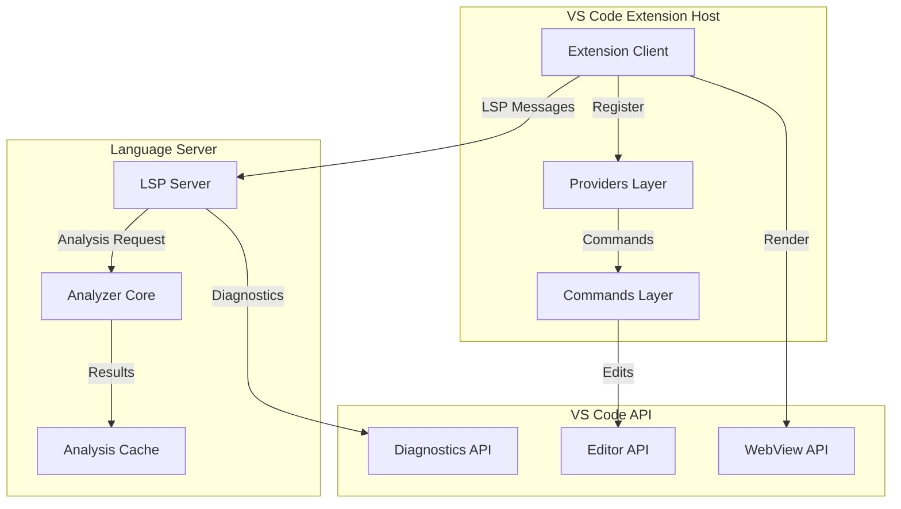

# VS Code Extension Type Definitions

## Overview

This document specifies the complete type system for the Vipr React Analyzer VS Code extension. All types follow strict TypeScript conventions with branded primitives, discriminated unions, and exhaustive pattern matching for type safety.

## Architecture Context

The extension integrates three distinct systems:

1. **Language Server Protocol (LSP)**: Client-server communication for real-time analysis
2. **VS Code Extension API**: Editor integrations (CodeLens, quick fixes, decorations)
3. **Analyzer Core**: Static analysis engine providing complexity metrics



---

## Table of Contents

1. [Core Extension Types](#1-core-extension-types)
2. [Provider Interfaces](#2-provider-interfaces)
3. [Message Protocols](#3-message-protocols)
4. [Schema Definitions](#4-schema-definitions)
5. [Type Safety Patterns](#5-type-safety-patterns)
6. [Integration Types](#6-integration-types)

---

## 1. Core Extension Types

### 1.1 ViprConfiguration

Extension settings interface with strict validation rules.

````typescript
/**
 * Extension configuration schema.
 * Maps to `vipr.*` settings in VS Code configuration.
 *
 * @example
 * ```typescript
 * const config: ViprConfiguration = {
 *   enable: true,
 *   showStatusBar: true,
 *   complexityThreshold: 50,
 *   analyzers: ['core', 'migration'],
 *   reactVersion: '19.0.0',
 *   diagnostics: { level: 'warning', showInlineHints: true },
 *   cache: { enabled: true, ttl: 300000 }
 * };
 * ```
 */
interface ViprConfiguration {
  /**
   * Global enable/disable toggle.
   * @default true
   */
  readonly enable: boolean;

  /**
   * Display complexity score in status bar.
   * @default true
   */
  readonly showStatusBar: boolean;

  /**
   * Complexity score threshold for warnings.
   * Range: [0, 100]
   * @default 50
   */
  readonly complexityThreshold: number;

  /**
   * Active analyzers for this workspace.
   * @default ['core']
   */
  readonly analyzers: ReadonlyArray<AnalyzerType>;

  /**
   * Target React version for migration analysis.
   * Semver string or 'auto' to detect from package.json.
   * @default 'auto'
   */
  readonly reactVersion: string;

  /**
   * Diagnostics display configuration.
   */
  readonly diagnostics: DiagnosticsConfiguration;

  /**
   * Analysis result caching configuration.
   */
  readonly cache: CacheConfiguration;

  /**
   * Code action preferences.
   */
  readonly codeActions: CodeActionConfiguration;

  /**
   * File patterns to exclude from analysis.
   */
  readonly exclude: ReadonlyArray<string>;

  /**
   * Performance tuning options.
   */
  readonly performance: PerformanceConfiguration;
}

/**
 * Analyzer type discriminator.
 * Each corresponds to a specific analysis dimension.
 */
type AnalyzerType = 'core' | 'migration' | 'performance' | 'antipatterns' | 'security' | 'a11y';

/**
 * Diagnostics configuration options.
 */
interface DiagnosticsConfiguration {
  /**
   * Minimum severity level to report.
   * @default 'info'
   */
  readonly level: DiagnosticLevel;

  /**
   * Show inline hints for complexity metrics.
   * @default true
   */
  readonly showInlineHints: boolean;

  /**
   * Enable CodeLens display.
   * @default true
   */
  readonly enableCodeLens: boolean;

  /**
   * Enable editor decorations.
   * @default true
   */
  readonly enableDecorations: boolean;
}

/**
 * Diagnostic severity levels.
 * Aligns with VS Code DiagnosticSeverity.
 */
type DiagnosticLevel = 'info' | 'warning' | 'error';

/**
 * Cache configuration for analysis results.
 */
interface CacheConfiguration {
  /**
   * Enable result caching.
   * @default true
   */
  readonly enabled: boolean;

  /**
   * Time-to-live for cached results in milliseconds.
   * @default 300000 (5 minutes)
   */
  readonly ttl: number;

  /**
   * Maximum cache size in MB.
   * @default 50
   */
  readonly maxSize: number;
}

/**
 * Code action preferences.
 */
interface CodeActionConfiguration {
  /**
   * Enable automatic quick fixes.
   * @default true
   */
  readonly enableQuickFix: boolean;

  /**
   * Enable refactoring suggestions.
   * @default true
   */
  readonly enableRefactor: boolean;

  /**
   * Auto-apply fixes on save.
   * @default false
   */
  readonly autoFixOnSave: boolean;

  /**
   * Preferred quick fix categories.
   */
  readonly preferred: ReadonlyArray<QuickFixCategory>;
}

/**
 * Quick fix categories for user preferences.
 */
type QuickFixCategory =
  | 'extract-hook'
  | 'add-memo'
  | 'fix-deps'
  | 'add-cleanup'
  | 'extract-callback'
  | 'move-component'
  | 'add-keyboard-handler';

/**
 * Performance tuning options.
 */
interface PerformanceConfiguration {
  /**
   * Debounce delay for analysis after file changes (ms).
   * @default 500
   */
  readonly debounceDelay: number;

  /**
   * Maximum file size to analyze (bytes).
   * @default 1048576 (1 MB)
   */
  readonly maxFileSize: number;

  /**
   * Enable incremental analysis.
   * @default true
   */
  readonly incrementalAnalysis: boolean;
}
````

### 1.2 ComponentAnalysisResult

Analysis data structure for a single React component.

````typescript
/**
 * Complete analysis result for a React component.
 * Extends the core analyzer result with extension-specific metadata.
 *
 * @example
 * ```typescript
 * const result: ComponentAnalysisResult = {
 *   componentId: 'MyComponent@12-45' as ComponentId,
 *   filePath: '/src/MyComponent.tsx' as FilePath,
 *   range: { startLine: 12, startColumn: 0, endLine: 45, endColumn: 1 },
 *   complexity: {
 *     total: 42,
 *     grade: 'C',
 *     structural: { score: 15, branches: 8, ... },
 *     // ... other dimensions
 *   },
 *   diagnostics: [...],
 *   refactoringSuggestions: [...],
 *   metadata: { ... }
 * };
 * ```
 */
interface ComponentAnalysisResult {
  /**
   * Unique identifier for this component instance.
   * Format: `{name}@{startLine}-{endLine}`
   * Branded type prevents accidental string usage.
   */
  readonly componentId: ComponentId;

  /**
   * Absolute file path to the component source.
   * Branded type ensures path validation.
   */
  readonly filePath: FilePath;

  /**
   * Source location range of the component.
   */
  readonly range: LocationRange;

  /**
   * Complete complexity analysis from core analyzer.
   * Imported from `@vipr/react`.
   */
  readonly complexity: ReactComplexityResult;

  /**
   * VS Code diagnostics derived from insights.
   */
  readonly diagnostics: ReadonlyArray<DiagnosticData>;

  /**
   * Applicable refactoring suggestions.
   */
  readonly refactoringSuggestions: ReadonlyArray<RefactoringSuggestion>;

  /**
   * Analysis execution metadata.
   */
  readonly metadata: AnalysisMetadata;
}

/**
 * Branded type for component identifiers.
 * Prevents accidental usage of arbitrary strings.
 *
 * @example
 * ```typescript
 * const id = createComponentId('MyComponent', 10, 50);
 * function getComponent(id: ComponentId): Component { ... }
 * // getComponent('random-string'); // Type error
 * ```
 */
type ComponentId = string & { readonly __brand: 'ComponentId' };

/**
 * Factory function to create validated ComponentId.
 */
function createComponentId(name: string, startLine: number, endLine: number): ComponentId {
  return `${name}@${startLine}-${endLine}` as ComponentId;
}

/**
 * Branded type for file paths.
 * Ensures absolute paths are used throughout the system.
 */
type FilePath = string & { readonly __brand: 'FilePath' };

/**
 * Validate and brand a file path.
 * Throws if path is not absolute.
 */
function createFilePath(path: string): FilePath {
  if (!path.startsWith('/') && !path.match(/^[A-Z]:\\/)) {
    throw new Error(`Path must be absolute: ${path}`);
  }
  return path as FilePath;
}

/**
 * Source code location range.
 * Zero-indexed line/column numbers.
 */
interface LocationRange {
  readonly startLine: number;
  readonly startColumn: number;
  readonly endLine: number;
  readonly endColumn: number;
}

/**
 * Analysis execution metadata.
 */
interface AnalysisMetadata {
  /**
   * Unix timestamp when analysis was performed.
   */
  readonly timestamp: number;

  /**
   * Analysis duration in milliseconds.
   */
  readonly durationMs: number;

  /**
   * Analyzer version used.
   */
  readonly analyzerVersion: string;

  /**
   * Active analyzers for this run.
   */
  readonly activeAnalyzers: ReadonlyArray<AnalyzerType>;

  /**
   * Whether result was loaded from cache.
   */
  readonly fromCache: boolean;
}
````

### 1.3 ProjectMetrics

Workspace-wide metrics aggregation.

````typescript
/**
 * Aggregated metrics across all analyzed files in the workspace.
 * Used for dashboard display and project-level insights.
 *
 * @example
 * ```typescript
 * const metrics: ProjectMetrics = {
 *   totalFiles: 150,
 *   analyzedFiles: 142,
 *   totalComponents: 387,
 *   averageComplexity: 32.5,
 *   medianComplexity: 28,
 *   gradeDistribution: { A: 89, B: 145, C: 98, D: 42, F: 13 },
 *   dimensionAverages: { ... },
 *   hotspots: [...],
 *   trends: { ... }
 * };
 * ```
 */
interface ProjectMetrics {
  /**
   * Total React files in workspace.
   */
  readonly totalFiles: number;

  /**
   * Files successfully analyzed.
   * May be less than totalFiles if some files errored or were skipped.
   */
  readonly analyzedFiles: number;

  /**
   * Total number of components across all files.
   */
  readonly totalComponents: number;

  /**
   * Mean complexity score across all components.
   */
  readonly averageComplexity: number;

  /**
   * Median complexity score.
   * More robust to outliers than mean.
   */
  readonly medianComplexity: number;

  /**
   * Distribution of letter grades.
   */
  readonly gradeDistribution: GradeDistribution;

  /**
   * Average scores for each complexity dimension.
   */
  readonly dimensionAverages: DimensionAverages;

  /**
   * Top N most complex components (hotspots).
   * Sorted descending by complexity score.
   */
  readonly hotspots: ReadonlyArray<Hotspot>;

  /**
   * Historical trend data if available.
   */
  readonly trends?: TrendData;

  /**
   * Metadata about the aggregation.
   */
  readonly metadata: ProjectMetricsMetadata;
}

/**
 * Grade distribution counts.
 */
interface GradeDistribution {
  readonly A: number;
  readonly B: number;
  readonly C: number;
  readonly D: number;
  readonly F: number;
}

/**
 * Average scores for each complexity dimension.
 */
interface DimensionAverages {
  readonly structural: number;
  readonly hooks: number;
  readonly temporal: number;
  readonly coupling: number;
  readonly identity: number;
}

/**
 * Hotspot component reference.
 * Links to specific component in a file.
 */
interface Hotspot {
  readonly componentId: ComponentId;
  readonly filePath: FilePath;
  readonly componentName: string;
  readonly score: number;
  readonly grade: Grade;
  readonly primaryIssues: ReadonlyArray<string>;
}

/**
 * Historical trend data.
 */
interface TrendData {
  /**
   * Data points indexed by timestamp.
   */
  readonly dataPoints: ReadonlyArray<TrendDataPoint>;

  /**
   * Trend direction.
   */
  readonly direction: TrendDirection;

  /**
   * Percentage change from first to last data point.
   */
  readonly percentageChange: number;
}

/**
 * Single trend data point.
 */
interface TrendDataPoint {
  readonly timestamp: number;
  readonly averageComplexity: number;
  readonly totalFiles: number;
}

/**
 * Trend direction discriminator.
 */
type TrendDirection = 'improving' | 'stable' | 'degrading';

/**
 * Project metrics metadata.
 */
interface ProjectMetricsMetadata {
  readonly generatedAt: number;
  readonly workspacePath: FilePath;
  readonly includePatterns: ReadonlyArray<string>;
  readonly excludePatterns: ReadonlyArray<string>;
}
````

### 1.4 DiagnosticData

Data structure attached to VS Code diagnostics.

````typescript
/**
 * Enhanced diagnostic with Vipr-specific data.
 * Extends VS Code Diagnostic with refactoring and fix information.
 *
 * @example
 * ```typescript
 * const diagnostic: DiagnosticData = {
 *   code: 'vipr/hooks/too-many' as DiagnosticCode,
 *   severity: 'warning',
 *   message: 'Component uses 12 hooks',
 *   range: { ... },
 *   source: 'vipr',
 *   category: 'hooks',
 *   relatedInformation: [...],
 *   quickFixes: [...],
 *   metadata: { ... }
 * };
 * ```
 */
interface DiagnosticData {
  /**
   * Unique diagnostic code.
   * Branded type using discriminated union for exhaustive checking.
   */
  readonly code: DiagnosticCode;

  /**
   * Severity level.
   */
  readonly severity: DiagnosticLevel;

  /**
   * Human-readable message.
   */
  readonly message: string;

  /**
   * Source location of the issue.
   */
  readonly range: LocationRange;

  /**
   * Diagnostic source identifier.
   * Always 'vipr' for our diagnostics.
   */
  readonly source: 'vipr';

  /**
   * Category for grouping related diagnostics.
   */
  readonly category: DiagnosticCategory;

  /**
   * Related locations for context.
   */
  readonly relatedInformation?: ReadonlyArray<RelatedInformation>;

  /**
   * Available quick fixes for this diagnostic.
   */
  readonly quickFixes: ReadonlyArray<QuickFixDescriptor>;

  /**
   * Additional diagnostic metadata.
   */
  readonly metadata: DiagnosticMetadata;
}

/**
 * Diagnostic code using discriminated union.
 * Enables exhaustive pattern matching and type-safe code handling.
 *
 * @example
 * ```typescript
 * function handleDiagnostic(code: DiagnosticCode): void {
 *   switch (code) {
 *     case 'vipr/hooks/too-many':
 *       // Type narrows to hooks category
 *       break;
 *     case 'vipr/temporal/missing-cleanup':
 *       // Type narrows to temporal category
 *       break;
 *     // ... exhaustive handling required
 *   }
 * }
 * ```
 */
type DiagnosticCode =
  // Hooks category
  | 'vipr/hooks/too-many'
  | 'vipr/hooks/suggest-custom'
  | 'vipr/hooks/wrong-order'
  // Temporal category
  | 'vipr/temporal/missing-cleanup'
  | 'vipr/temporal/missing-deps'
  | 'vipr/temporal/every-render'
  | 'vipr/temporal/async-risk'
  // Structural category
  | 'vipr/structural/high-complexity'
  | 'vipr/structural/deep-nesting'
  | 'vipr/structural/suggest-split'
  // Coupling category
  | 'vipr/coupling/too-many-props'
  | 'vipr/coupling/too-many-contexts'
  | 'vipr/coupling/prop-drilling'
  // Identity category
  | 'vipr/identity/inline-function'
  | 'vipr/identity/inline-object'
  | 'vipr/identity/missing-memo'
  // Performance category
  | 'vipr/performance/expensive-render'
  | 'vipr/performance/unnecessary-effect'
  | 'vipr/performance/component-in-render'
  // Accessibility category
  | 'vipr/a11y/missing-keyboard-handler'
  | 'vipr/a11y/missing-aria-label'
  | 'vipr/a11y/missing-alt-text'
  // Security category
  | 'vipr/security/dangerous-html'
  | 'vipr/security/unsafe-href'
  // Migration category
  | 'vipr/migration/deprecated-api'
  | 'vipr/migration/legacy-lifecycle';

/**
 * Diagnostic category for grouping.
 */
type DiagnosticCategory =
  | 'hooks'
  | 'temporal'
  | 'structural'
  | 'coupling'
  | 'identity'
  | 'performance'
  | 'a11y'
  | 'security'
  | 'migration';

/**
 * Related information pointing to contextual locations.
 */
interface RelatedInformation {
  readonly location: LocationWithFile;
  readonly message: string;
}

/**
 * Location including file path.
 */
interface LocationWithFile {
  readonly filePath: FilePath;
  readonly range: LocationRange;
}

/**
 * Quick fix descriptor.
 * References a code action that can be applied.
 */
interface QuickFixDescriptor {
  /**
   * Quick fix identifier.
   */
  readonly id: string;

  /**
   * Display title for the quick fix.
   */
  readonly title: string;

  /**
   * Quick fix category.
   */
  readonly category: QuickFixCategory;

  /**
   * Whether this fix is preferred (shown first).
   */
  readonly isPreferred: boolean;

  /**
   * Command to execute or edit to apply.
   */
  readonly action: QuickFixAction;
}

/**
 * Quick fix action - either a command or direct edit.
 */
type QuickFixAction =
  | { readonly type: 'command'; readonly command: CommandReference }
  | { readonly type: 'edit'; readonly edit: WorkspaceEditData };

/**
 * Command reference for execution.
 */
interface CommandReference {
  readonly command: string;
  readonly title: string;
  readonly arguments?: ReadonlyArray<unknown>;
}

/**
 * Workspace edit data for direct text edits.
 */
interface WorkspaceEditData {
  readonly changes: ReadonlyMap<FilePath, ReadonlyArray<TextEdit>>;
}

/**
 * Single text edit operation.
 */
interface TextEdit {
  readonly range: LocationRange;
  readonly newText: string;
}

/**
 * Diagnostic metadata.
 */
interface DiagnosticMetadata {
  /**
   * Complexity score that triggered this diagnostic (if applicable).
   */
  readonly complexityScore?: number;

  /**
   * Link to documentation.
   */
  readonly documentationUrl?: string;

  /**
   * Whether this diagnostic can be auto-fixed.
   */
  readonly autoFixable: boolean;

  /**
   * Tags for filtering.
   */
  readonly tags: ReadonlyArray<DiagnosticTag>;
}

/**
 * Diagnostic tags for classification.
 */
type DiagnosticTag = 'deprecated' | 'unnecessary' | 'performance' | 'security' | 'a11y';
````

---

## 2. Provider Interfaces

### 2.1 CodeLensData

Data structure for CodeLens items.

````typescript
/**
 * Data for CodeLens display above components.
 * CodeLens shows at-a-glance complexity information.
 *
 * @example
 * ```typescript
 * const codeLens: CodeLensData = {
 *   componentId: 'MyComponent@10-50' as ComponentId,
 *   range: { startLine: 10, startColumn: 0, endLine: 10, endColumn: 50 },
 *   score: 42,
 *   grade: 'C',
 *   command: {
 *     command: 'vipr.showComponentDetails',
 *     title: 'Complexity: 42 (C)',
 *     arguments: [componentId]
 *   },
 *   tooltip: 'Click for detailed complexity breakdown'
 * };
 * ```
 */
interface CodeLensData {
  /**
   * Component this CodeLens refers to.
   */
  readonly componentId: ComponentId;

  /**
   * Location to display the CodeLens.
   * Typically the first line of the component.
   */
  readonly range: LocationRange;

  /**
   * Complexity score to display.
   */
  readonly score: number;

  /**
   * Letter grade to display.
   */
  readonly grade: Grade;

  /**
   * Command to execute when clicked.
   */
  readonly command: CodeLensCommand;

  /**
   * Tooltip shown on hover.
   */
  readonly tooltip: string;

  /**
   * Metadata for rendering.
   */
  readonly metadata: CodeLensMetadata;
}

/**
 * Command executed when CodeLens is clicked.
 */
interface CodeLensCommand {
  readonly command: string;
  readonly title: string;
  readonly arguments?: ReadonlyArray<unknown>;
}

/**
 * CodeLens rendering metadata.
 */
interface CodeLensMetadata {
  /**
   * Display style based on severity.
   */
  readonly style: CodeLensStyle;

  /**
   * Whether to show additional inline hints.
   */
  readonly showInlineHints: boolean;
}

/**
 * CodeLens display style discriminator.
 */
type CodeLensStyle =
  | { readonly type: 'normal' }
  | { readonly type: 'warning'; readonly reason: string }
  | { readonly type: 'error'; readonly reason: string };
````

### 2.2 QuickFixContext

Context passed to quick fix handlers.

````typescript
/**
 * Context object passed to quick fix handlers.
 * Contains all information needed to generate and apply fixes.
 *
 * @example
 * ```typescript
 * function generateQuickFix(context: QuickFixContext): QuickFixResult {
 *   const { diagnostic, document, range, analysisResult } = context;
 *
 *   switch (diagnostic.code) {
 *     case 'vipr/hooks/too-many':
 *       return generateExtractHookFix(context);
 *     // ... other cases
 *   }
 * }
 * ```
 */
interface QuickFixContext {
  /**
   * The diagnostic being fixed.
   */
  readonly diagnostic: DiagnosticData;

  /**
   * Document containing the issue.
   */
  readonly document: DocumentContext;

  /**
   * Range of the issue.
   */
  readonly range: LocationRange;

  /**
   * Full analysis result for the component.
   */
  readonly analysisResult: ComponentAnalysisResult;

  /**
   * Extension configuration.
   */
  readonly configuration: ViprConfiguration;

  /**
   * Shared state for multi-step fixes.
   */
  readonly state: QuickFixState;
}

/**
 * Document context for quick fixes.
 */
interface DocumentContext {
  /**
   * File path of the document.
   */
  readonly filePath: FilePath;

  /**
   * Document content.
   */
  readonly content: string;

  /**
   * Language identifier (typescriptreact, javascriptreact).
   */
  readonly languageId: string;

  /**
   * Document version for conflict detection.
   */
  readonly version: number;
}

/**
 * Shared state for multi-step quick fixes.
 */
interface QuickFixState {
  /**
   * Store data for multi-step operations.
   */
  get<T>(key: string): T | undefined;
  set<T>(key: string, value: T): void;
  clear(): void;
}
````

### 2.3 RefactoringResult

Result of AST transformation operations.

````typescript
/**
 * Result of a refactoring operation.
 * Contains both the transformed code and metadata about the change.
 *
 * @example
 * ```typescript
 * const result: RefactoringResult = {
 *   success: true,
 *   changes: [{
 *     filePath: '/src/MyComponent.tsx' as FilePath,
 *     edits: [{ range: ..., newText: 'const hook = ...' }],
 *     metadata: { ... }
 *   }],
 *   summary: {
 *     description: 'Extracted state logic to useComponentState',
 *     complexityImpact: { before: 52, after: 38, reduction: 14 }
 *   }
 * };
 * ```
 */
interface RefactoringResult {
  /**
   * Whether the refactoring succeeded.
   */
  readonly success: boolean;

  /**
   * File changes to apply.
   * May span multiple files for cross-file refactorings.
   */
  readonly changes: ReadonlyArray<FileChange>;

  /**
   * Human-readable summary of the refactoring.
   */
  readonly summary: RefactoringSummary;

  /**
   * Warnings encountered during refactoring.
   */
  readonly warnings?: ReadonlyArray<RefactoringWarning>;

  /**
   * Error if refactoring failed.
   */
  readonly error?: RefactoringError;
}

/**
 * Changes to a single file.
 */
interface FileChange {
  /**
   * File being modified.
   */
  readonly filePath: FilePath;

  /**
   * Text edits to apply.
   * Applied in reverse order to preserve ranges.
   */
  readonly edits: ReadonlyArray<TextEdit>;

  /**
   * Metadata about this change.
   */
  readonly metadata: FileChangeMetadata;
}

/**
 * File change metadata.
 */
interface FileChangeMetadata {
  /**
   * Whether this creates a new file.
   */
  readonly isNewFile: boolean;

  /**
   * Import statements to add/update.
   */
  readonly imports?: ReadonlyArray<ImportChange>;

  /**
   * Exports to add/update.
   */
  readonly exports?: ReadonlyArray<ExportChange>;
}

/**
 * Import statement change.
 */
interface ImportChange {
  readonly type: 'add' | 'update' | 'remove';
  readonly moduleSpecifier: string;
  readonly namedImports?: ReadonlyArray<string>;
  readonly defaultImport?: string;
}

/**
 * Export statement change.
 */
interface ExportChange {
  readonly type: 'add' | 'update' | 'remove';
  readonly exportName: string;
  readonly isDefault: boolean;
}

/**
 * Refactoring summary.
 */
interface RefactoringSummary {
  /**
   * Description of what was done.
   */
  readonly description: string;

  /**
   * Complexity impact analysis.
   */
  readonly complexityImpact: ComplexityImpact;

  /**
   * Files affected.
   */
  readonly filesAffected: number;

  /**
   * Lines added/removed.
   */
  readonly lineChanges: LineChanges;
}

/**
 * Complexity impact of a refactoring.
 */
interface ComplexityImpact {
  readonly before: number;
  readonly after: number;
  readonly reduction: number;
  readonly percentageReduction: number;
}

/**
 * Line change statistics.
 */
interface LineChanges {
  readonly added: number;
  readonly removed: number;
  readonly net: number;
}

/**
 * Refactoring warning.
 */
interface RefactoringWarning {
  readonly message: string;
  readonly location?: LocationWithFile;
  readonly severity: 'info' | 'warning';
}

/**
 * Refactoring error.
 */
interface RefactoringError {
  readonly message: string;
  readonly code: RefactoringErrorCode;
  readonly location?: LocationWithFile;
  readonly stack?: string;
}

/**
 * Refactoring error codes.
 */
type RefactoringErrorCode =
  | 'PARSE_ERROR'
  | 'INVALID_SELECTION'
  | 'NAMING_CONFLICT'
  | 'TYPE_ERROR'
  | 'DEPENDENCY_ANALYSIS_FAILED'
  | 'UNKNOWN_ERROR';
````

### 2.4 DecorationRange

Complexity decoration data for editor highlighting.

````typescript
/**
 * Editor decoration for complexity visualization.
 * Highlights code regions with background colors based on complexity.
 *
 * @example
 * ```typescript
 * const decoration: DecorationRange = {
 *   range: { startLine: 20, startColumn: 0, endLine: 45, endColumn: 1 },
 *   level: 'high',
 *   score: 68,
 *   message: 'High complexity: 68 (D)',
 *   hoverText: '**Complexity Details**\n\nStructural: 22\nHooks: 18...',
 *   style: { backgroundColor: 'rgba(244, 67, 54, 0.1)' }
 * };
 * ```
 */
interface DecorationRange {
  /**
   * Range to decorate.
   */
  readonly range: LocationRange;

  /**
   * Complexity level for styling.
   */
  readonly level: ComplexityLevel;

  /**
   * Numeric complexity score.
   */
  readonly score: number;

  /**
   * Brief message for the decoration.
   */
  readonly message: string;

  /**
   * Rich hover text in Markdown.
   */
  readonly hoverText: string;

  /**
   * Visual style for the decoration.
   */
  readonly style: DecorationStyle;

  /**
   * Optional gutter icon.
   */
  readonly gutterIcon?: GutterIcon;
}

/**
 * Complexity level discriminator for decorations.
 */
type ComplexityLevel = 'low' | 'medium' | 'high' | 'critical';

/**
 * Decoration style properties.
 */
interface DecorationStyle {
  /**
   * Background color (rgba string).
   */
  readonly backgroundColor?: string;

  /**
   * Border properties.
   */
  readonly border?: string;

  /**
   * Whether decoration is full line.
   */
  readonly isWholeLine?: boolean;

  /**
   * Outline style.
   */
  readonly outline?: string;
}

/**
 * Gutter icon configuration.
 */
interface GutterIcon {
  /**
   * Icon type or custom SVG data.
   */
  readonly icon: GutterIconType;

  /**
   * Icon color.
   */
  readonly color?: string;

  /**
   * Size scaling.
   */
  readonly size?: 'small' | 'medium' | 'large';
}

/**
 * Gutter icon types.
 */
type GutterIconType = 'warning' | 'error' | 'info' | 'lightbulb' | { readonly customSvg: string };
````

---

## 3. Message Protocols

### 3.1 Client-Server LSP Messages

Language Server Protocol message types.

```typescript
/**
 * LSP message protocol for client-server communication.
 * Extends standard LSP with Vipr-specific messages.
 */

/**
 * Custom LSP request types.
 */
namespace LSPRequests {
  /**
   * Request full workspace analysis.
   */
  export interface AnalyzeWorkspace {
    readonly method: 'vipr/analyzeWorkspace';
    readonly params: AnalyzeWorkspaceParams;
  }

  export interface AnalyzeWorkspaceParams {
    /**
     * File patterns to include.
     */
    readonly include?: ReadonlyArray<string>;

    /**
     * File patterns to exclude.
     */
    readonly exclude?: ReadonlyArray<string>;

    /**
     * Whether to use cached results.
     */
    readonly useCache?: boolean;
  }

  export interface AnalyzeWorkspaceResult {
    readonly metrics: ProjectMetrics;
    readonly components: ReadonlyArray<ComponentAnalysisResult>;
  }

  /**
   * Request component details.
   */
  export interface GetComponentDetails {
    readonly method: 'vipr/getComponentDetails';
    readonly params: GetComponentDetailsParams;
  }

  export interface GetComponentDetailsParams {
    readonly componentId: ComponentId;
  }

  export interface GetComponentDetailsResult {
    readonly component: ComponentAnalysisResult;
    readonly relatedComponents: ReadonlyArray<ComponentId>;
  }

  /**
   * Request refactoring preview.
   */
  export interface PreviewRefactoring {
    readonly method: 'vipr/previewRefactoring';
    readonly params: PreviewRefactoringParams;
  }

  export interface PreviewRefactoringParams {
    readonly filePath: FilePath;
    readonly range: LocationRange;
    readonly refactoringType: RefactoringType;
    readonly options?: Record<string, unknown>;
  }

  export interface PreviewRefactoringResult {
    readonly preview: RefactoringResult;
    readonly canApply: boolean;
    readonly conflicts?: ReadonlyArray<RefactoringConflict>;
  }
}

/**
 * Custom LSP notification types.
 */
namespace LSPNotifications {
  /**
   * Notify client of complexity update.
   */
  export interface ComplexityUpdate {
    readonly method: 'vipr/complexityUpdate';
    readonly params: ComplexityUpdateParams;
  }

  export interface ComplexityUpdateParams {
    readonly uri: string;
    readonly componentId: ComponentId;
    readonly score: number;
    readonly grade: Grade;
    readonly timestamp: number;
  }

  /**
   * Notify client of analysis progress.
   */
  export interface AnalysisProgress {
    readonly method: 'vipr/analysisProgress';
    readonly params: AnalysisProgressParams;
  }

  export interface AnalysisProgressParams {
    readonly phase: AnalysisPhase;
    readonly progress: number; // 0-100
    readonly message: string;
  }

  export type AnalysisPhase = 'discovering' | 'parsing' | 'analyzing' | 'aggregating' | 'complete';

  /**
   * Notify client of cache invalidation.
   */
  export interface CacheInvalidated {
    readonly method: 'vipr/cacheInvalidated';
    readonly params: CacheInvalidatedParams;
  }

  export interface CacheInvalidatedParams {
    readonly filePaths: ReadonlyArray<FilePath>;
    readonly reason: CacheInvalidationReason;
  }

  export type CacheInvalidationReason =
    | 'file-changed'
    | 'dependency-changed'
    | 'config-changed'
    | 'manual';
}

/**
 * Refactoring conflict.
 */
interface RefactoringConflict {
  readonly type: ConflictType;
  readonly message: string;
  readonly location: LocationWithFile;
}

type ConflictType = 'naming-conflict' | 'scope-conflict' | 'type-conflict' | 'dependency-conflict';
```

### 3.2 Webview Message Protocol

Message protocol for sidebar webview communication.

```typescript
/**
 * Message protocol for webview communication.
 * Uses structured message types for type safety.
 */

/**
 * Messages sent from webview to extension.
 */
type WebviewToExtensionMessage =
  | RefreshMetricsMessage
  | OpenFileMessage
  | ApplyFilterMessage
  | ExportReportMessage
  | ChangeViewMessage;

interface RefreshMetricsMessage {
  readonly type: 'refresh-metrics';
}

interface OpenFileMessage {
  readonly type: 'open-file';
  readonly payload: {
    readonly filePath: FilePath;
    readonly componentId?: ComponentId;
    readonly line?: number;
  };
}

interface ApplyFilterMessage {
  readonly type: 'apply-filter';
  readonly payload: {
    readonly filterType: FilterType;
    readonly value: unknown;
  };
}

type FilterType = 'grade' | 'analyzer' | 'complexity-range' | 'file-pattern';

interface ExportReportMessage {
  readonly type: 'export-report';
  readonly payload: {
    readonly format: ReportFormat;
  };
}

type ReportFormat = 'json' | 'html' | 'markdown' | 'csv';

interface ChangeViewMessage {
  readonly type: 'change-view';
  readonly payload: {
    readonly view: DashboardView;
  };
}

type DashboardView = 'overview' | 'hotspots' | 'trends' | 'details';

/**
 * Messages sent from extension to webview.
 */
type ExtensionToWebviewMessage =
  | UpdateMetricsMessage
  | UpdateConfigurationMessage
  | ShowErrorMessage
  | ShowSuccessMessage;

interface UpdateMetricsMessage {
  readonly type: 'update-metrics';
  readonly payload: {
    readonly metrics: ProjectMetrics;
  };
}

interface UpdateConfigurationMessage {
  readonly type: 'update-configuration';
  readonly payload: {
    readonly configuration: ViprConfiguration;
  };
}

interface ShowErrorMessage {
  readonly type: 'show-error';
  readonly payload: {
    readonly message: string;
    readonly details?: string;
  };
}

interface ShowSuccessMessage {
  readonly type: 'show-success';
  readonly payload: {
    readonly message: string;
  };
}
```

### 3.3 Inter-Provider Communication Types

Communication between different provider instances.

```typescript
/**
 * Event bus for inter-provider communication.
 * Enables loose coupling between providers while maintaining type safety.
 */

/**
 * Event types for the extension event bus.
 */
type ExtensionEvent =
  | AnalysisCompletedEvent
  | DiagnosticsUpdatedEvent
  | ConfigurationChangedEvent
  | RefactoringAppliedEvent
  | CacheUpdatedEvent;

interface AnalysisCompletedEvent {
  readonly type: 'analysis-completed';
  readonly payload: {
    readonly filePath: FilePath;
    readonly results: ReadonlyArray<ComponentAnalysisResult>;
  };
}

interface DiagnosticsUpdatedEvent {
  readonly type: 'diagnostics-updated';
  readonly payload: {
    readonly filePath: FilePath;
    readonly diagnostics: ReadonlyArray<DiagnosticData>;
  };
}

interface ConfigurationChangedEvent {
  readonly type: 'configuration-changed';
  readonly payload: {
    readonly configuration: ViprConfiguration;
    readonly changedKeys: ReadonlyArray<string>;
  };
}

interface RefactoringAppliedEvent {
  readonly type: 'refactoring-applied';
  readonly payload: {
    readonly refactoringType: RefactoringType;
    readonly result: RefactoringResult;
  };
}

interface CacheUpdatedEvent {
  readonly type: 'cache-updated';
  readonly payload: {
    readonly filePath: FilePath;
    readonly cacheKey: string;
  };
}

/**
 * Event bus interface.
 */
interface EventBus {
  /**
   * Subscribe to events.
   */
  on<T extends ExtensionEvent>(type: T['type'], handler: (event: T) => void): Disposable;

  /**
   * Emit an event.
   */
  emit(event: ExtensionEvent): void;

  /**
   * Remove all listeners.
   */
  dispose(): void;
}

/**
 * Disposable resource.
 */
interface Disposable {
  dispose(): void;
}
```

---

## 4. Schema Definitions

### 4.1 Workspace Analysis Cache Schema

JSON schema for persisted analysis cache.

```typescript
/**
 * Cache schema for workspace analysis results.
 * Persisted to disk for fast extension activation.
 */

/**
 * Root cache structure.
 */
interface WorkspaceCacheSchema {
  /**
   * Schema version for migration.
   */
  readonly version: string;

  /**
   * Workspace identifier.
   */
  readonly workspaceId: string;

  /**
   * Last update timestamp.
   */
  readonly lastUpdated: number;

  /**
   * Cached project metrics.
   */
  readonly projectMetrics: ProjectMetrics;

  /**
   * Per-file analysis results.
   */
  readonly files: ReadonlyMap<FilePath, FileCacheEntry>;

  /**
   * Cache metadata.
   */
  readonly metadata: CacheMetadata;
}

/**
 * Cache entry for a single file.
 */
interface FileCacheEntry {
  /**
   * File path (cache key).
   */
  readonly filePath: FilePath;

  /**
   * File content hash for invalidation.
   */
  readonly contentHash: string;

  /**
   * Analysis results for this file.
   */
  readonly results: ReadonlyArray<ComponentAnalysisResult>;

  /**
   * When this entry was created.
   */
  readonly cachedAt: number;

  /**
   * When this entry expires.
   */
  readonly expiresAt: number;

  /**
   * Analyzer version used.
   */
  readonly analyzerVersion: string;
}

/**
 * Cache metadata.
 */
interface CacheMetadata {
  /**
   * Total cache size in bytes.
   */
  readonly sizeBytes: number;

  /**
   * Number of cached files.
   */
  readonly entryCount: number;

  /**
   * Cache hit rate statistics.
   */
  readonly statistics: CacheStatistics;
}

/**
 * Cache performance statistics.
 */
interface CacheStatistics {
  readonly hits: number;
  readonly misses: number;
  readonly evictions: number;
  readonly hitRate: number; // 0-1
}

/**
 * JSON schema representation for validation.
 */
const WORKSPACE_CACHE_JSON_SCHEMA = {
  $schema: 'http://json-schema.org/draft-07/schema#',
  type: 'object',
  required: ['version', 'workspaceId', 'lastUpdated', 'projectMetrics', 'files', 'metadata'],
  properties: {
    version: { type: 'string', pattern: '^\\d+\\.\\d+\\.\\d+$' },
    workspaceId: { type: 'string' },
    lastUpdated: { type: 'number' },
    projectMetrics: { $ref: '#/definitions/ProjectMetrics' },
    files: {
      type: 'object',
      additionalProperties: { $ref: '#/definitions/FileCacheEntry' },
    },
    metadata: { $ref: '#/definitions/CacheMetadata' },
  },
  definitions: {
    ProjectMetrics: {
      type: 'object',
      required: ['totalFiles', 'analyzedFiles', 'totalComponents', 'averageComplexity'],
      properties: {
        totalFiles: { type: 'number' },
        analyzedFiles: { type: 'number' },
        totalComponents: { type: 'number' },
        averageComplexity: { type: 'number' },
        medianComplexity: { type: 'number' },
        gradeDistribution: { $ref: '#/definitions/GradeDistribution' },
        dimensionAverages: { $ref: '#/definitions/DimensionAverages' },
        hotspots: {
          type: 'array',
          items: { $ref: '#/definitions/Hotspot' },
        },
      },
    },
    FileCacheEntry: {
      type: 'object',
      required: ['filePath', 'contentHash', 'results', 'cachedAt', 'expiresAt'],
      properties: {
        filePath: { type: 'string' },
        contentHash: { type: 'string' },
        results: {
          type: 'array',
          items: { $ref: '#/definitions/ComponentAnalysisResult' },
        },
        cachedAt: { type: 'number' },
        expiresAt: { type: 'number' },
        analyzerVersion: { type: 'string' },
      },
    },
    CacheMetadata: {
      type: 'object',
      required: ['sizeBytes', 'entryCount', 'statistics'],
      properties: {
        sizeBytes: { type: 'number' },
        entryCount: { type: 'number' },
        statistics: { $ref: '#/definitions/CacheStatistics' },
      },
    },
  },
} as const;
```

### 4.2 Configuration Schema

VS Code configuration contribution schema.

```typescript
/**
 * Configuration schema for VS Code settings.
 * Defines the shape of `vipr.*` settings in settings.json.
 */

const CONFIGURATION_SCHEMA = {
  type: 'object',
  title: 'Vipr React Analyzer',
  properties: {
    'vipr.enable': {
      type: 'boolean',
      default: true,
      description: 'Enable/disable Vipr analysis globally',
    },
    'vipr.showStatusBar': {
      type: 'boolean',
      default: true,
      description: 'Show complexity score in status bar',
    },
    'vipr.complexityThreshold': {
      type: 'number',
      default: 50,
      minimum: 0,
      maximum: 100,
      description: 'Complexity score threshold for warnings',
    },
    'vipr.analyzers': {
      type: 'array',
      default: ['core'],
      items: {
        type: 'string',
        enum: ['core', 'migration', 'performance', 'antipatterns', 'security', 'a11y'],
      },
      description: 'Active analyzers for this workspace',
      uniqueItems: true,
    },
    'vipr.reactVersion': {
      type: 'string',
      default: 'auto',
      pattern: '^(auto|\\d+\\.\\d+\\.\\d+)$',
      description: 'Target React version (semver or "auto")',
    },
    'vipr.diagnostics.level': {
      type: 'string',
      enum: ['info', 'warning', 'error'],
      default: 'info',
      description: 'Minimum diagnostic severity to display',
    },
    'vipr.diagnostics.showInlineHints': {
      type: 'boolean',
      default: true,
      description: 'Show inline complexity hints',
    },
    'vipr.diagnostics.enableCodeLens': {
      type: 'boolean',
      default: true,
      description: 'Enable CodeLens above components',
    },
    'vipr.diagnostics.enableDecorations': {
      type: 'boolean',
      default: true,
      description: 'Enable editor background decorations',
    },
    'vipr.cache.enabled': {
      type: 'boolean',
      default: true,
      description: 'Enable analysis result caching',
    },
    'vipr.cache.ttl': {
      type: 'number',
      default: 300000,
      minimum: 0,
      description: 'Cache time-to-live in milliseconds',
    },
    'vipr.cache.maxSize': {
      type: 'number',
      default: 50,
      minimum: 1,
      maximum: 500,
      description: 'Maximum cache size in MB',
    },
    'vipr.codeActions.enableQuickFix': {
      type: 'boolean',
      default: true,
      description: 'Enable quick fix suggestions',
    },
    'vipr.codeActions.enableRefactor': {
      type: 'boolean',
      default: true,
      description: 'Enable refactoring suggestions',
    },
    'vipr.codeActions.autoFixOnSave': {
      type: 'boolean',
      default: false,
      description: 'Automatically apply fixes on file save',
    },
    'vipr.codeActions.preferred': {
      type: 'array',
      default: [],
      items: {
        type: 'string',
        enum: [
          'extract-hook',
          'add-memo',
          'fix-deps',
          'add-cleanup',
          'extract-callback',
          'move-component',
          'add-keyboard-handler',
        ],
      },
      description: 'Preferred quick fix categories',
      uniqueItems: true,
    },
    'vipr.exclude': {
      type: 'array',
      default: ['**/node_modules/**', '**/dist/**', '**/build/**'],
      items: { type: 'string' },
      description: 'File patterns to exclude from analysis',
    },
    'vipr.performance.debounceDelay': {
      type: 'number',
      default: 500,
      minimum: 0,
      maximum: 5000,
      description: 'Debounce delay for analysis after file changes (ms)',
    },
    'vipr.performance.maxFileSize': {
      type: 'number',
      default: 1048576,
      minimum: 1024,
      description: 'Maximum file size to analyze (bytes)',
    },
    'vipr.performance.incrementalAnalysis': {
      type: 'boolean',
      default: true,
      description: 'Enable incremental analysis for better performance',
    },
  },
} as const;
```

### 4.3 Diagnostic-Analysis Result Mapping

Schema for mapping analysis results to diagnostics.

```typescript
/**
 * Mapping configuration from analysis insights to VS Code diagnostics.
 * Defines transformation rules for each diagnostic type.
 */

/**
 * Diagnostic mapping rule.
 */
interface DiagnosticMapping {
  /**
   * Source insight category from analyzer.
   */
  readonly sourceCategory: string;

  /**
   * Target diagnostic code.
   */
  readonly diagnosticCode: DiagnosticCode;

  /**
   * Severity mapping function.
   */
  readonly severityMapper: SeverityMapper;

  /**
   * Message template.
   */
  readonly messageTemplate: MessageTemplate;

  /**
   * Quick fix factories for this diagnostic type.
   */
  readonly quickFixFactories: ReadonlyArray<QuickFixFactory>;

  /**
   * Range extraction function.
   */
  readonly rangeExtractor: RangeExtractor;
}

/**
 * Function to determine diagnostic severity based on insight data.
 */
type SeverityMapper = (
  insight: ComplexityInsight,
  result: ReactComplexityResult
) => DiagnosticLevel;

/**
 * Message template with interpolation support.
 */
interface MessageTemplate {
  readonly template: string;
  readonly interpolate: (
    insight: ComplexityInsight,
    result: ReactComplexityResult
  ) => Record<string, string>;
}

/**
 * Factory function for creating quick fixes.
 */
type QuickFixFactory = (
  insight: ComplexityInsight,
  context: QuickFixContext
) => QuickFixDescriptor | undefined;

/**
 * Function to extract range from insight.
 */
type RangeExtractor = (insight: ComplexityInsight) => LocationRange;

/**
 * Diagnostic mapping registry.
 */
const DIAGNOSTIC_MAPPINGS: ReadonlyArray<DiagnosticMapping> = [
  {
    sourceCategory: 'hooks',
    diagnosticCode: 'vipr/hooks/too-many',
    severityMapper: (insight, result) => {
      const hookCount = result.hooks.totalHooks;
      if (hookCount > 15) return 'error';
      if (hookCount > 10) return 'warning';
      return 'info';
    },
    messageTemplate: {
      template: 'Component uses {count} hooks. Consider extracting to custom hooks.',
      interpolate: (insight, result) => ({
        count: String(result.hooks.totalHooks),
      }),
    },
    quickFixFactories: [
      // Factories defined elsewhere
    ],
    rangeExtractor: insight => ({
      startLine: insight.line ?? 0,
      startColumn: 0,
      endLine: insight.line ?? 0,
      endColumn: Number.MAX_SAFE_INTEGER,
    }),
  },
  // ... other mappings
];
```

---

## 5. Type Safety Patterns

### 5.1 Discriminated Unions

Using discriminated unions for exhaustive pattern matching.

````typescript
/**
 * Example: Refactoring type discriminated union.
 * Enables exhaustive switch statements with compiler checking.
 *
 * @example
 * ```typescript
 * function applyRefactoring(type: RefactoringType): RefactoringResult {
 *   switch (type) {
 *     case 'extract-hook':
 *       return applyExtractHook();
 *     case 'split-component':
 *       return applySplitComponent();
 *     // ... all cases must be handled
 *     default:
 *       // TypeScript error if any case is missing
 *       const exhaustive: never = type;
 *       throw new Error(`Unhandled type: ${exhaustive}`);
 *   }
 * }
 * ```
 */
type RefactoringType =
  | 'extract-hook'
  | 'split-component'
  | 'add-memo'
  | 'lift-state'
  | 'add-error-boundary'
  | 'fix-deps'
  | 'add-cleanup'
  | 'extract-callback'
  | 'move-component';

/**
 * Helper for exhaustive checking.
 */
function assertNever(value: never): never {
  throw new Error(`Unexpected value: ${value}`);
}

/**
 * Example: Analysis phase discriminated union with data.
 */
type AnalysisPhaseState =
  | { readonly phase: 'idle' }
  | { readonly phase: 'discovering'; readonly filesFound: number }
  | { readonly phase: 'parsing'; readonly currentFile: FilePath; readonly progress: number }
  | {
      readonly phase: 'analyzing';
      readonly currentComponent: ComponentId;
      readonly progress: number;
    }
  | { readonly phase: 'complete'; readonly results: ProjectMetrics }
  | { readonly phase: 'error'; readonly error: Error };

/**
 * Type-safe phase handler.
 */
function handlePhase(state: AnalysisPhaseState): string {
  switch (state.phase) {
    case 'idle':
      return 'Waiting to start';
    case 'discovering':
      return `Found ${state.filesFound} files`;
    case 'parsing':
      // TypeScript knows currentFile and progress are available
      return `Parsing ${state.currentFile} (${state.progress}%)`;
    case 'analyzing':
      return `Analyzing ${state.componentId} (${state.progress}%)`;
    case 'complete':
      // TypeScript knows results are available
      return `Complete: ${state.results.totalComponents} components`;
    case 'error':
      return `Error: ${state.error.message}`;
    default:
      return assertNever(state);
  }
}
````

### 5.2 Branded Types

Using branded types to prevent primitive obsession.

```typescript
/**
 * Branded type pattern for type safety.
 * Prevents accidental misuse of primitive values.
 */

/**
 * File path brand.
 */
declare const FILE_PATH_BRAND: unique symbol;
type FilePath = string & { readonly [FILE_PATH_BRAND]: true };

/**
 * Component ID brand.
 */
declare const COMPONENT_ID_BRAND: unique symbol;
type ComponentId = string & { readonly [COMPONENT_ID_BRAND]: true };

/**
 * Diagnostic code brand.
 * Note: Also uses discriminated union for exhaustiveness.
 */
declare const DIAGNOSTIC_CODE_BRAND: unique symbol;
type DiagnosticCode = string & { readonly [DIAGNOSTIC_CODE_BRAND]: true };

/**
 * Type guard for branded types.
 */
function isFilePath(value: string): value is FilePath {
  return value.startsWith('/') || value.match(/^[A-Z]:\\/) !== null;
}

/**
 * Safe constructor pattern.
 */
function toFilePath(value: string): FilePath {
  if (!isFilePath(value)) {
    throw new TypeError(`Invalid file path: ${value}`);
  }
  return value;
}

/**
 * Example usage preventing bugs:
 */
function openFile(path: FilePath): void {
  // Implementation
}

const userInput = '/src/Component.tsx';
// openFile(userInput); // Type error - string is not FilePath
openFile(toFilePath(userInput)); // OK - validated and branded

/**
 * Branded type for normalized complexity scores.
 * Ensures scores are always in [0, 100] range.
 */
declare const NORMALIZED_SCORE_BRAND: unique symbol;
type NormalizedScore = number & { readonly [NORMALIZED_SCORE_BRAND]: true };

function normalizeScore(raw: number): NormalizedScore {
  const clamped = Math.max(0, Math.min(100, raw));
  return clamped as NormalizedScore;
}

/**
 * Type-safe comparison using branded scores.
 */
function compareComplexity(a: NormalizedScore, b: NormalizedScore): number {
  return a - b; // Both guaranteed to be valid scores
}
```

### 5.3 Generic Patterns for Provider Factories

Type-safe factory patterns for providers.

```typescript
/**
 * Generic provider factory pattern.
 * Enables reusable provider creation with type safety.
 */

/**
 * Base provider interface.
 */
interface Provider<TConfig, TResult> {
  readonly name: string;
  configure(config: TConfig): void;
  provide(): Promise<TResult>;
  dispose(): void;
}

/**
 * Provider factory interface.
 */
interface ProviderFactory<TConfig, TResult> {
  create(config: TConfig): Provider<TConfig, TResult>;
}

/**
 * Example: CodeLens provider factory.
 */
interface CodeLensProviderConfig {
  readonly showComplexity: boolean;
  readonly showGrade: boolean;
  readonly threshold: number;
}

/**
 * Generic CodeLens provider implementation.
 */
class GenericCodeLensProvider implements Provider<CodeLensProviderConfig, CodeLensData[]> {
  readonly name = 'codeLens';
  private config: CodeLensProviderConfig;

  constructor(config: CodeLensProviderConfig) {
    this.config = config;
  }

  configure(config: CodeLensProviderConfig): void {
    this.config = config;
  }

  async provide(): Promise<CodeLensData[]> {
    // Implementation
    return [];
  }

  dispose(): void {
    // Cleanup
  }
}

/**
 * Factory implementation.
 */
const codeLensProviderFactory: ProviderFactory<CodeLensProviderConfig, CodeLensData[]> = {
  create(config) {
    return new GenericCodeLensProvider(config);
  },
};

/**
 * Generic provider registry with type safety.
 */
class ProviderRegistry {
  private providers = new Map<string, Provider<unknown, unknown>>();

  register<TConfig, TResult>(
    name: string,
    factory: ProviderFactory<TConfig, TResult>,
    config: TConfig
  ): void {
    const provider = factory.create(config);
    this.providers.set(name, provider);
  }

  get<TConfig, TResult>(name: string): Provider<TConfig, TResult> | undefined {
    return this.providers.get(name) as Provider<TConfig, TResult> | undefined;
  }

  dispose(): void {
    for (const provider of this.providers.values()) {
      provider.dispose();
    }
    this.providers.clear();
  }
}

/**
 * Usage:
 */
const registry = new ProviderRegistry();
registry.register('codeLens', codeLensProviderFactory, {
  showComplexity: true,
  showGrade: true,
  threshold: 50,
});

const provider = registry.get<CodeLensProviderConfig, CodeLensData[]>('codeLens');
```

---

## 6. Integration Types

### 6.1 Analyzer Core Integration

Types for integrating with the analyzer core package.

```typescript
/**
 * Adapter types for integrating analyzer core with extension.
 */

/**
 * Analyzer adapter interface.
 * Wraps core analyzer with extension-specific concerns.
 */
interface AnalyzerAdapter {
  /**
   * Analyze a document.
   */
  analyze(document: DocumentContext): Promise<ComponentAnalysisResult[]>;

  /**
   * Analyze a file by path.
   */
  analyzeFile(filePath: FilePath): Promise<ComponentAnalysisResult[]>;

  /**
   * Analyze workspace.
   */
  analyzeWorkspace(options: AnalyzeWorkspaceParams): Promise<ProjectMetrics>;

  /**
   * Get cached result if available.
   */
  getCached(filePath: FilePath): ComponentAnalysisResult[] | undefined;

  /**
   * Invalidate cache for files.
   */
  invalidateCache(filePaths: ReadonlyArray<FilePath>): void;
}

/**
 * Analyzer adapter configuration.
 */
interface AnalyzerAdapterConfig {
  /**
   * Core analyzer instance.
   */
  readonly analyzer: typeof ReactComplexityAnalyzer;

  /**
   * Extension configuration.
   */
  readonly configuration: ViprConfiguration;

  /**
   * Cache manager.
   */
  readonly cacheManager: CacheManager;

  /**
   * Event bus for notifications.
   */
  readonly eventBus: EventBus;
}

/**
 * Cache manager interface.
 */
interface CacheManager {
  get(key: string): Promise<unknown | undefined>;
  set(key: string, value: unknown, ttl?: number): Promise<void>;
  delete(key: string): Promise<void>;
  clear(): Promise<void>;
  keys(): Promise<string[]>;
}

/**
 * Result converter.
 * Converts core analyzer results to extension format.
 */
interface ResultConverter {
  /**
   * Convert core result to component analysis result.
   */
  toComponentAnalysisResult(
    coreResult: ReactComplexityResult,
    filePath: FilePath,
    componentId: ComponentId,
    range: LocationRange
  ): ComponentAnalysisResult;

  /**
   * Convert insights to diagnostics.
   */
  toDiagnostics(
    insights: ReadonlyArray<ComplexityInsight>,
    filePath: FilePath
  ): ReadonlyArray<DiagnosticData>;

  /**
   * Convert insights to refactoring suggestions.
   */
  toRefactoringSuggestions(
    insights: ReadonlyArray<ComplexityInsight>,
    result: ReactComplexityResult
  ): ReadonlyArray<RefactoringSuggestion>;
}
```

### 6.2 VS Code API Integration

Type-safe wrappers for VS Code API interactions.

```typescript
/**
 * Type-safe wrappers for VS Code API.
 * Prevents direct API usage errors and enables testing.
 */

/**
 * Diagnostic publisher interface.
 */
interface DiagnosticPublisher {
  /**
   * Publish diagnostics for a file.
   */
  publish(filePath: FilePath, diagnostics: ReadonlyArray<DiagnosticData>): void;

  /**
   * Clear diagnostics for a file.
   */
  clear(filePath: FilePath): void;

  /**
   * Clear all diagnostics.
   */
  clearAll(): void;
}

/**
 * Status bar manager interface.
 */
interface StatusBarManager {
  /**
   * Update status bar with complexity info.
   */
  update(score: number, grade: Grade): void;

  /**
   * Show status bar item.
   */
  show(): void;

  /**
   * Hide status bar item.
   */
  hide(): void;

  /**
   * Set status bar message.
   */
  setMessage(message: string): void;

  /**
   * Set status bar tooltip.
   */
  setTooltip(tooltip: string): void;
}

/**
 * Command registry interface.
 */
interface CommandRegistry {
  /**
   * Register a command.
   */
  register(command: string, handler: (...args: unknown[]) => unknown): Disposable;

  /**
   * Execute a command.
   */
  execute<T>(command: string, ...args: unknown[]): Promise<T>;
}

/**
 * Workspace manager interface.
 */
interface WorkspaceManager {
  /**
   * Get workspace root path.
   */
  getRootPath(): FilePath | undefined;

  /**
   * Find files matching pattern.
   */
  findFiles(include: string, exclude?: string): Promise<ReadonlyArray<FilePath>>;

  /**
   * Get configuration.
   */
  getConfiguration(): ViprConfiguration;

  /**
   * Watch for configuration changes.
   */
  onDidChangeConfiguration(handler: (config: ViprConfiguration) => void): Disposable;
}

/**
 * Editor manager interface.
 */
interface EditorManager {
  /**
   * Get active editor.
   */
  getActiveEditor(): TextEditorContext | undefined;

  /**
   * Watch for active editor changes.
   */
  onDidChangeActiveEditor(handler: (editor: TextEditorContext | undefined) => void): Disposable;

  /**
   * Apply text edits to editor.
   */
  applyEdits(filePath: FilePath, edits: ReadonlyArray<TextEdit>): Promise<boolean>;
}

/**
 * Text editor context.
 */
interface TextEditorContext {
  readonly filePath: FilePath;
  readonly document: DocumentContext;
  readonly selection: LocationRange;
}
```

---

## Summary

This type system provides:

1. **Strict Type Safety**: Branded types prevent primitive obsession and accidental misuse
2. **Exhaustive Checking**: Discriminated unions ensure all cases are handled
3. **Domain Modeling**: Types encode business rules and invariants
4. **Testability**: Interfaces enable dependency injection and mocking
5. **Maintainability**: Clear contracts between components
6. **IDE Support**: Rich IntelliSense and type inference

All types integrate cleanly with:

- VS Code Extension API
- Language Server Protocol
- Core analyzer package
- TypeScript compiler

---

**Document Version:** 1.0
**Created:** January 10, 2026
**Status:** Ready for Implementation
