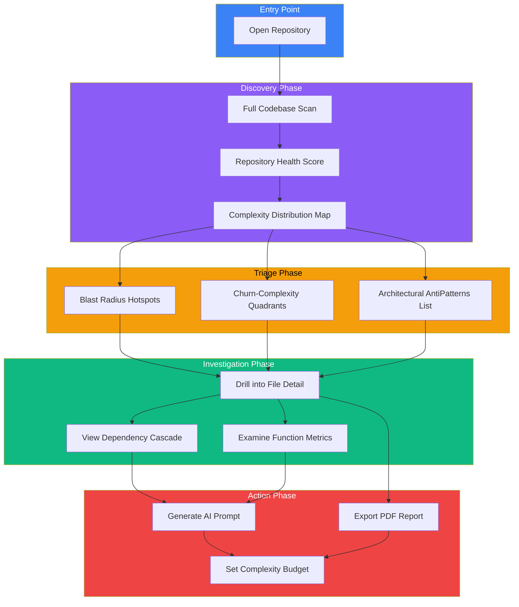
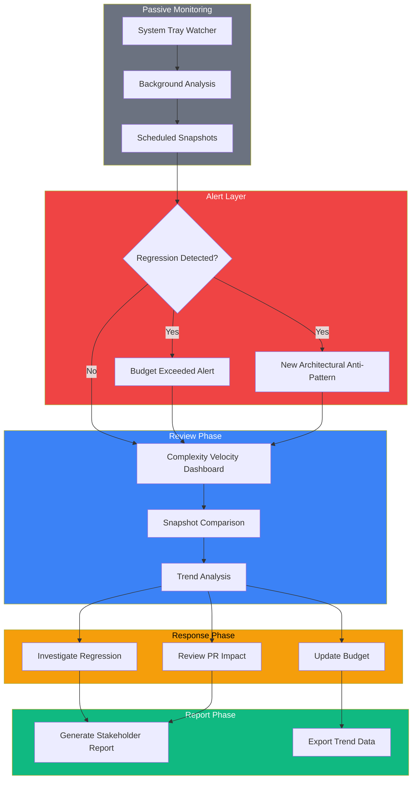
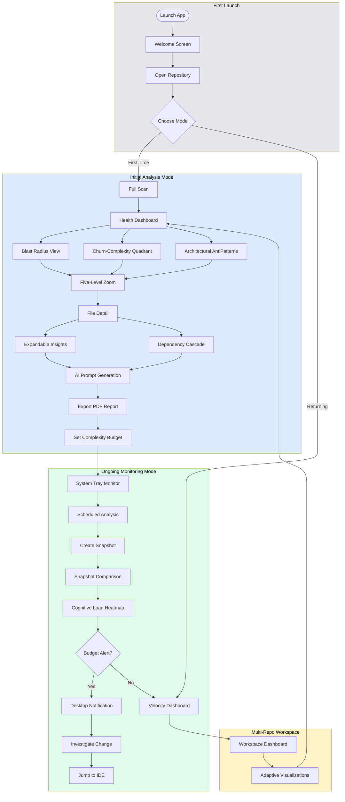
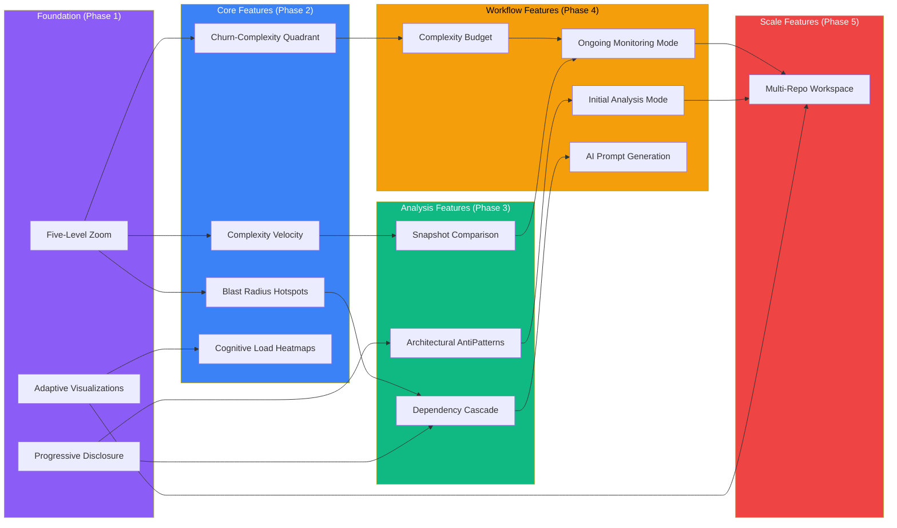

# Vipr Desktop Round Two: Overview and User Flows

This document provides the executive summary and navigation map for all Round Two user stories. It establishes the two core user flows that unify all features and defines the UX principles that guide implementation decisions.

## Executive Summary

Round Two transforms Vipr Desktop from a static analysis tool into a dynamic codebase intelligence platform. Where Round One focused on foundational capabilities (repository management, analysis engine, basic dashboard), Round Two delivers the insights layer that makes multi-dimensional metric data actionable.

Vipr leverages a powerful three-plugin architecture (Core, React, Next.js) that tracks comprehensive metrics across structural complexity, temporal patterns, coupling, performance, security, reliability, technical debt, accessibility, and technology-specific concerns. This goes far beyond traditional "complexity analysis"—it provides a holistic view of code health.

### The Core Promise

Developers waste time on the wrong problems. They refactor stable code while complexity accumulates in frequently-changed files. They review changes without understanding blast radius. They measure code health without connecting it to business outcomes.

Round Two delivers three capabilities that change this:

1. **Multi-Dimensional Intelligence** - Understanding code through 14 comprehensive metric categories spanning structural complexity, React-specific patterns (hooks, effects, coupling), performance, security, reliability, technical debt, accessibility, and more—not just cyclomatic complexity
2. **Temporal Intelligence** - Tracking how ALL metrics evolve over time, detecting velocity changes, maintainability trends, anti-pattern introduction, and security risk acceleration
3. **Spatial Navigation** - Moving fluidly between codebase scales (ecosystem down to function) while maintaining metric context
4. **Action Orientation** - Every insight leads to a concrete next step, informed by comprehensive metric analysis

### User Story Inventory

| ID        | Title                                           | Category                 | Owner                     |
| --------- | ----------------------------------------------- | ------------------------ | ------------------------- |
| US-NEW-01 | Blast Radius Hotspot View                       | Visualization            | ux-design-specialist      |
| US-NEW-02 | Complexity Velocity Dashboard                   | Temporal Analysis        | ux-design-specialist      |
| US-NEW-03 | Churn-Complexity Quadrant Analysis              | Risk Assessment          | ux-design-specialist      |
| US-NEW-04 | Architectural AntiPatterns Detection            | Pattern Detection        | ux-design-specialist      |
| US-NEW-05 | Five-Level Zoom Navigation                      | Navigation               | ux-design-specialist      |
| US-NEW-06 | Progressive Disclosure with Expandable Insights | Information Architecture | ux-design-specialist      |
| US-NEW-07 | Dependency Cascade Analysis                     | Impact Analysis          | ux-design-specialist      |
| US-NEW-08 | System Tray Always-On Monitoring                | Platform Integration     | electron-desktop-engineer |
| US-NEW-09 | IDE Deep Linking from Issues                    | Platform Integration     | electron-desktop-engineer |
| US-NEW-10 | Multi-Repository Workspace Dashboard            | Scale                    | ux-design-specialist      |
| US-NEW-11 | Global Keyboard Shortcuts                       | Platform Integration     | electron-desktop-engineer |
| US-NEW-12 | Embedded MCP Server                             | AI Integration           | electron-desktop-engineer |
| US-NEW-13 | Initial Analysis Mode                           | Workflow                 | ux-design-specialist      |
| US-NEW-14 | Ongoing Monitoring Mode                         | Workflow                 | ux-design-specialist      |
| US-NEW-15 | Snapshot Comparison with Git Context            | Temporal Analysis        | ux-design-specialist      |
| US-NEW-16 | Complexity Budget Monitoring                    | Governance               | ux-design-specialist      |
| US-NEW-17 | Adaptive Visualizations for Scale               | Visualization            | ux-design-specialist      |
| US-NEW-18 | Cognitive Load and Halstead Effort Heatmaps     | Visualization            | ux-design-specialist      |
| US-NEW-19 | One-Click AI Prompt Generation                  | AI Integration           | ux-design-specialist      |
| US-NEW-20 | Scheduled Background Analysis                   | Platform Integration     | electron-desktop-engineer |

---

## The Two Core User Flows

Every feature in Round Two serves one of two fundamental workflows. Understanding these flows is essential for making coherent UX decisions.

### Flow 1: Initial Analysis

When a developer inherits a codebase, joins a project, or prepares for a refactoring initiative, they need to build a mental model quickly. The Initial Analysis flow answers: "What is the state of this codebase and where should I focus?"



**Key UX Principles for Initial Analysis:**

1. **Progressive Revelation** - Start with the 30,000-foot view, let users drill down on demand
2. **Prioritized Presentation** - Show the most impactful problems first, not all problems equally
3. **Clear Exit Ramps** - Every investigation should lead to an actionable output

### Flow 2: Ongoing Monitoring

After the initial assessment, developers need to maintain codebase health over time. The Ongoing Monitoring flow answers: "What changed and is it getting better or worse?"



**Key UX Principles for Ongoing Monitoring:**

1. **Ambient Awareness** - Health status visible without opening the app
2. **Exception-Based Alerts** - Only interrupt when something needs attention
3. **Temporal Context** - Always show change relative to a meaningful baseline

---

## Complete User Journey Map

This diagram shows how all features connect from first launch through daily use.



---

## Navigation Model and Information Architecture

### Five-Level Zoom Hierarchy

The application's information architecture is built around a consistent zoom model that applies across all views.

```
Level 1: Ecosystem (Multi-Repository)
    |
    +-- Level 2: Repository
            |
            +-- Level 3: Directory/Module
                    |
                    +-- Level 4: File
                            |
                            +-- Level 5: Function/Component
```

**Navigation Principles:**

1. **Consistent Zoom Controls** - Same gestures and shortcuts work at every level
2. **Breadcrumb Persistence** - Always know where you are in the hierarchy
3. **Context Preservation** - Drilling down retains filters and sort order
4. **Escape Hatches** - Quick actions to zoom out to any level

### Primary Navigation Structure

```
Sidebar Navigation:
|
+-- Analysis (Primary)
|   +-- Dashboard
|   +-- Files
|   +-- Issues
|   +-- Blast Radius [NEW]
|   +-- Churn Analysis [NEW]
|
+-- Insights (Historical)
|   +-- Snapshots [ENHANCED]
|   +-- Velocity Trends [NEW]
|   +-- Architectural AntiPatterns [NEW]
|
+-- Tools (Actions)
|   +-- AI Prompts [ENHANCED]
|   +-- Reports
|   +-- Budgets [NEW]
|
+-- Settings
    +-- Preferences
    +-- Monitoring [NEW]
    +-- Integrations
```

---

## Key UX Principles

These principles guide all UX decisions across Round Two features.

### 1. Opportunity Framing

**Principle:** Frame complexity as opportunity for improvement, not as failure or criticism.

**Application:**

- "This file has high impact potential" instead of "This file is problematic"
- "Reducing complexity here improves 23 dependent files" instead of "High coupling detected"
- Use green/blue color schemes for recommendations, reserve red for true errors

### 2. Progressive Disclosure

**Principle:** Show summary first, reveal detail on demand. Never overwhelm with data.

**Application:**

- Default views show top 5-10 items, not all items
- Expand/collapse for additional context
- "Show more" buttons instead of pagination when exploring

### 3. Temporal Context

**Principle:** Current state is meaningless without trend. Always show direction of change.

**Application:**

- Every metric shows delta from previous snapshot
- Trend arrows on all dashboard cards
- Sparklines for quick temporal scanning

### 4. Action Orientation

**Principle:** Every screen should have a clear "what to do next" path.

**Application:**

- Primary action button visible without scrolling
- AI prompt generation available from any file view
- One-click to IDE from any issue

### 5. Adaptive Density

**Principle:** Information density scales with user expertise and screen size.

**Application:**

- Compact mode for power users (keyboard-driven)
- Comfortable mode for occasional use (mouse-driven)
- Responsive layouts that prioritize key metrics on small screens

### 6. Predictable Patterns

**Principle:** Same interaction patterns across all features reduce cognitive load.

**Application:**

- Treemaps always use same color scale (green = good, yellow = warning, red = critical)
- Tables always support same sort, filter, and search operations
- Cards always expand on click, collapse on click again

---

## Feature Dependencies

This graph shows implementation dependencies between user stories.



---

## Success Metrics

### Initial Analysis Flow

| Metric                | Target       | Measurement                                    |
| --------------------- | ------------ | ---------------------------------------------- |
| Time to first insight | < 30 seconds | From scan complete to first actionable finding |
| Navigation efficiency | < 3 clicks   | From dashboard to any file detail              |
| Triage completion     | < 5 minutes  | From scan to prioritized action list           |
| Report generation     | < 2 minutes  | From dashboard to PDF export                   |

### Ongoing Monitoring Flow

| Metric               | Target       | Measurement                        |
| -------------------- | ------------ | ---------------------------------- |
| Regression detection | < 5 minutes  | From commit to alert               |
| Trend comprehension  | < 10 seconds | User can identify trend direction  |
| Context switch time  | < 5 seconds  | From notification to investigation |
| False positive rate  | < 10%        | Alerts that require no action      |

### Overall Application Health

| Metric                  | Target | Measurement                                |
| ----------------------- | ------ | ------------------------------------------ |
| Feature discoverability | > 80%  | Users find relevant feature within session |
| Return rate             | > 60%  | Users return within 7 days                 |
| Task completion         | > 90%  | Users complete intended workflow           |

---

## Vipr's Comprehensive Metric Architecture

### Three-Plugin System

Vipr's analysis is powered by three specialized plugins that work together to provide comprehensive code intelligence:

#### Core Plugin Metrics (JavaScript/TypeScript)

- **Cyclomatic Complexity**: Decision point analysis
- **Halstead Metrics**: Operators/operands analysis (volume, difficulty, effort, time, bugs)
- **Maintainability Index**: Microsoft's formula (0-100 scale, A-F ratings)
- **Function/Method Analysis**: Size, count, complexity distribution

#### React Plugin Metrics (React Components)

- **Structural Analysis**:
  - Branches, JSX conditionals, early returns, loops, logical operators
  - Component complexity scoring
- **Hook Analysis**:
  - Counts by type (useEffect, useRef, useState, useCallback, useMemo, useContext, custom)
  - Temporal complexity weight (effects are weighted higher)
  - Custom hook detection
- **Temporal Complexity**:
  - Effect analysis (dependency count, cleanup presence, risk level)
  - Effect execution timing (mount-only vs every-render)
  - Dependency array completeness
- **Coupling Analysis**:
  - Props count, context consumers, callback props
  - Ref forwarding, children usage patterns
  - Unstable context values detection
- **Identity Analysis**:
  - useCallback/useMemo usage tracking
  - Unstable reference detection (inline functions, object literals)
- **Dataflow Analysis**:
  - State update paths complexity
  - Prop drilling depth and chains
  - Transform chain length
  - Shared mutable state detection
  - Derived state count
- **Anti-pattern Detection** (categorized by type and severity):
  - Hooks anti-patterns (conditional hooks, hooks in loops, missing deps, stale closures)
  - Performance anti-patterns (inline functions, missing keys, expensive operations)
  - State management anti-patterns (direct mutation, unnecessary state)
  - Lifecycle anti-patterns (missing cleanup, infinite loops, race conditions)
  - JSX anti-patterns (fragment misuse, key issues, dangerous HTML)
  - Props anti-patterns (boolean overuse, too many props)
  - Security anti-patterns (XSS, unsafe binding, missing sanitization)
  - Testing anti-patterns (missing coverage, hard-to-test components)
  - Accessibility anti-patterns (missing labels, keyboard nav issues)
- **Security Analysis**:
  - XSS vulnerabilities, injection risks
  - Sensitive data exposure, authentication issues
  - Access control problems, cryptography weaknesses
  - Input validation gaps
  - Severity levels (critical, high, medium, low)
- **Migration Readiness**:
  - React version compatibility
  - Blockers and warnings
  - Estimated effort, codemods needed
- **Performance Analysis**:
  - Render performance (unnecessary render risk, expensive operations)
  - Memoization (usage tracking, missing opportunities)
  - Bundle impact (import count, heavy dependencies, tree-shaking score, code-splitting opportunities)
- **Reliability Analysis**:
  - Crash risk score
  - Error boundary coverage score
  - Null safety score
  - Async error handling coverage
  - Memory leak risk assessment
  - Failure modes identification
- **Technical Debt Analysis**:
  - Code health grade (A-F with trend)
  - Technical debt score (principal + interest)
  - Maintenance burden assessment
  - Hotspot identification
  - Debt interest rate calculation
  - Compounding factors
- **React Maintainability Index**:
  - Halstead volume, cyclomatic complexity, LOC (traditional factors)
  - Hook complexity, temporal complexity, coupling complexity (React factors)
  - Type coverage, identity complexity (modern React factors)
  - Normalized 0-100 scale with A-F ratings
- **Type Analysis**:
  - Generic depth, conditional type branches
  - Union size, intersection size
  - Mapped types, recursive types
  - Template literal complexity
- **Accessibility Analysis**:
  - WCAG violations by level (A, AA, AAA)
  - Keyboard navigation score
  - Screen reader compatibility score
  - ARIA attribute coverage
  - Best practices compliance

#### Next.js Plugin Metrics (Next.js Applications)

- **Routing Analysis**:
  - App Router vs Pages Router detection
  - Route optimization opportunities
- **Component Boundaries**:
  - Server Component detection
  - Client Component boundary analysis
- **Data Fetching**:
  - Data fetching pattern quality
  - Next.js-specific optimizations
- **Note**: React plugin defers to Next.js plugin for Next.js files to prevent duplicate analysis

### How Metrics Inform Features

Every Round Two feature leverages this comprehensive metric set:

1. **Blast Radius Hotspots (US-01)**: Not just complexity × dependents, but:
   - Temporal complexity (risky effects) × dependents
   - Security vulnerabilities × dependents
   - Poor maintainability index × dependents
   - Reliability issues × dependents

2. **Complexity Velocity (US-02)**: Tracks trends across ALL metrics:
   - Maintainability index velocity
   - Hook complexity acceleration
   - Security risk trending
   - Anti-pattern introduction rate
   - Technical debt accumulation

3. **Churn-Complexity Quadrant (US-03)**: Y-axis can be:
   - Overall Vipr score (composite of all metrics)
   - React maintainability index
   - Specific metric (security, reliability, etc.)
   - Traditional cyclomatic complexity

4. **Architectural AntiPatterns (US-04)**: Automatically detects:
   - React anti-patterns (all categories)
   - SRP violations with responsibility breakdown
   - Prop drilling with exact depth and chain
   - Temporal complexity issues
   - Security vulnerabilities
   - Error boundary gaps
   - Poor null safety

5. **Budget Monitoring (US-16)**: Supports budgets for:
   - All Core metrics (cyclomatic, Halstead, maintainability)
   - All React metrics (hooks, temporal, coupling, identity, dataflow)
   - Security vulnerability counts
   - Reliability scores
   - Anti-pattern counts by category
   - Accessibility violation counts

6. **Cognitive Load Heatmaps (US-18)**: Visualizes:
   - Traditional cognitive complexity
   - Halstead effort
   - React-specific cognitive factors (hook, temporal, coupling, identity complexity)
   - Risk-based cognitive load (security, reliability, performance, accessibility)

## Document Index

| Document                                                                                               | Title                                           | Status                    |
| ------------------------------------------------------------------------------------------------------ | ----------------------------------------------- | ------------------------- |
| [01-blast-radius-hotspot-view.md](./01-blast-radius-hotspot-view.md)                                   | Blast Radius Hotspot View                       | UX-focused                |
| [02-complexity-velocity-dashboard.md](./02-complexity-velocity-dashboard.md)                           | Complexity Velocity Dashboard                   | UX-focused                |
| [03-churn-complexity-quadrant-analysis.md](./03-churn-complexity-quadrant-analysis.md)                 | Churn-Complexity Quadrant Analysis              | UX-focused                |
| [04-architectural-smells-detection.md](./04-architectural-smells-detection.md)                         | Architectural AntiPatterns Detection            | UX-focused                |
| [05-five-level-zoom-navigation.md](./05-five-level-zoom-navigation.md)                                 | Five-Level Zoom Navigation                      | UX-focused                |
| [06-progressive-disclosure-expandable-insights.md](./06-progressive-disclosure-expandable-insights.md) | Progressive Disclosure with Expandable Insights | UX-focused                |
| [07-dependency-cascade-analysis.md](./07-dependency-cascade-analysis.md)                               | Dependency Cascade Analysis                     | UX-focused                |
| 08-system-tray-monitoring.md                                                                           | System Tray Always-On Monitoring                | electron-desktop-engineer |
| 09-ide-deep-linking.md                                                                                 | IDE Deep Linking from Issues                    | electron-desktop-engineer |
| [10-multi-repository-workspace-dashboard.md](./10-multi-repository-workspace-dashboard.md)             | Multi-Repository Workspace Dashboard            | UX-focused                |
| 11-global-keyboard-shortcuts.md                                                                        | Global Keyboard Shortcuts                       | electron-desktop-engineer |
| 12-embedded-mcp-server.md                                                                              | Embedded MCP Server                             | electron-desktop-engineer |
| [13-initial-analysis-mode.md](./13-initial-analysis-mode.md)                                           | Initial Analysis Mode                           | UX-focused                |
| [14-ongoing-monitoring-mode.md](./14-ongoing-monitoring-mode.md)                                       | Ongoing Monitoring Mode                         | UX-focused                |
| [15-snapshot-comparison-git-context.md](./15-snapshot-comparison-git-context.md)                       | Snapshot Comparison with Git Context            | UX-focused                |
| [16-complexity-budget-monitoring.md](./16-complexity-budget-monitoring.md)                             | Complexity Budget Monitoring                    | UX-focused                |
| [17-adaptive-visualizations-scale.md](./17-adaptive-visualizations-scale.md)                           | Adaptive Visualizations for Scale               | UX-focused                |
| [18-cognitive-load-halstead-heatmaps.md](./18-cognitive-load-halstead-heatmaps.md)                     | Cognitive Load and Halstead Effort Heatmaps     | UX-focused                |
| [19-one-click-ai-prompt-generation.md](./19-one-click-ai-prompt-generation.md)                         | One-Click AI Prompt Generation                  | UX-focused                |
| 20-scheduled-background-analysis.md                                                                    | Scheduled Background Analysis                   | electron-desktop-engineer |
